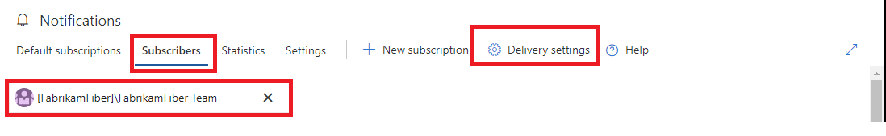
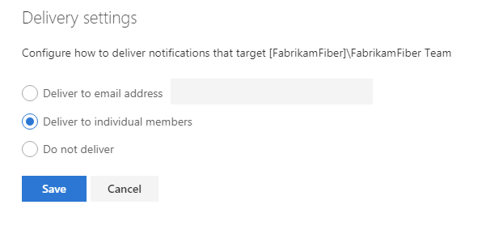
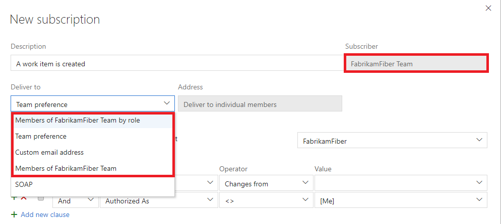
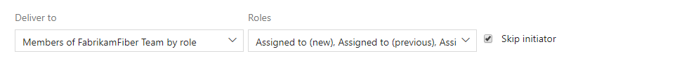
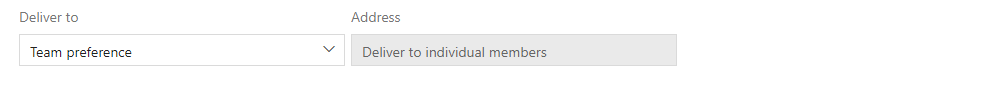
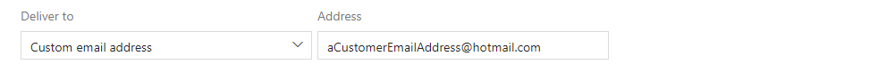
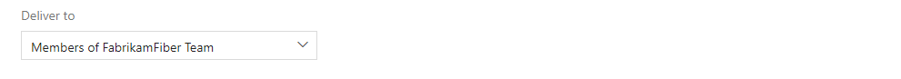
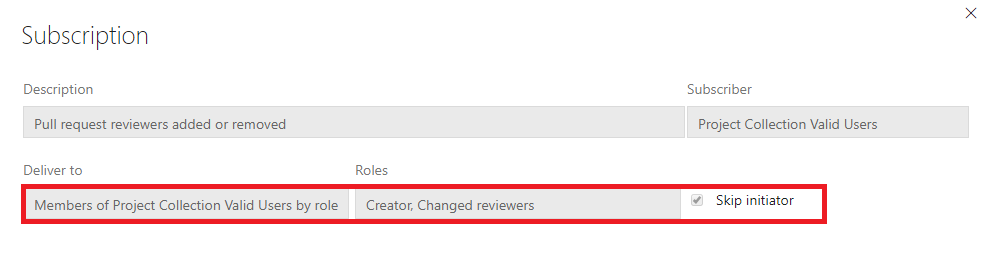

# How are email recipients determined

<b>VSTS | TFS 2018 | TFS 2017.1 | [Previous versions](../work/track/alerts-and-notifications.md)</b> 

> [!NOTE]  
> This topic applies to VSTS and to TFS 2017.1 and later versions. If you work from an on-premises TFS 2017 or earlier versions, see [Set alerts, get notified when changes occur](../work/track/alerts-and-notifications.md). For on-premises TFS, [you must configure an SMTP server](/tfs/server/admin/setup-customize-alerts) in order for team members to see the Notifications option from their account menu and to receive notifications.

The determination of who receives an email when a VSTS notification is generated is controlled by a few variables and can result in unanticipated results if these variables are not understood.  This document explains the variables involved.

## Delivery options for a personal subscription
The delivery options for a personal subscription are the easiest to understand.  The emails for a personal subscription are to delivered to the _preferred email address_ specified on the users profile, or to a specific email address defined on the subscription.

**Default preferred email address on a personal subscription**

**Optional customer email address on a personal subscription**

Any notification generated for this subscription will be sent to this email address with no other settings impacting delivery.

## Delivery settings for a team or group
Delivery preferences for a team or group are managed in either of the following notification hubs.
* the account-level notifications hub under the _Subscribers_ tab
* the team-level notifications hub

Both hubs have a _Delivery Settings_ button in the UX.  Delivery settings for a team or group apply to all subscriptions for that team or group.

**Team delivery settings button under account level settings**

**Team Delivery settings dialog**

There are three settings to choose from for team or group email delivery
* **Deliver to email address:** This defines the team's preferred email.
* **Deliver to individual members:** This option is explained in detail below.
* **Do not deliver:** No email is delivered.

If an team delivery setting is not explicitly chosen, the value is inherited from the [account-level delivery setting](howto-manage-account-notifications-settings.md) and will be either _Deliver to individual members_ or _Do not deliver_.  The delivery settings dialog does not indicate whether the setting is inherited or set explicitly.

## Delivery options for a team or group subscription

The following delivery options are available for a group or team subscription.
* **Member of team by role:** Recipients are the individuals or groups of the chosen roles (e.g. work item assignee)
* **Team preference:** The team's delivery setting. Do not deliver, preferred email address, or members of team.
* **Custom email address:** Email recipient is the custom email address.
* **Members of team:** Email recipients determined by expanding the team membership (details below)

### Option: Member of team by role
The email recipient list is determined by the individual or team identities which had a role in the VSTS event.  For example, the identity to which a work item was assigned has the role _Assigned to (new)_ while the identity that was previously assigned the work item has the role _Assigned to (previous)_.  The full list of roles for each event type are listed in the [supported event type](oob-supported-event-types.md) table.

The special option _Skip initiator_ means the email will **not** be sent to the indiviual or group identity's preferred email if they are the initiator of the event.  Not all event types have an initiator role.

### Option: Team preference
The delivery option is taken from the team's delivery setting.  It will be one of the following.
* **Deliver to email address:** The email is delivered to the team's preferred email address.
* **Deliver to individual members:** See section below for details of _Members of team_.
* **Do not deliver:** No email is delivered.

The teams's delivery setting value is displayed under the _Address_ label and can't be changed.

### Option: Custom email address
The email is sent to the email address chosen for the subscription.

### Option: Members of team
The team or group membership is expanded to determine the email recipients. In the simple case a team or group expands to a list of individuals and each is included on the To: line of the resulting email.  However, the results of this expansion can be complicated and are explained in more detail in the [team and group expansion](#team-and-group-expansion-for-email-recipients) section.

## Delivery options for default subscriptions
The delivery setting and delivery option for all default subscriptions are the following.
* **Delivery setting:** Delivery to all members
* **Delivery option:** Members of team by role

When viewing a default subscription you'll notice these values can't be changed.  The roles and the _Skip initiator_ option vary depending on the event type.  See [supported event types](oob-supported-event-types.md) for a list of roles available for each event type.  Note, the _Skip initiator_ option is not available for all event types.

## Team and group expansion for email recipients
