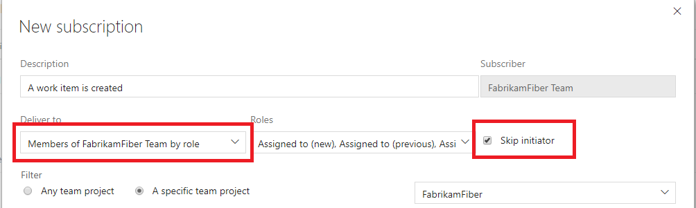

# How to prevent emails to yourself from event you initiated

<b>VSTS | TFS 2018 | TFS 2017.1 | [Previous versions](../work/track/alerts-and-notifications.md)</b> 

> [!NOTE]  
> This topic applies to VSTS and to TFS 2017.1 and later versions. If you work from an on-premises TFS 2017 or ealier versions, see [Set alerts, get notified when changes occur](../work/track/alerts-and-notifications.md). For on-premises TFS, [you must configure an SMTP server](/tfs/server/admin/setup-customize-alerts) in order for team members to see the Notifications option from their account menu and to receive notifications.

The option _Skip initiator_ is available when creating a team role-based notification subscription.  This option causes emails to be skipped for the initiator of the event which triggered the email.

This option can be beneficial for users who don't want to be notified of events they just triggered, but has caused some users to feel they missed an email when their teammates received the email and they didn't.

 