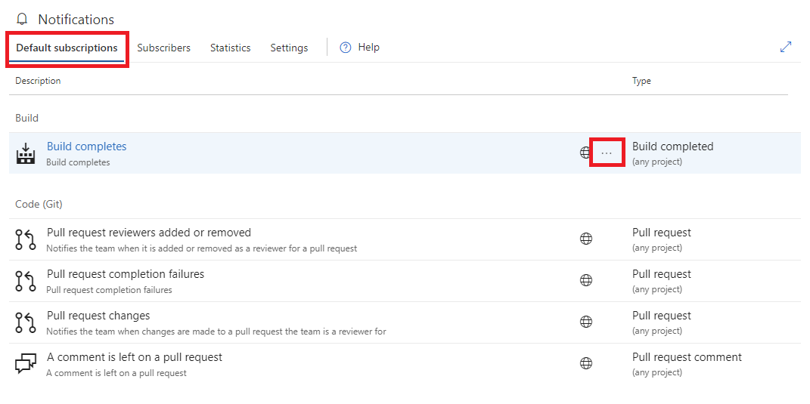
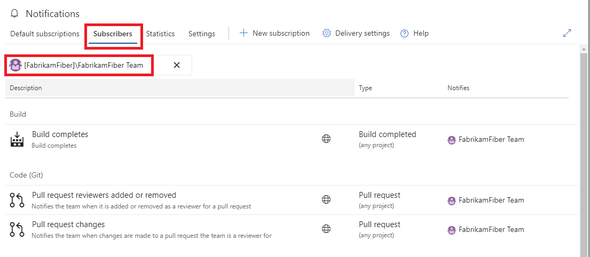

# Manage notifications for an account

<b>VSTS | TFS 2018 | TFS 2017.1 | [Previous versions](../work/track/alerts-and-notifications.md)</b> 

> [!NOTE] 
> This topic applies to VSTS and to TFS 2017.1 and later versions. If you work from an on-premises TFS 2017 or ealier versions, see [Set alerts, get notified when changes occur](../work/track/alerts-and-notifications.md). For on-premises TFS, [you must configure an SMTP server](/tfs/server/admin/setup-customize-alerts) in order for team members to see the Notifications option from their account menu and to receive notifications.

## Account level notification hub
See [Navigating the UX](navigating-the-ux.md) to learn how to locate this hub.

The account notification hub consists of the following sections:
* Default subscriptions - view all [default notification subscriptions](./oob-built-in-notifications.md)
* Subscribers - view notification subscriptions for a specific group, team, or individual
* Statistics - view the most active subscriptions and top event initiators
* Settings - manage account level settings such as delivery preferences

## Account notification hub: Default subscriptions

The `Default subscriptions` section lists all default subscriptions available to the account. The globe icon on a notification subscription indicates the subscription is a default subscription.

Members of the **project collection administrators** group have permission to enable/disable any default subscription in this view. Any member project collection valid users have permission to view the details of the default subscription. The view and enablement options are available in the context menu (`...`) associated with each individual subscription.

## Account notification hub: Subscribers

The `Subscribers` section begins with an empty identity search box. Enter any group, team, or individual to view the list of subscriptions associated with the specified identity.

All notification subscriptions associated with the specified identity are listed in this view, which include [default subscriptions]() and [custom subscriptions](). Subscribers have options to [add](), [remove](), [edit](), or [toggle the enablement]() of a customer subscription. Subscribers can also [opt-in or opt-out]() of a default subscription in this view. Management options are available from the context menu (`...`) associated with each subscription.

Note, the globe icon on subscription row indicates a default subscription while custom subscriptions have no associated icon.

## Account notification hub: Statistics

The `Statistics` section shows the most active notification subscriptions and the top event initiators (group, team, or individual). The statistics are only for the current day and reset at 00:00 UTC. A benefit of these statistics is identifying unintended high volume subscriptions or event initiators.

## Account notification hub: Settings

The `Settings` section allows account level notification settings to be managed by any member of the **project collection administrators** group. The _Default delivery option_ setting is inherited by all teams and groups, and therefore is not explicitly set at the team or group level.

