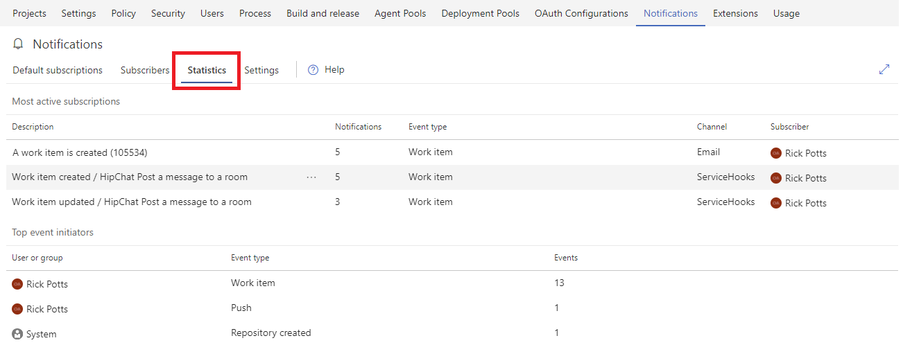

# Analyze notifications statistics for an account

<b>VSTS | TFS 2018 | TFS 2017.1 | [Previous versions](../work/track/alerts-and-notifications.md)</b> 

> [!NOTE]
> This topic applies to VSTS and to TFS 2017.1 and later versions. If you work from an on-premises TFS 2017 or ealier versions, see [Set alerts, get notified when changes occur](../work/track/alerts-and-notifications.md). For on-premises TFS, [you must configure an SMTP server](/tfs/server/admin/setup-customize-alerts) in order for team members to see the Notifications option from their account menu and to receive notifications.

## View notification statistics for an account
Notification statistics show the top 10 most active subscriptions and the top event initiators in your account for the current day. Administrators should periodically review statistics to ensure there are no unintended high volume subscriptions or event initiators.

1. Navigate to the account notifications setings hub. Click [here](navigating-the-ux.md#navigating-to-the-account-level-notification-hub) to see how.
1. Click the *Statistics* tab.
1. Analyze the most active subscriptions and top event initiators.

    

**Notes:**
* A context menu (`...`) on the most active subscriptions provides the option to edit, disable, or delete the subscription
* Both email and service hooks subscriptions are eligible for the most active subscriptions
* The integer subscription ID is shown in the description for a custom email subscription
* Results are not a sliding 24-hour window and reset at the beginning of each day (00:00 UTC)