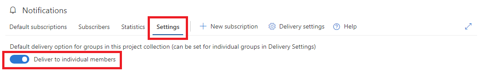

# Manage account notification settings

<b>VSTS | TFS 2018 | TFS 2017.1 | [Previous versions](../work/track/alerts-and-notifications.md)</b> 

> [!NOTE]  
> This topic applies to VSTS and to TFS 2017.1 and later versions. If you work from an on-premises TFS 2017 or ealier versions, see [Set alerts, get notified when changes occur](../work/track/alerts-and-notifications.md). For on-premises TFS, [you must configure an SMTP server](/tfs/server/admin/setup-customize-alerts) in order for team members to see the Notifications option from their account menu and to receive notifications. 

Account level notification settings can be used to set defaults which apply to all groups unless explictily overriden.

## How to navigate to account level notification settings

The direct URL is `https://{account}.visualstudio.com/_admin/_notifications?view=settings`.  Or follow these steps to navigate through the UI.

1. Open the [account notifications hub](navigating-the-ux.md) under account settings
1. Click **Settings**.

    

## Manage the account level notification delivery setting
The account level notification delivery setting defines the default setting for all groups in this account.  This option is inherited by every group and will apply to a group's notification subscriptions unless explicitly overriden by that group's delivery setting.

1. Choose to allow or block delivery of emails to group members.

    