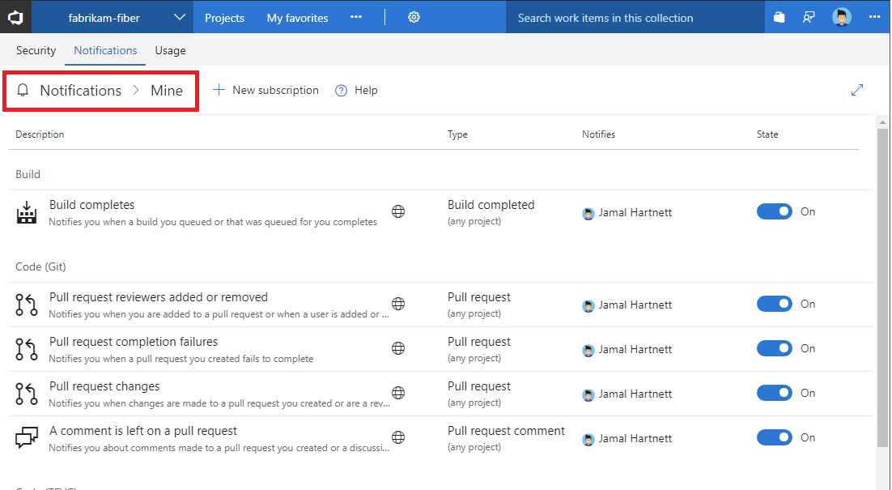

# Navigating the notifications UX

<b>VSTS | TFS 2018 | TFS 2017.1 | [Previous versions](../work/track/alerts-and-notifications.md)</b> 

> [!NOTE]  
> This topic applies to VSTS and to TFS 2017.1 and later versions. If you work from an on-premises TFS 2017 or ealier versions, see [Set alerts, get notified when changes occur](../work/track/alerts-and-notifications.md). For on-premises TFS, [you must configure an SMTP server](/tfs/server/admin/setup-customize-alerts) in order for team members to see the Notifications option from their account menu and to receive notifications.

## The notification hubs
There are three notification hubs in the UX.
* Account notification hub
* Team notification hub
* Personal notification hub

Permissions to manage notification at each hub default as follows
* Account administrators can manage accuont notifications
* Account and team administrators can manage team notifications
* Each user can manage their personal notifications


## Direct navigation to notification hubs using URL

Account:
```
https://{account}.visualstudio.com/_admin/_notifications
```

Team:
```
https://{account}.visualstudio.com/{team}/_admin/_notifications
```

Personal:
```
https://{account}.visualstudio.com/_notifications
```


## Navigating to the account level notification hub
Choose the Notifications hub under account settings.


**The account Notification hub**


## Navigating to the team level notification hub
Choose the Notifications hub under project settings.


**The team Notification hub**


## Navigating to the personal notification hub
Choose Notification hub under your profile


**The personal Notification hub**



