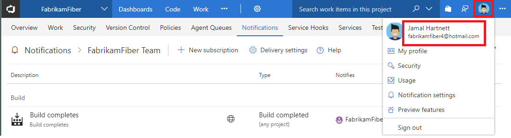

# Why did I get this email

<b>VSTS | TFS 2018 | TFS 2017.1 | [Previous versions](../work/track/alerts-and-notifications.md)</b> 

> [!NOTE]  
> This topic applies to VSTS and to TFS 2017.1 and later versions. If you work from an on-premises TFS 2017 or ealier versions, see [Set alerts, get notified when changes occur](../work/track/alerts-and-notifications.md). For on-premises TFS, [you must configure an SMTP server](/tfs/server/admin/setup-customize-alerts) in order for team members to see the Notifications option from their account menu and to receive notifications.

If you're receiving a notification email that you didn't expect, it could be for one of the following reasons.

* The email is sent to a group of which you are a member.
* The email was triggered by a different subscription than you expected.

Please perform the following step to determine if any of these resolve the issue.

## Step 1: Inspect the 'To:' line on the email
Your email address is on this line or are you a member of a group included on the To: line. User receiving unexpected emails are often included as part of a group which is receiving the email.  The subscription administrator might have configured the email delivery preferences to a wider than anticipated group.

## Step 2: Inspect the footer of the unexpected email
All emails will have a footer which contains a link to view the subscription which triggered the email.  Click the link and view the subscription.

## Contact customer support
If you're not able to resolve the issue with the steps above, consider contacting [customer support](troubleshoot-contact-support.md)
