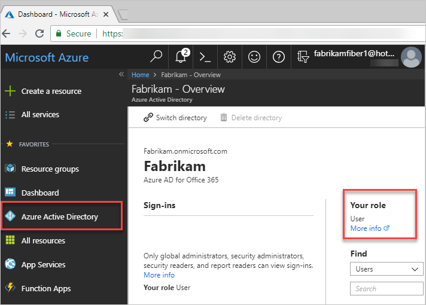

# Access VSTS with Azure Active Directory

**VSTS**

Want to authenticate users and control access to
your VSTS organization the same way that you
can with Microsoft services like Office 365 and Azure?
If your VSTS organization was created with a Microsoft account,
you can connect your VSTS organization to your
organization's directory in
[Azure Active Directory (Azure Active Directory)](https://azure.microsoft.com/en-us/documentation/articles/active-directory-whatis/).
You can then sign in to VSTS with the same username
and password that you use with these Microsoft services.
You can also enforce policies for accessing
your team's critical resources and key assets.

> To use existing on-premises identities with VSTS,
> you can integrate on-premises directories with Azure Active Directory by using
> [Azure Active Directory Connect](https://azure.microsoft.com/en-us/documentation/articles/active-directory-aadconnect/).
> To switch your VSTS organization to another directory,
> learn [how to change your directory in Azure Active Directory](change-organization-location.md).

## How does Azure Active Directory control access to VSTS?

Your VSTS organization authenticates users
through your directory so that
only users who are members or guests in that directory can
get access to your VSTS organization.
When users are removed from your directory,
for example, because they've moved elsewhere,
they can't access your organization anymore.
Only specific [Azure Active Directory administrators](https://azure.microsoft.com/en-us/documentation/articles/active-directory-assign-admin-roles/)
can manage users in your directory,
so they control who can get access to your VSTS organization.

Without Azure Active Directory, you're solely responsible for
controlling VSTS organization access.
And all users must sign in with Microsoft accounts.

## What do I need to set up an existing VSTS with Azure Active Directory?

You'll need the following:

* [Ownership of the VSTS organization](faq-add-delete-users.md#find-owner) that you want to connect to Azure Active Directory.

* A ["full" Azure subscription](https://azure.microsoft.com/en-us/pricing/purchase-options/),
such as a ["Pay-As-You-Go" subscription](https://azure.microsoft.com/en-us/offers/ms-azr-0003p/),
associated with your Azure Active Directory and at
least co-administrator permissions for your subscription.
You'll need both to make your directory appear in the Azure portal,
so that you can link your subscription and connect your
Azure Active Directory to your VSTS organization. Learn about
[Azure subscription co-administrator permissions](../../organizations/billing/add-backup-billing-managers.md).

  [Want to use Office 365 Azure Active Directory with VSTS?](faq-azure-access.md#o365aad)

* To add users to Azure Active Directory, you need global administrator permissions for your directory so you can add current VSTS users to that directory.

Otherwise, work with your directory's global administrator to add users.
Learn more about [Azure Active Directory administrators](https://azure.microsoft.com/en-us/documentation/articles/active-directory-assign-admin-roles/).

  To check your permissions, [Sign in to the Azure classic portal](https://manage.windowsazure.com/) with your
  work or school account. Go to your directory.

  

* You must add your Microsoft account to your Azure Active Directory.

Although directory membership isn't required to
connect your VSTS organization to Azure Active Directory, this will make sure that you can sign in and
access your VSTS organization after connecting to Azure Active Directory. Otherwise, your Microsoft account will not have access to
your VSTS organization.

## What happens to current users?

Your work in VSTS is associated with your sign-in address.
After your VSTS organization is connected to your directory,
users will continue working seamlessly if their
sign-in addresses appear in the connected directory.
If they don't, you'll have to [add those users to your directory](add-users-to-aad.md#SetUpCurrentUsers).
Your enterprise might have policies about adding users to the directory,
so find out more first.

What if we can't use the same sign-in addresses?  You'll have to add these users to the directory with new work or school accounts,
or if they have existing work or school accounts, they can use those instead. Their work in VSTS
won't be lost and will stay with their current VSTS sign-in addresses.  You must add them as new
users to VSTS, reassign access levels, and readd them to any team projects. Users can migrate work that they want to keep,
except for their work history. Learn [how to manage VSTS organization users](add-organization-users-from-user-hub.md).

What happens to tools that use my credentials, like alternate credentials?  Alternate credentials won't work anymore for
tools that run outside a web browser, like the Git command line tool.  You'll have
to [set up your credentials](http://support.microsoft.com/kb/2991274/en-us) again for the VSTS organization that you connected.

## What if I accidentally delete a user in Azure Active Directory?

You should [restore the user](https://docs.microsoft.com/en-us/azure/active-directory/active-directory-users-restore), rather than create a new one. If you create a new user, even with the same email address, this user would not be associated with the previous identity.

## Manage organization access with Azure Active Directory

* [Add VSTS users to your Azure Active Directory](add-users-to-aad.md)
* [Connect VSTS organization to Azure Active Directory](connect-organization-to-aad.md)
* [Disconnect VSTS organization from Azure Active Directory](disconnect-organization-from-aad.md)
* [Delete users from VSTS connected to Azure Active Directory](delete-users-from-services-aad.md)
