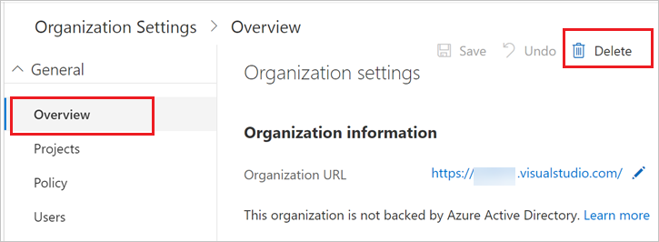
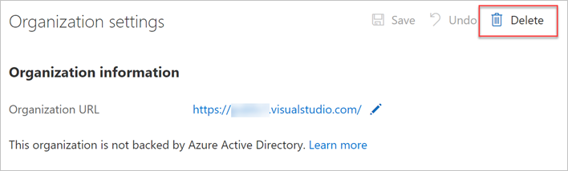

# Delete your VSTS organization

[!INCLUDE [version-vsts-only](../../_shared/version-vsts-only.md)]

If you don't need your VSTS organization, you can delete it. If you change your mind within 30 days, you can [recover your organization](recover-your-vsts-organization.md).
After 30 days, your organization and data are permanently deleted.

When you delete your VSTS organization:

* All users lose access to organization services and resources immediately.

* Your organization URL becomes available for anyone to use. (It might take up to one hour before your organization URL becomes available again.)

* Your organization is disabled, and appears deleted in your profile for 30 days.

* If your organization is linked to an Azure subscription for billing purchases, you must unlink your organization before you delete your organization.

  You're still charged for any paid users and VSTS that your organization uses during this billing cycle. Billing stops after the current cycle ends.

To delete your VSTS organization, you need VSTS organization owner permissions. [How do I find the organization owner?](faq-delete-restore-vsts-organization.md#find-owner)

## Before you delete your VSTS organization

If your VSTS organization uses an Azure subscription to bill purchases, you must first unlink your organization from your Azure subscription before deleting your organization.

To disconnect Azure Active Directory from your organization, you need VSTS organization owner permissions, and at least Azure subscription co-administrator permissions. For more information, see [How do I find the organization owner?](faq-delete-restore-vsts-organization.md#find-owner) and [Azure subscription administrators](https://azure.microsoft.com/documentation/articles/billing-add-change-azure-subscription-administrator/).

1. Sign in to the [Azure portal](https://portal.azure.com).
2. In the search box, enter *team services*. In the list, select **Team Services organizations**.
3. Select the organization you are deleting.
4. Choose **Disconnect AAD**. Your VSTS organization is disconnected from your Azure subscription.

  

  [Need help?](faq-delete-restore-vsts-organization.md#get-support)

## Delete your organization

To delete your VSTS organization, you need at least Basic access and VSTS organization owner
permissions. [How do I find the organization owner?](faq-delete-restore-vsts-organization.md#find-owner)

### [New way to delete your organization](#tab/new-nav)

1. Sign in to your VSTS organization (```https://{yourorganization}.visualstudio.com```).
2. Highlight the organization that you want to delete, and select the  > **Admin settings**.

  3. Select **Overview** > **Delete**.

   

4. In the resulting dialog box, from the drop-down menu, choose your reason for deleting the organization. Then enter the name of your organization, and select **Delete**.

   

5. To review your organizations, go to your [Visual Studio profile](https://app.vsaex.visualstudio.com/profile/view), where you'll see your deleted organization.

   [Need help?](faq-delete-restore-vsts-organization.md#get-support)
---
### [Previous way to delete your organization](#tab/previous-nav)

1. Sign in to your VSTS organization (```https://{yourorganization}.visualstudio.com```).

2. Choose the , and then the admin settings icon.

   

3. Select **Delete **.

   

4. To review your organizations, go to your [Visual Studio profile](https://app.vsaex.visualstudio.com/profile/view), where you'll see your deleted organization.

  [Need help?](faq-delete-restore-vsts-organization.md#get-support)

---
