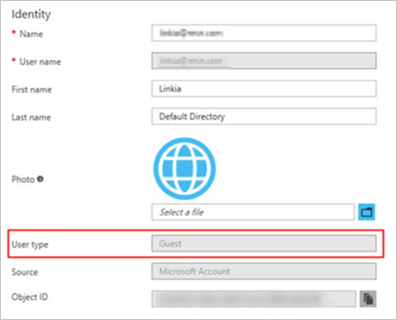

# Troubleshoot adding members to team projects in Visual Studio Team Services (VSTS)

**VSTS**

### Q:	Why can't I add any more members to my team project?

A:	Your VSTS organization is free for the first 5 users with Basic access. 
You can add unlimited Stakeholders and Visual Studio subscribers for no extra charge. 
After you assign all 5 free users with Basic access, 
you can continue adding Stakeholders and Visual Studio subscribers. 
To add a 6th user or more with Basic access, 
you'll need to [set up billing in Azure](../../billing/set-up-billing-for-your-organization-vs.md). 
You can then [pay for more users who need Basic access](../../billing/buy-basic-access-add-users.md), 
return to your VSTS organization, 
[add these users, and assign them Basic access](add-organization-users-from-user-hub.md). 
This lets you pay monthly for their access, and you can cancel anytime.

If you need more Visual Studio subscriptions, 
learn [how to buy these subscriptions](../../billing/vs-subscriptions/buy-vs-subscriptions.md) 
from the [Visual Studio Marketplace](https://marketplace.visualstudio.com/subscriptions).

### Q:	Why can't some users sign in?

A:	This might happen because users must 
sign in with Microsoft accounts 
unless your VSTS organization 
controls access with Azure Active Directory. 
If your organization is connected to Azure Active Directory, 
users must be directory members to get access. 
[How do I find out if my organization uses Azure Active Directory?](#ConnectedDirectory) 

If you're an Azure Active Directory administrator, 
you can add users to the directory. If you're not, 
work with the directory administrator to add them. 
Learn [how to control organization access with Azure Active Directory](access-with-azure-ad.md).

[!INCLUDE [no-access-existing-features](../../_shared/qa-no-access-existing-features.md)]

### Q:	 Why did some users lose access to certain features?

A:	This might happen for [different reasons](faq-add-delete-users.md#stopped-features).  

[!INCLUDE [does-organization-use-azuread](../../_shared/qa-does-organization-use-azuread.md)]

### Q:	How do I remove users from my VSTS organization?

A:	Learn [how to delete users](delete-organization-users.md) 
across all team projects in your VSTS organization. 
If you paid for more users, but don't need their organization access
anymore, you must reduce your paid users to avoid charges.

### Q: Why can't I find members from my connected Azure Active Directory, even though I am the Azure Active Directory global admin?

A: You are probably a guest in the Azure Active Directory that backs VSTS. By default, Azure Active Directory guests cannot search into the Azure Active Directory and that's why you are not finding users in your Azure Active Directory to add to your VSTS organization.

First, check to see if you are an Azure Active Directory guest:

1. Go to the **Settings** section of your VSTS organization and look at the **Azure Active Directory** section at the bottom. Make a note of the directory that backs your VSTS organization.
2. Sign in to the new Azure portal (portal.azure.com) and check your user profile from step 1. Check the **User type** value as seen below.

   > [!div class="mx-imgBorder"] 

If you are an Azure Active Directory guest, do one of the following:

* Have another VSTS admin - someone who is not an Azure Active Directory guest - manage the users in VSTS for you. Members of the Project Collection Administrators group inside VSTS can administer users.
* Have the Azure Active Directory admin(s) remove you from the Azure Active Directory and re-add you, making you an Azure Active Directory member rather than a guest when they do. See "Can Azure Active Directory B2B users be added as members instead of guests?"
* Change the User Type of the Azure Active Directory guest using Azure Active Directory PowerShell. This is an advanced topic and is not advised, but it does work and allows the user to query Azure Active Directory from VSTS thereafter. 
1. [Download and install Azure Active Directory PowerShell module](https://docs.microsoft.com/en-us/powershell/module/azuread/?view=azureadps-2.0).
2. Open PowerShell and run the following cmdlets.

    a. Connect to Azure Active Directory

        C:\Users\rajr> Connect-AzureAD

    b. Find the objectId of the user
    
        C:\Users\rajr> Get-AzureADUser

    c. Check the usertype attribute for this user to see if they are a guest or member.
    
        C:\Users\rajr> Get-AzureADUser -objectId cd7d47bf-1c6e-4839-b765-13edcd164e66

    d. Change the usertype from *member* to *guest*

        C:\Users\rajr> Set-AzureADUser -objectId cd7d47bf-1c6e-4839-b765-13edcd164e66 -UserType Member

[!INCLUDE [user-delay](../../_shared/qa-user-delay.md)]

[!INCLUDE [choose-msa-azuread-organization](../../_shared/qa-choose-msa-azuread-organization.md)]

[!INCLUDE [choose-msa-azuread-organization2](../../_shared/qa-choose-msa-azuread-organization2.md)]

[!INCLUDE [why-cant-sign-in-msa-azuread-organization](../../_shared/qa-why-cant-sign-in-msa-azuread-organization.md)]

[!INCLUDE [find-project-collection-administrator](../../_shared/qa-find-project-collection-administrator.md)]

[!INCLUDE [find-organization-owner](../../_shared/qa-find-organization-owner.md)]

[!INCLUDE [get-team-services-support](../../_shared/qa-get-vsts-support.md)]
