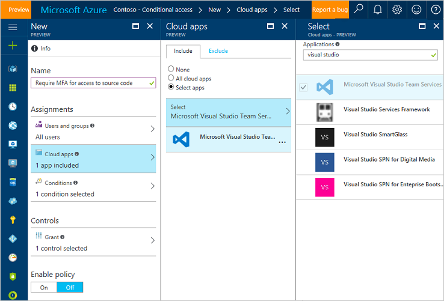

# Manage conditional access to VSTS

[!INCLUDE [version-vsts-only](../../_shared/version-vsts-only.md)]

Conditional access offers simple ways to help secure resources for Visual Studio Team Services (VSTS) organizations that are backed by an Azure Active Directory (Azure AD) tenant. Conditional access policies like multi-factor authentication help protect against the risk of compromised credentials and help keep your organization's data safe. In addition to requiring credentials, you can have a policy that only devices that are connected to a corporate network can gain access. More generally, there are a few requirements and actions that you can implement for devices in a device management system. This system is security software that's used by IT departments to manage devices running various operating systems from various locations and networks.

You can require conditions, such as security group membership, location and network identity, a specific OS, an enabled device in a management system, and so on.

Depending on which conditions the user satisfies, you can require multi-factor authentication, require further checks, or block access.

> [!IMPORTANT] 
> VSTS only enforces conditional access policies when a user signs into services with their Azure AD credentials. Conditional access policies are circumvented when VSTS is accessed by using personal access tokens (PATs), alternate authentication, OAuth, and SSH keys.

For more information and resources, see [What is conditional access in Azure Active Directory?](https://docs.microsoft.com/azure/active-directory/active-directory-conditional-access).

## Enable conditional access for VSTS

Use the Azure portal to enable conditional access.

For detailed instructions and requirements, see this [quickstart](https://docs.microsoft.com/azure/active-directory/active-directory-conditional-access-azuread-connected-apps).

