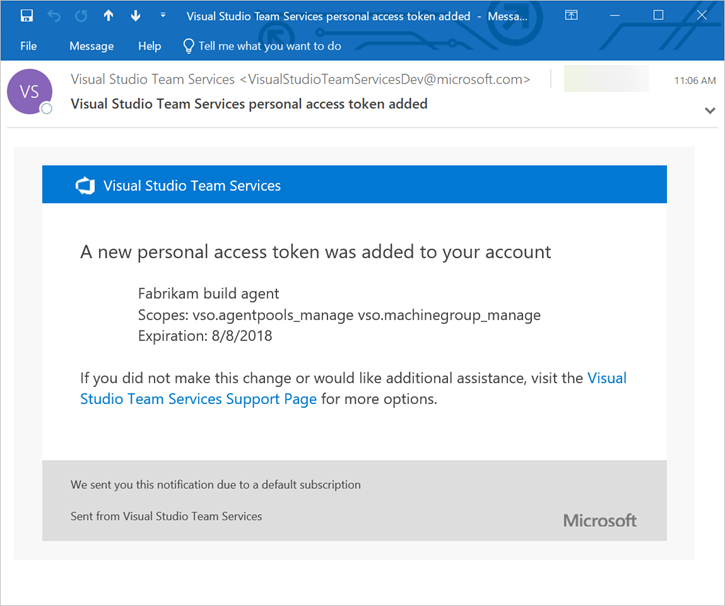
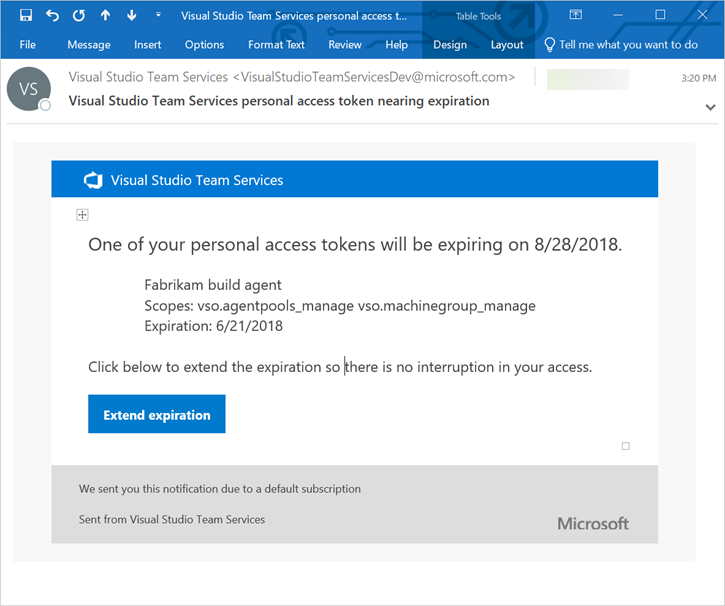

# Authenticate access with personal access tokens for VSTS and TFS

[!INCLUDE [version-tfs-2017-through-vsts](../../_shared/version-tfs-2017-through-vsts.md)]

Visual Studio Team Services (VSTS) and Team Foundation Server (TFS) use enterprise-grade authentication, backed by Microsoft account or Azure Active Directory (Azure AD), to protect and secure your data.  Clients like Visual Studio and Eclipse (with the Team Explorer Everywhere plug-in)
natively support Microsoft account and Azure AD authentication, so you can directly use those authentication methods to sign in.

For non-Microsoft tools that integrate into VSTS but do not support Microsoft account or Azure AD authentication
interactions (for example, Git, NuGet, or Xcode), you need to set up personal access tokens by using [Git credential managers](../../repos/git/set-up-credential-managers.md) or by creating PATs manually (see below).  You can also use personal access tokens when there is no "pop up UI" such as with command-line tools, integrating tools or tasks into build pipelines, or using  [REST APIs](../../integrate/get-started/rest/basics.md).

Personal access tokens essentially are alternate passwords that you create in a secure way using your normal authentication, and PATs can have expiration dates, limited scopes (for example, only certain REST APIs or command line operations are valid), and specific VSTS organizations.  You can put them into environment variables so that scripts do not hard code passwords.  For more information, see [Authentication overview](../../repos/git/auth-overview.md) and  [scopes](../../integrate/get-started/authentication/oauth.md#scopes).

[!INCLUDE [personal-access-tokens-procedure](../../repos/git/_shared/personal-access-tokens.md)]

## Using PATs

For example using PATs, see using [Git credential managers](../../repos/git/set-up-credential-managers.md), [REST APIs](../../integrate/get-started/rest/basics.md), [NuGet on a Mac](../../package/nuget/consume.md#mac-os), and [Reporting clients](../../report/analytics/client-authentication-options.md#enter-credentials-within-a-client).

## Frequently asked questions (FAQ)  

### Q: What is my Visual Studio Team Services URL?

**A:** https://{yourorganization}.visualstudio.com, for example.

### Q: What notifications may I receive regarding my PAT?

**A:** Users will receive two notifications during the lifetime of a PAT, one at creation and the other 7 days approaching the expiration.

PAT creation

PAT nearing expiration

### Q: What do I do if I believe that someone other than me is creating access tokens on my organization?

**A:** If you receive a notification of a PAT being created and you're unaware of what caused this, there are a number of actions that may have automatically create a PAT on your behalf, for example:

- Connecting to a VSTS git repo using git.exe.  This creates a token with a display name like "git: https://MyOrganization.visualstudio.com/ on MyMachine".
- Setting up an Azure App Service web app deployment.  This creates a token with a display name like "Service Hooks :: Azure App Service :: Deploy web app".
- Setting up web load testing as part of a pipeline.  This creates a token with a display name like "WebAppLoadTestCDIntToken".

If you still believe a PAT was created in error, we suggest [revoking the PAT](../../integrate/get-started/authentication/PATs.md). The next step would be to investigate whether or not your password has been compromised; changing your password is always a good first step to defend against this attack vector. If you’re an Azure Active Directory user, talk with your administrator to check if your organization was used from an unknown source/location.  

