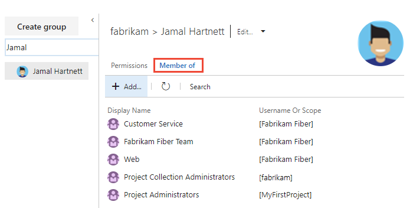
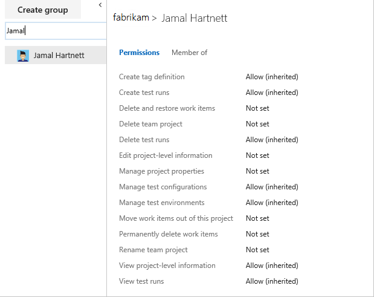

# View permissions for yourself or others

[!INCLUDE [temp](../../_shared/version-vsts-tfs-all-versions.md)]

You can view your permissions or those defined for another which have been set in Visual Studio Team Services (VSTS) or Team Foundation Server (TFS). That way, if you don't have the permission to access a feature or function, you can request it from the right resource.

Permissions are set at the collection, project, and object level as described in [About permissions and groups](about-permissions.md). So to view the permissions you have, you need to open the permissions at the object, project, or collection level.

## Prerequisites

* You must have a team project to connect to. If you don't have a team project yet, [create one](../projects/create-project.md).
* You must be a member of the Project Valid Users Group or Project Collection Valid Users Group to view permissions.

> [!NOTE]
> This article shows how to view permissions assigned to a user as the project-level. However, the steps are similar whether you work from the Security dialog of an object or at the organization or collection-level.

## View project-level permissions

[!INCLUDE [temp](../../_shared/new-navigation.md)] 

# [New navigation](#tab/new-nav)

::: moniker range="vsts"  

0. Choose **Project Settings** and then **Security**.

	

2. Begin typing the name into the *Filter users and groups* box. The system will automatically show the names that begin with the characters you type.  

	> [!div class="mx-imgBorder"]
	>   

3. Choose the name you want. The project-level permissions you have set are based on the groups you belong to or those specifically set for your account.      

	> [!div class="mx-imgBorder"]
	>   

4. Choose **Member of** to see which security groups the user belongs to.  

	Here we see that *Jamal Hartnett* belongs to several teams as well as the Project Collection Administrators group. 

	> [!div class="mx-imgBorder"]
	>   

::: moniker-end  

::: moniker range=">= tfs-2013  <= tfs-2018"  
[!INCLUDE [temp](../../_shared/new-navigation-not-supported.md)]  
::: moniker-end  

# [Previous navigation](#tab/previous-nav)

1. Open **Project Settings**. Choose the  gear settings icon, and choose **Security**. 

	> [!div class="mx-imgBorder"]
	> 

2. Begin typing the name into the *Filter users and groups* box. The system will automatically show the names that begin with the characters you type.  

	::: moniker range="vsts"  
	> [!div class="mx-imgBorder"]
	>   
	::: moniker-end  
	::: moniker range=">= tfs-2013  <= tfs-2018"  
	
	::: moniker-end  

3. Choose the name you want. The project-level permissions you have set are based on the groups you belong to or those specifically set for your account.      

	::: moniker range="vsts"  
	> [!div class="mx-imgBorder"]
	>   
	::: moniker-end  
	::: moniker range=">= tfs-2013  <= tfs-2018"  
	> [!div class="mx-imgBorder"]
	>   
	::: moniker-end  

	For a description of each permissions, see [Permissions and groups reference](permissions.md#project-level). 

4. Choose **Member of** to see which security groups the user belongs to.  

	Here we see that *Jamal Hartnett* belongs to several teams as well as the Project Collection Administrators group. 

	    

	For a description of each group, see [Permissions and groups reference](permissions.md#project-level-groups). 

---

## View collection-level permissions 

1. Open the admin context for the organization or collection. Choose the  gear settings icon, and then **Security**. 

2.  Follow steps 2 through 4 in the procedure outlined previously for view project-level permissions. 

## View object-level permissions 

You can define the security or permissions for a number of objects. You access them from the context menu of the object. 

From the web portal, open the Security dialog for the object whose permissions you want to set. For specific instructions, see the following articles: 

> [!div class="mx-tdBreakAll"]  
> |Wiki & Dashboard permissions | DevOps permissions  |Agile/Work tracking permissions |  
> |-------------|----------|---------|   
> |- [README & Wiki](../../project/wiki/manage-readme-wiki-permissions.md) - [Dashboards](../../report/dashboards/dashboard-permissions.md)  |- [Git branch](../../repos/git/branch-permissions.md) - [Git repository](set-git-tfvc-repository-permissions.md) - [TFVC](set-git-tfvc-repository-permissions.md) - [Builds](../../pipelines/policies/set-permissions.md) - [Release pipeline security](../../pipelines/policies/set-permissions.md) - [Approvals and approvers](../../pipelines/release/approvals/index.md) |- [Area and iteration paths](../../organizations/security/set-permissions-access-work-tracking.md) - [Work item query and folder](../../work/track/set-query-permissions.md) - [Plan permissions](set-permissions-access-work-tracking.md#plan-permissions)|  

## Next steps

> [!div class="nextstepaction"]
> [Look up the organization owner or a project administrator](lookup-organization-owner-admin.md) 

