# Add a team, move from one default team to several teams

[!INCLUDE [temp](../../_shared/version-vsts-tfs-all-versions.md)]

As your organization grows, you'll want to make sure that you configure your Agile tools to support that growth. To enable each feature team the autonomy it needs to manage their backlog and plan their sprints, they need their own set of team tools. For more information about features assigned to teams, see [About teams and Agile tools](about-teams-and-settings.md). 

> [!NOTE]    
> This article describes how to add a team or team members to a project defined in Visual Studio Team Services (VSTS) or Team Foundation Server (TFS). To learn about Microsoft Teams, see the Marketplace extension, [Microsoft Teams Integration](https://marketplace.visualstudio.com/items?itemName=ms-vsts.vss-services-teams). 
>
> For a good understanding on how to remain Agile as you add teams, review the [Scale Agile to Large Teams](/azure/devops/agile/scale-agile-large-teams) article.

<!---
In this topic you'll learn:  

>[!div class="checklist"]    
> * How to add a team, moving from one team to two teams   
> * How to add team members  
> * How to move work items assigned to one team to another team  
> * How to delete a team      
> * Additional permissions you may want to grant team members    
-->

  

As your team grows, you can easily move from one team to two. In this example, we add two feature teams, Email and Voice, and maintain the Fabrikam Fiber team with visibility across each of these two teams.  

## Prerequisites 

- If you don't have a project yet, [create one](../projects/create-project.md).  
- If you're not a project administrator, [get added as one](../../organizations/security/set-project-collection-level-permissions.md). Only members of the Project Administrators group or those who have been [granted explicit permissions to edit project information](../security/set-project-collection-level-permissions.md) can add and delete teams.   

## Add two feature teams 

Add and configure two teams, Email and Voice. Here we show you how to add and configure the Email team. 

[!INCLUDE [temp](../../_shared/new-navigation.md)]  

# [New navigation](#tab/new-nav)  
::: moniker range="vsts"

0. From the web portal, choose **Project settings** and open **Teams**. 

	> [!div class="mx-imgBorder"]
	> 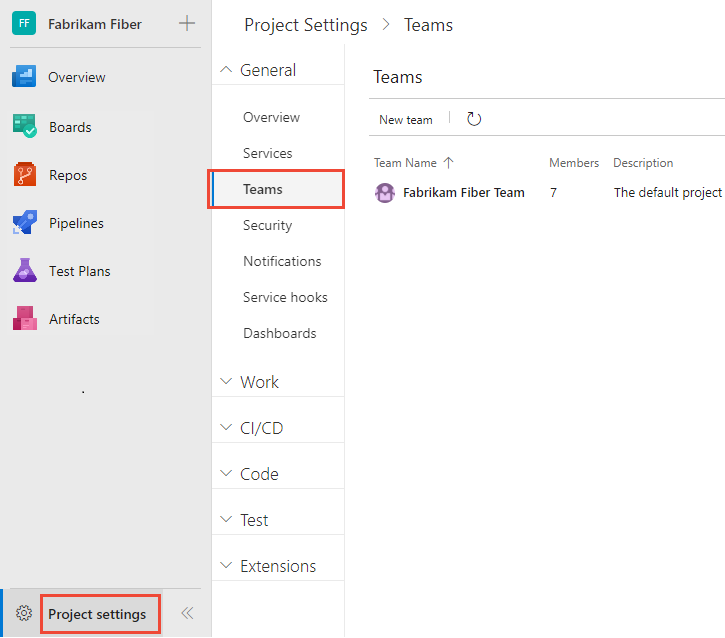 

0. Choose **New team**. Give the team a name, and optionally a description. 

	> [!div class="mx-imgBorder"]
	> 

0. Select the team to configure it. To select the set of sprints and area paths the team will use, choose **Iterations and areas** See [Set team defaults](set-team-defaults.md).

	> [!div class="mx-imgBorder"]
	> 

	> [!IMPORTANT]  
	> Team tools aren't available until the team's default area path is set. If you haven't created one or more Area Paths for the team to use, then [do that now](set-area-paths.md). Area Paths must be created for the project first, then assigned to the team. 

	From the team profile, you can perform these additional tasks:  
	- [Add team administrators](add-team-administrator.md)  
	- [Add team members](#add-team-members)  
	- [Navigate to team notifications](../../notifications/howto-manage-team-notifications.md)
	- [Navigate to and set default team dashboard permissions](../../report/dashboards/dashboard-permissions.md)  

	To configure other team features, see [Configure team settings](configure-team-settings.md).

::: moniker-end

::: moniker range=">= tfs-2013  <= tfs-2018"
[!INCLUDE [temp](../../_shared/new-navigation-not-supported.md)]  
::: moniker-end

# [Previous navigation](#tab/previous-nav)  

::: moniker range=">= tfs-2017"

<a id="add-team-team-services" /> 

0. From the web portal, choose the  gear settings icon to open the **Project settings** page for the project.  

	 

0. Choose **New team**. Give the team a name, and make sure to select **Create an area path with the name of the team**. If you do not select this option, you will have to set the default area path for the team once you create it. You can choose an existing area path or create a new one at that time. Team tools aren't available until the team's default area path is set. 

	

0. Select the team to configure it. 

	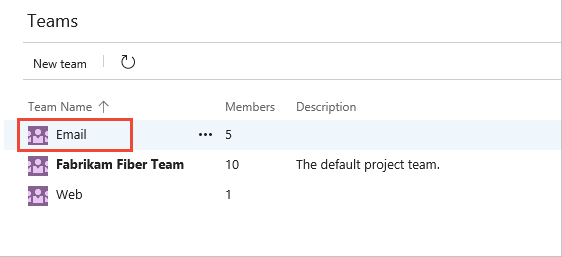

	The Team Profile opens. From the team profile, you can [Add team members](#add-team-members) and [Add team administrators](add-team-administrator.md).

	  

0. To select the set of sprints and area paths the team will use, see [Set team defaults](set-team-defaults.md).

	> [!IMPORTANT]  
	> Team tools aren't available until the team's default area path is set. 

	To configure other team features, see [Configure team settings](configure-team-settings.md).

::: moniker-end  

::: moniker range=">= tfs-2013  <= tfs-2015"
<a id="add-team-tfs-2015" />

1. From the web portal, choose the  gear settings icon to open **Project Settings.**  

	

2. Create a new team. Give the team a name, and make sure to select **Create an area path with the name of the team**. 

	If you do not select this option, you will have to set the default area path for the team once you create it. You can choose an existing area path or create a new one at that time. Team tools aren't available until the team's default area path is set. 

	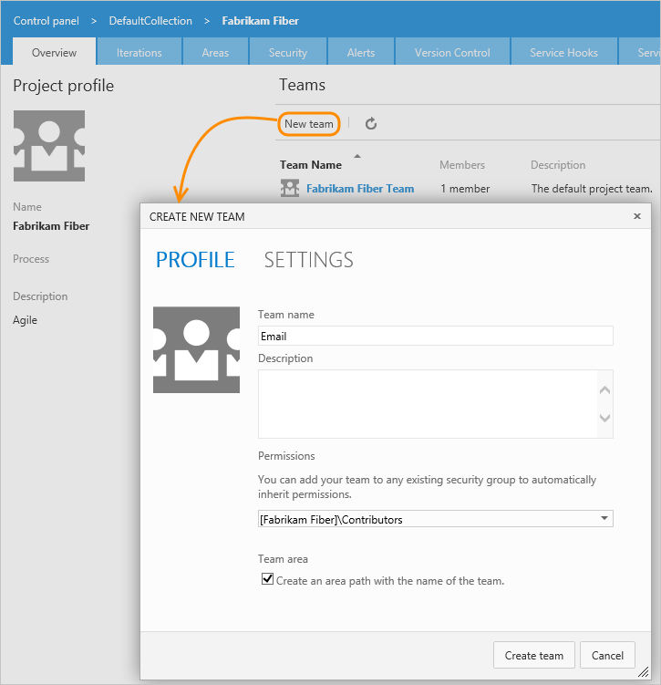

3. Select the team from the Overview tab to configure it.  

	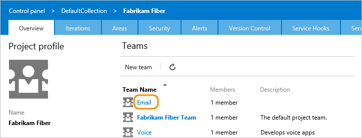

4. To select the set of sprints the team will use, open the **Iterations** page for the team. See [Set team defaults, Select team sprints and default iteration path](set-team-defaults.md#activate).  

5. To change the area paths that the team will reference, open the **Areas** page. See [Set team defaults, Set team default area path(s)](set-team-defaults.md#team-area-paths).  
 
::: moniker-end   

---

  

## Add team members
If you're moving from one team to two teams, team members already have access to the project. If you're setting up a team structure for the first time, adding user accounts as team members provides them access to the project and team assets. Access to the project is required to support sharing code and planning and tracking work. 

Several Agile tools, like capacity planning and team alerts, and dashboard widgets are team-scoped. That is, they automatically reference the user accounts of team members to support planning activities or sending alerts. 

::: moniker range="vsts"  
> [!NOTE]   
> You must first [add user to a project or to your organization](../accounts/add-organization-users-from-user-hub.md) or [setup your account to work with Azure AD](../accounts/access-with-azure-ad.md). This way users will be available to add to a team.
::: moniker-end 

::: moniker range=">= tfs-2013 <= tfs-2018"  
> [!NOTE]   
> The first time you add a user account, you must enter the full domain name and the alias. Afterwards, you can browse for that name by display name as well as account name. To learn more, see [Set up groups for use in TFS deployments](/tfs/server/admin/setup-ad-groups).
::: moniker-end 

For details, see [Add users to a project or specific team](../security/add-users-team-project.md). 

## Move work items under teams 
Now that your two feature teams are configured, you'll want to move existing work items from their current assignments to the team's default area path. This way, the work items will show up on each team's backlog. 

1.	The quickest way to do this, is to [create a query](../../work/track/using-queries.md) of all work items you want to reassign, multi-select those items belonging to each team, and [bulk edit the area path](../../work/backlogs/bulk-modify-work-items.md). 

	::: moniker range="vsts"  
	> [!div class="mx-imgBorder"]  
	>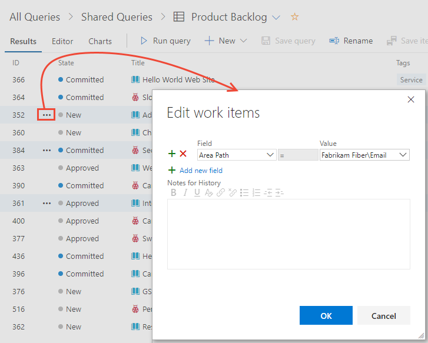
	::: moniker-end  
	::: moniker range=">= tfs-2013  <= tfs-2018"  
	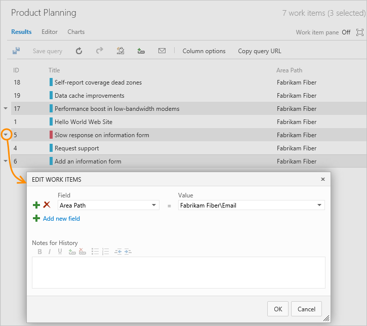
	::: moniker-end  
2.	After you bulk modify, do a bulk save.  

	::: moniker range="vsts"  
	> [!div class="mx-imgBorder"]  
	>
	::: moniker-end  
	::: moniker range=">= tfs-2013  <= tfs-2018"  
	  
	::: moniker-end  

  

## Configure the default project team 
One last step in moving from one team to two teams requires configuring the default project team to exclude sub-areas.  

# [New navigation](#tab/new-nav)

::: moniker range="vsts"  
0. Open **Project Settings>Team Configuration** settings page for the default project team, and change the setting as shown.  
	> [!div class="mx-imgBorder"]  
	> 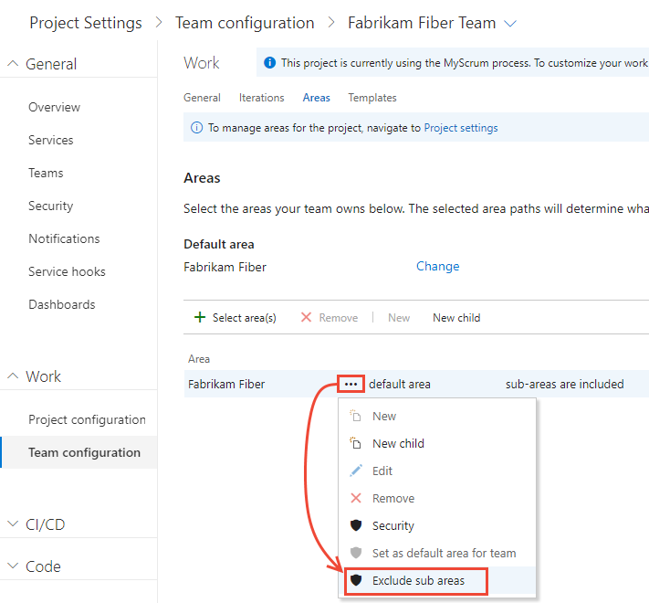  

0.	Refresh the product backlog page for the team, and you'll see only those work items assigned to the *Fabrikam Fiber* area path.  

	> [!div class="mx-imgBorder"]  
	> 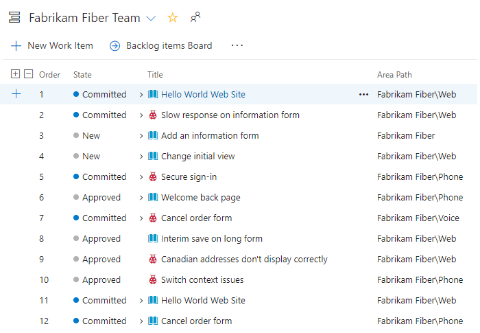

::: moniker-end  

::: moniker range=">= tfs-2015  <= tfs-2018"  
[!INCLUDE [temp](../../_shared/new-navigation-not-supported.md)]  
::: moniker-end  

# [Previous navigation](#tab/previous-nav)

::: moniker range=">= tfs-2017"  
0. Open the **Work>Areas** settings page for the default project team, and change the setting as shown.  

	> [!div class="mx-imgBorder"]  
	>   

0.	Refresh the product backlog page for the team, and you'll see only those work items assigned to the *Fabrikam Fiber* area path.  

	> [!div class="mx-imgBorder"]  
	>   

::: moniker-end  

::: moniker range=">= tfs-2013  <= tfs-2015"  
0. Open the **Areas** settings page for the default project team, and change the setting as shown.  

	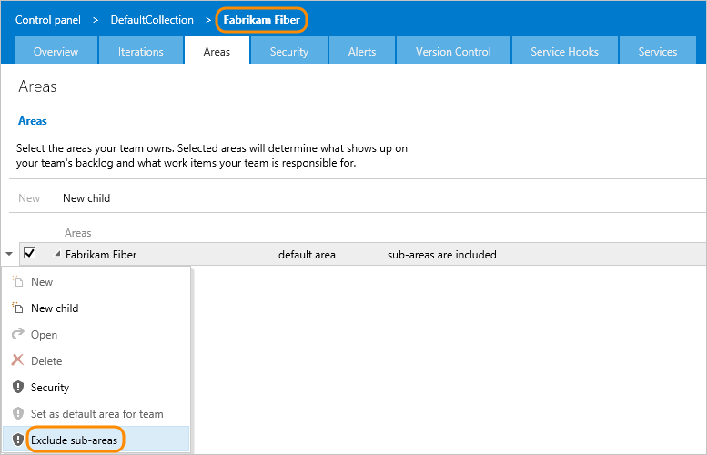  

0.	Refresh the product backlog page for the team, and you'll see only those work items assigned to the *Fabrikam Fiber* area path.  

	  

::: moniker-end  

--- 

## Delete a team 

# [New navigation](#tab/new-nav)

::: moniker range="vsts"  

0. To delete a team, open **Project Settings>Teams**, choose the &hellip; context menu for the team you want to delete, and select the **Delete** option.   
	> [!div class="mx-imgBorder"]  
	> 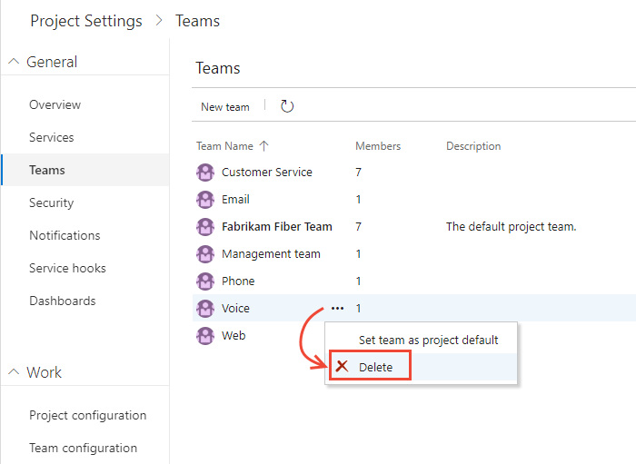  

	> [!IMPORTANT]   
	> Deleting a team deletes all team configuration settings, including team dashboards, backlogs, and boards. Data defined for work items assigned to the team are left unchanged. Once deleted, you can't recover the team configurations. 

2. To complete the delete operation, you must type the name of the WIT as shown. 

	

::: moniker-end  

::: moniker range=">= tfs-2013  <= tfs-2018"  
[!INCLUDE [temp](../../_shared/new-navigation-not-supported.md)]  
::: moniker-end  

# [Previous navigation](#tab/previous-nav)

::: moniker range=">= tfs-2013"  

1. To delete a team, open **Project Settings>Work>Overview**, choose the &hellip; context menu for the team you want to delete, and select the **Delete** option.   

	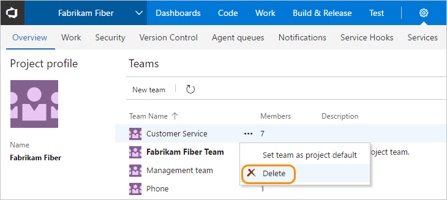
 
	> [!IMPORTANT]   
	> Deleting a team deletes all team configuration settings, including team dashboards, backlogs, and boards. Data defined for work items assigned to the team are left unchanged. Once deleted, you can't recover the team configurations. 

2. To complete the delete operation, you must type the name of the WIT as shown. 

	

::: moniker-end  

---

  

## Grant team members additional permissions  

For teams to work autonomously, you may want to provide them with permissions that they don't have by default. Suggested tasks include providing team administrators or team leads permissions to:  

- Create and edit child nodes under their default area path
- Create and edit child nodes under an existing iteration node 
- Create shared queries and folders under the Shared Queries folder

For more information on setting the above permissions or restricting access for select users, see [Set permissions and access for work tracking](../security/set-permissions-access-work-tracking.md).

::: moniker range="tfs-2018" 

If your TFS deployment is integrated withSQL Server Reports, you'll need to [Grant permissions to view or create SQL Server reports to team members](../../report/admin/grant-permissions-to-reports.md). 

::: moniker-end 

::: moniker range=">= tfs-2013 <= tfs-2017" 

If your TFS deployment is integrated with a SharePoint product or SQL Server Reports, you'll need to manage membership for those products separately from their websites. 

-  [Set SharePoint site permissions](../security/set-sharepoint-permissions.md) 
-  [Grant permissions to view or create SQL Server reports in TFS](../../report/admin/grant-permissions-to-reports.md). 

::: moniker-end 

## Try this next 

Once you've created a team, you'll want to configure your Agile tools to support how your team works. Also, consider adding one or more users as team administrators. Team admins have the necessary permissions to add team members, add a picture to the team profile , and configure and manage all team features.  

> [!div class="nextstepaction"]
> [Add team administrator](add-team-administrator.md)
> or
> [Configure team settings](configure-team-settings.md)

