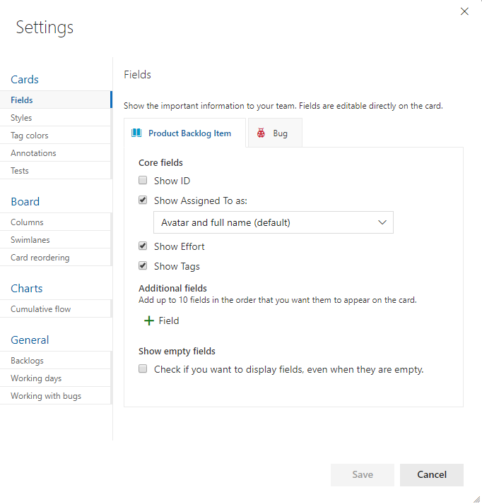

# Configure team settings 

[!INCLUDE [temp](../../_shared/version-vsts-tfs-all-versions.md)]

<!--- Still needs work, versioning, and other team settings from the admin context, add something about something, team-specific widgets--> 

Within a project, you [add teams](add-teams.md) to support the needs of several feature teams, or an enterprise organized to deliver different products. Each team is then able to configure the Agile tools the way that works for their team, supporting each team to collaborate most effectively in planning and managing their work.  

As a team administrator, you can configure, customize, and manage all team-related activities for your team. These include being able to add team members, add team admins, and configure Agile tools. Members of the Project Administrators group can manage all team-related activities for all teams. 

Team admin permissions are role-based, unlike permissions that are assigned to a security group or set individually for a user.  Also, because team administrators are members of the Contributor role they have permissions assigned to that role.  

You can configure most of your team settings from the common configuration dialog. 

::: moniker range="tfs-2015"  

> [!NOTE]
> **Feature availability:** The common configuration dialog is available for TFS 2015.1 and later versions.  

::: moniker-end 

[!INCLUDE [temp](../../_shared/new-navigation.md)]  

# [New navigation](#tab/new-nav)  

::: moniker range="vsts"  

0. Make sure that you select the team backlog or board that you want to configure using the team selector. To learn more, see [Use breadcrumbs and selectors to navigate and open artifacts](../../project/navigation/use-breadcrumbs-selectors.md). 

0. Choose the product or portfolio backlog from the board-selection menu. 
	> [!div class="mx-imgBorder"]
	> 

0. Choose the  gear icon to configure the board and set general team settings.  

	> [!div class="mx-imgBorder"]
	>   

0. Choose a tab under any of the sections&mdash;**Cards**,**Board**, **Charts**, and **General**&mdash;to configure the cards or boards, the cumulative flow chart, or other team settings.   

	> [!div class="mx-imgBorder"]
	> 

::: moniker-end  

::: moniker range=">= tfs-2015  <= tfs-2018"  
[!INCLUDE [temp](../../_shared/new-navigation-not-supported.md)]  
::: moniker-end  

# [Previous navigation](#tab/previous-nav)  

0. Make sure that you select the team from the project/team selector. You can switch your team focus to one that you've recently viewed from the project/team selector. If you don't see the team or project you want, choose **Browse&hellip;** or choose the  VSTS icon to [access the **Projects** page](../../project/navigation/work-across-projects.md).  

	

1. Open the board you want to configure and then choose the  gear icon to configure the board and set general team settings.  

	For example, from the Kanban board ...  

	::: moniker range=">= tfs-2017"  
	> [!div class="mx-imgBorder"]
	> 
	::: moniker-end  
	::: moniker range="tfs-2015"  
	
	::: moniker-end  
2. Choose a tab under **Cards** or **Board** to configure the cards and Kanban board columns and swimlanes.  

	::: moniker range=">= tfs-2017"  
	
	::: moniker-end  
	::: moniker range="tfs-2015"  
	
	::: moniker-end 

---

For details on each configuration option, see one of these topics:  

> [!div class="mx-tdBreakAll"]  
> |Cards  | Boards  | Charts & widgets |  General  | 
> |-------------|----------|---------|---------|   
> |- [Fields](../../boards/boards/customize-cards.md) - [Styles](../../boards/boards/customize-cards.md#style-rule) - [Tag colors](../../boards/boards/customize-cards.md#color-tags) - [Annotations](../../boards/boards/customize-cards.md#annotations) - [Tests](../../boards/boards/customize-cards.md#tests) |- [Columns](../../boards/boards/add-columns.md) - [Swimlanes](../../boards/boards/expedite-work.md) - [Card reordering](../../boards/boards/reorder-cards.md) |- [Cumulative flow chart & widget](../../report/dashboards/cumulative-flow.md#configure) - [Lead & Cycle time widgets](../../report/dashboards/cycle-time-and-lead-time.md)  - [Team-scoped widgets](../../report/dashboards/widget-catalog.md)   - [Velocity chart and widget](../../report/dashboards/velocity-chart-data-store.md) |- [Backlogs](select-backlog-navigation-levels.md) - [Working days](../../boards/boards/expedite-work.md) - [Working with bugs](show-bugs-on-backlog.md) |

## Team name, description, and picture

Team settings also include the team name, description, and team profile image.  

To add a team picture. Open the Team Profile and choose the picture icon. The maximum file size is 4 MB. 

## Related articles 

To create additional teams, see [Add teams](add-teams.md).  

If team members don't have access to all the features they want, check that they have [the permissions needed for those features](../security/set-permissions-access-work-tracking.md).  

To favorite team artifacts, see [Set personal or team favorites](../../project/navigation/set-favorites.md). 

To define work item templates for a team, see [Use templates to add and update work items](../../boards/backlogs/work-item-template.md).
