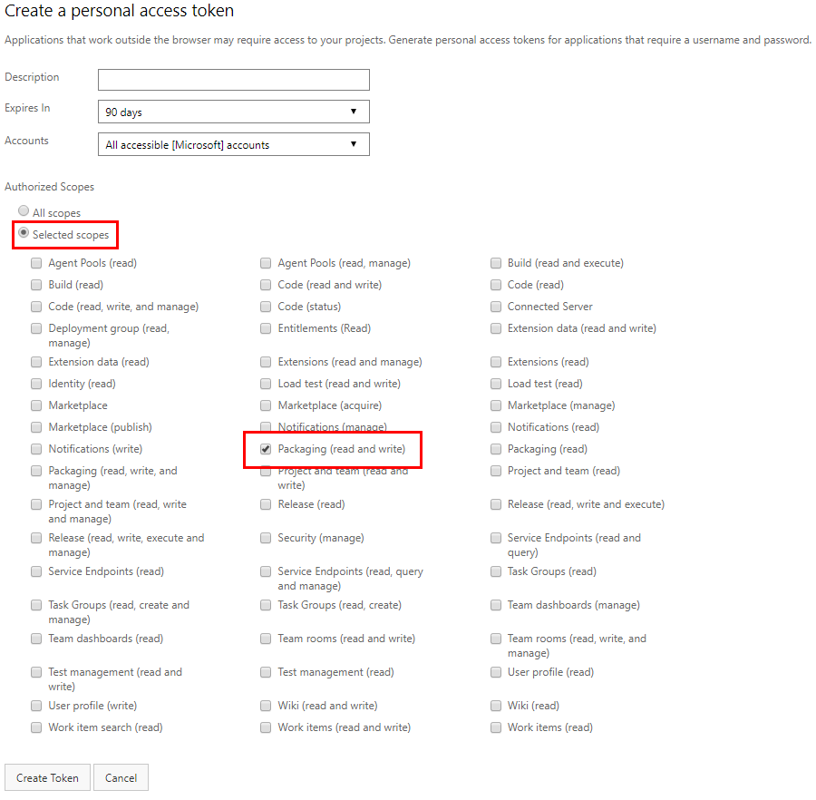

# Publish a Maven artifact using Gradle

**VSTS** | **TFS 2018**

This topic covers creating and publishing a Maven artifact with Gradle using Visual Studio Team Services (VSTS).

## Prerequisites

Before you start, [install the Gradle build tool](https://gradle.org/install/). Note that Gradle itself requires a prior installation of the Java JDK or JRE (version 7 or later). You can [get the Java JDK here](http://www.oracle.com/technetwork/java/javase/downloads/index.html).

From a command prompt, verify that you have the Java JDK or JRE version 7 or later:

```cli
java -version
```

And then install Gradle. Once it completes, confirm the installation from a command prompt:

```cli
gradle -v
```

You're ready to start! This tutorial will guide you through the process of publishing a Maven artifact using Gradle.

> [!NOTE]
> This topic assumes you have cloned your Git repo to your local machine. If you aren't sure how to clone your repo, read [Clone a repo](/vsts/repos/git/clone).

## Set up authentication

First, you need a **gradle.properties** file that contains a VSTS credential token.

Navigate to `https://{yourAccount}.visualstudio.com/_details/organizations/security/tokens`, where `{yourAccount}` is the name of your VSTS account.

Click **Add**.


Give your new token a name and a duration. 

Select the **Packaging (read and write)** scope.



The token will be a long alphanumeric string, like "lzitaoxppojf6smpl2cxdoxybepfxfetjvtkmcpw3o6u2smgebfa". Copy this string and treat it securely.

Now, go to the `.gradle` folder under the Gradle installation root directory. Typically, this is `%INSTALLPATH%/gradle/user/home/.gradle/`. In that folder, create a file named **gradle.properties**. 

Open the **gradle.properties** file with a UTF-8-capable text editor and add the following:
```
vstsMavenAccessToken=YOUR_TOKEN_HERE
```

Where *YOUR_TOKEN_HERE* is the token string you created previously. Save the file when you're done.

## Configure build.gradle 

Create a file called **build.gradle** in the root of your cloned (local) repo. Open it with a UTF-8-capable text editor and add the following code:

```text
apply plugin: 'java' 
apply plugin: 'maven-publish' 
 
publishing { 
    publications { 
        myPublication(MavenPublication) { 
            groupId '{your-group-ID-here}' 
            artifactId '{your-artifact-id-here}' 
            version '{your-version-number-here}' 
            artifact '{path-to-your-JAR-file-here}' 
        } 
    } 

    // Repositories *to* which Gradle can publish artifacts 
    repositories { 
        maven { 
            url 'https://{your-VSTS-account-name-here}.pkgs.visualstudio.com/_packaging/{your-VSTS-project-name-here}' 
            credentials { 
                username "VSTS" 
                //The VSTS build system will use the "VSTS_ENV_ACCCESS_TOKEN" to authenticate to VSTS feeds 
                password System.getenv("VSTS_ENV_ACCESS_TOKEN") != null ? System.getenv("VSTS_ENV_ACCESS_TOKEN") : vstsMavenAccessToken 
            } 
        } 
    } 
} 
 
// Repositories *from* which Gradle can download dependencies; it's the same as above in this example
repositories { 
    maven { 
        url 'https://{your-VSTS-account-name-here}.pkgs.visualstudio.com/_packaging/{your-VSTS-project-name-here}' 
        credentials { 
            username "VSTS" 
            //The VSTS build system will use the "VSTS_ENV_ACCCESS_TOKEN" to authenticate to VSTS feeds 
            password System.getenv("VSTS_ENV_ACCESS_TOKEN") != null ? System.getenv("VSTS_ENV_ACCESS_TOKEN") : vstsMavenAccessToken 
        } 
    } 
} 
```
In the above example, you are publishing artifacts and downloading dependent artifacts from the same VSTS account. You can configure
publishing and downloading to use separate VSTS accounts, if you prefer.

Replace the following fields with your own values:

- `groupId`: A group ID you associate with your artifact. Give it a team or organization name so consumers can identify the origin easier.
- `artifactId`: An artifact ID used when publishing your artifact. Again, give it a meaningful name that aptly describes the intent of the APIs in the artifact.
- `version`: The version of the artifact you're publishing. Update this when you've made changes.
- `artifact`: The path from the root of the repo to the JAR file that is the artifact to publish. For example, *./target/myJavaClasses.jar*.


## Publish your Gradle artifact

From a command prompt, run:

```cli
gradle publish
```

Your new artifact name is `groupId:artifactId`.
