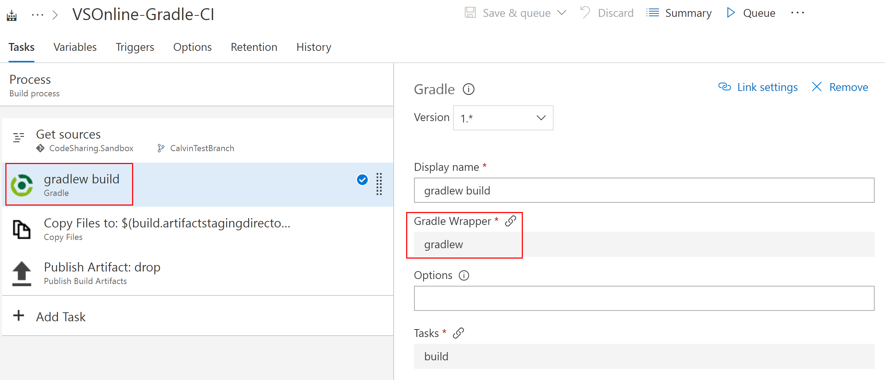

[//]: # (monikerRange: '>= tfs-2018')

# Install a Maven artifact using Gradle in a VSTS build

**VSTS** | **TFS 2018**

Gradle is a popular build tool for Java applications and the primary build tool for Android. Learn how to download a Maven artifact using Gradle during a VSTS build of your application.

## Prerequisites

Before you start, [install the Gradle build tool](https://gradle.org/install/). Note that Gradle itself requires a prior installation of the Java JDK or JRE (version 7 or later). You can [get the Java JDK here](http://www.oracle.com/technetwork/java/javase/downloads/index.html).

From a command prompt, verify that you have the Java JDK or JRE version 7 or later:

```cli
java -version
```

And then install Gradle. Once it completes, confirm the installation from a command prompt:

```cli
gradle -v
```

You're ready to start! This tutorial will guide you through the process of installing a Maven artifact using Gradle.

> [!NOTE]
> This topic assumes you have cloned your Git repo to your local machine. If you aren't sure how to clone your repo, read [Clone a repo](/vsts/git/tutorial/clone).

## Set up authentication

First, you need a **gradle.properties** file that contains a VSTS credential token.

Navigate to `https://{yourAccount}.visualstudio.com/_details/security/tokens`, where `{yourAccount}` is the name of your VSTS account.

Click **Add**.


Give your new token a name and a duration. 

Select the **Packaging (read and write)** scope.


The token will be a long alphanumeric string, like "lzitaoxppojf6smpl2cxdoxybepfxfetjvtkmcpw3o6u2smgebfa". Copy this string and treat it securely.

Now, go to the `.gradle` folder under the Gradle installation root directory. Typically, this is `%INSTALLPATH%/gradle/user/home/.gradle/`. In that folder, create a file named **gradle.properties**. 

Open the **gradle.properties** file with a UTF-8-capable text editor and add the following:
```
vstsMavenAccessToken=YOUR_TOKEN_HERE
```

Where *YOUR_TOKEN_HERE* is the token string you created previously. Save the file when you're done.

## Install a Maven artifact using Gradle

Open your **build.gradle** file and confirm that the following text is present at the top of it:
```
apply plugin: 'java'
```

Now, add the following code to the end of your **build.gradle** file. Use the `groupId`, `artifactId`, and `version` you supplied in the previous step.

```
dependencies { 
    compile(group: '{your-group-ID-here}', name: '{your-artifact-ID-here}', version: '{your-version-number-here}')  
} 
```   
For example: `compile(group: 'siteOps', name: 'odata-wrappers', version: '1.0.0.0')

This tells `gradle build` to download the artifact you created prior, which is effectively named `orgId:artifactId`, and that it should be applied to the app named in the dependencies. 

To test this, create a simple Java code file and build it with Gradle. You can use this code to test:

```java
package

public class HelloWorld { 
    public static void main(String[] args) { 
        System.out.println("Hello, world!"); 
    } 
} 
```

Build the code by running Gradle from a command prompt:

```cli
gradle build
```

If the build is successful, you will see `BUILD SUCCESSFUL` displayed when it completes.

## Configure your build to install Maven artifacts using Gradle

Run the following from a command prompt:

```cli
gradle wrapper
```

The Gradle wrapper is created in the directory where you ran the above command. The wrapper's file name is **gradlew**. Do not rename this file.

`git push` an update that contains the wrapper (gradlew) from your cloned (local) repo to `origin`. Team Build requires this file on the remote repo for Gradle to build your project.

Go to the **Build and Release** hub for your project, and then select **Builds**.

Select the **+ New** button. Scroll down and select the **Gradle** template.


Select **Apply** to start configuring the build to use your Gradle wrapper.

Now, select the **gradlew build** step. You can use the default settings to start.



Here, you can configure various Gradle tasks to run during the build.  Once you've configured the build definition, click **Save & queue** from the top menu and start building with your Gradle wrapper. You're done!
