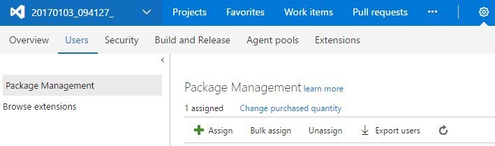

# Purchase and assign Package Management licenses

**VSTS** | **TFS 2018** | **TFS 2017**

Package Management is an *extension* to VSTS and TFS.  This means you'll need the Package Management extension installed in your account and have Package Management assigned to you in order to view, upload, and download packages.  

::: moniker range="vsts" 

## Install Package Management in VSTS

Package Management is now installed by default for Visual Studio Team Services (VSTS) accounts.

::: moniker-end

::: moniker range=">= tfs-2017 < vsts" 

## Install Package Management in TFS

Package Management is installed by default for TFS 2017 and newer.  You must upgrade to TFS 2017 in order to use Package Management.

::: moniker-end

::: moniker range="vsts" 

## Assign Package Management in VSTS

Each VSTS account gets five (5) free licenses, you will need to assign your licenses by following the instructions below:

1. Go to your account, select the **Users** hub, and select **Package Management**.
1. Select **Assign**, type the users you want to assign licenses to, then select **Ok.**

   > If you have a Visual Studio Enterprise license, you already have access to Package Management and don't need to be assigned a license, just ensure that you've been assigned the "Visual Studio Enterprise" access level.

::: moniker-end

::: moniker range=">= tfs-2017 < vsts" 

## Assign licenses in TFS

1. From any collection in TFS, hover over the settings menu and select the **Users** hub. Then select **Package Management**.

   

1. Select **Assign**, type the user(s) you want to assign licenses, then select **Ok.**

   * Users with Visual Studio Enterprise subscriptions get Package Management for free.  [Ensure that your Visual Studio Enterprise subscribers are assigned VSE access level](../security/change-access-levels.md).

   * Users using an instance of TFS disconnected from the internet (and thus unable to purchase licenses from the marketplace) can still assign licenses purchased through an enterprise agreement.

::: moniker-end

## Purchase additional licenses

Additional Package Management licenses can be purchased through the Marketplace.

<!-- BEGINSECTION class="md-qanda" -->

#### Q:  I am one of my account's 5 free Basic users. Does that mean I can use Package Management as well?

A:  Your account's 5 free Basic users are separate from your 5 free Package Management users. 
The free Package Management licenses must be assigned in the Package Management section of the Users hub.

#### Q: I have a Visual Studio Professional subscription. Can I use Package Management for free?

A: Unfortunately not. Only Visual Studio Enterprise subscriptions include Package Management.

<!-- ENDSECTION -->
