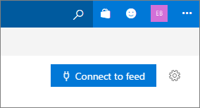
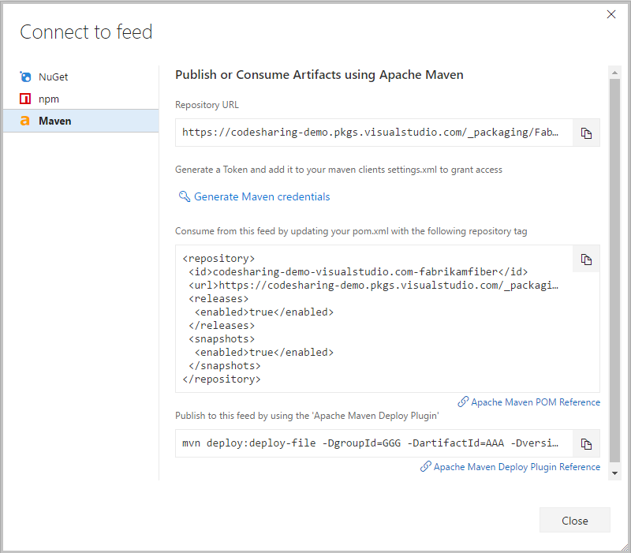
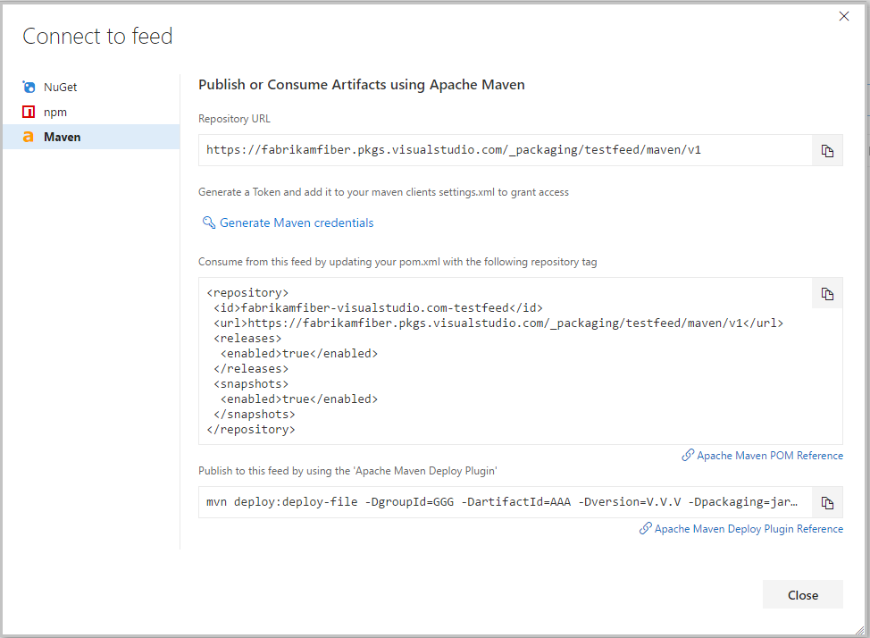

# Set up Maven client in Visual Studio Team Services and TFS

**Availability** 
Maven Package Management is available with **Visual Studio Team Services** and **TFS 2017 Update 3**.

1. Navigate to your feed. If you haven't created a feed, [create one now](../feeds/create-feed.md).
2. Select **Connect to feed**.
3. Select **Maven**.
4. Follow the steps on the screen.

### Team Services

### Team Foundation Server
