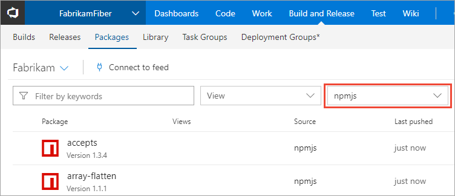

# Use packages from npmjs.com

**Availability** 
npm Package Management is available with **Visual Studio Team Services** and **TFS 2017 Update 1 and newer**.

The npm client is designed to work with a single primary *registry* (what Package Management calls a *feed*). It also supports secondary *scoped* registries. Scoped registries can only be used to install packages whose names begin with the scope prefix, so their usage is more restrictive. If you want to use both private packages you've created **and** public packages from npmjs.com, we recommend using upstream sources. 

## Upstream sources
Upstream sources allow you to merge the contents of npmjs.com into your feed such that the npm client can install packages from both locations.  Enabling upstream sources also automatically enables caching.
**This is the recommended way to use Package Management with npm.**
Upstreams give you the most flexibility to use a combination of scoped- and non-scoped packages in your feed, as well as scoped- and non-scoped packages from npmjs.com.

### Enable npmjs.com as an upstream
To enable npmjs.com as an upstream source on your feed, check the box in the Create Feed or Edit Feed dialog.

## Order and shadowing
When a feed with upstreams enabled receives a query (e.g. `npm install lodash`), it will first check for local packages with that package ID.
If there is at least one local version of that package ID, the upstream source will not be used.
So, for example, if you publish `lodash@1.0.0` and run `npm install lodash@2.0.0`, the request will fail, even if 2.0.0 exists on npmjs.com and upstream sources are enabled.

> [!NOTE]
> Shadowing is permanent. So, in the example above, even if you later unpublish `lodash@1.0.0`, requests for any `lodash` version will only check the local feed.

## Caching
When you enable npmjs.com as an upstream source, packages installed from npmjs.com will automatically be cached in your feed.These packages could be installed directly from the upstream (e.g. `npm install lodash`) or as dependencies of packages that reside in your feed. 

Caching can improve download performance and save network bandwidth, esp. for TFS servers located on internal/dedicated networks.

### Internet requirements
When you run an `npm install` command, the feed will check to see if it has a cache of the package(s) requested by the `npm` client. If it does not, it will redirect the client to download the package from npmjs.com directly, and also cache the package in the background. The first client (where client is a developer machine or a build agent) to install a given npm package **will** need Internet access to successfully retrieve the package *or* they will have to run `npm install` twice. The first install will fail but cause the package to be cached; the second install will return the package from the cache.

If you host your own build agents, they do not need access to the Internet for this feature. However, per the limitation above, a developer machine will need to first run `npm install` to cache the package(s) so that they're available to the build agents.

For TFS users, the TFS server must be able to access the `https://registry.npmjs.org` domain in order to cache packages.

### Filtering to cached packages
You can see the packages you have cached in your feed by selecting the "Source = npmjs.com cache" filter.

### No guarantee of caching
> [!NOTE]
> Right now, VSTS and TFS do not provide a guarantee that every package `npm installed` via a feed with upstreams enabled will be cached. 

Packages with malformed version numbers in their packages.json cannot be ingested into the feed, and thus must still be retrieved directly from npmjs.com. If npmjs.com goes down, you are not fully protected if you depend on these packages. 

In a future sprint, we'll be updating the upstreams feature to always cache and serve packages through the feed. In the rare case where a package cannot be cached, the install will fail (without redirecting to npmjs.com) so that you have full confidence that every package you use is cached by your feed.

## Scopes
If you prefer to use scopes, which limit your private packages to those with the `@<scope>` prefix e.g. `@fabrikam/core` but enable you to consume public packages **directly** from npmjs.com, see [Scopes](scopes.md).