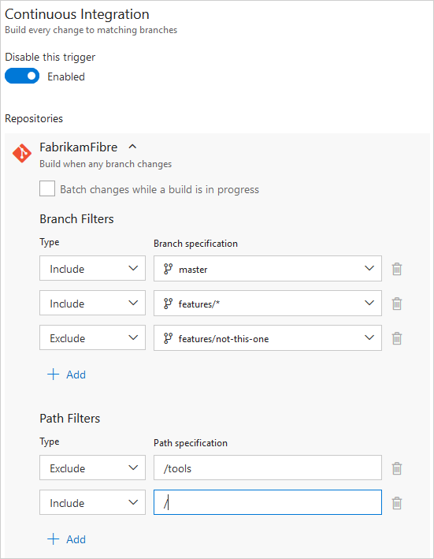
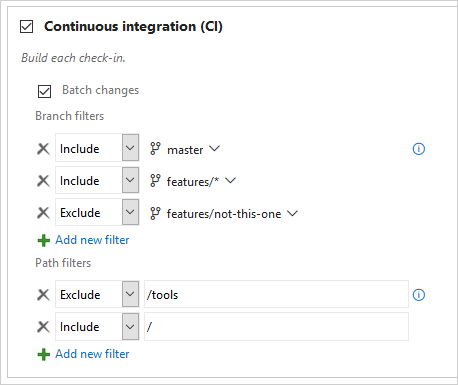
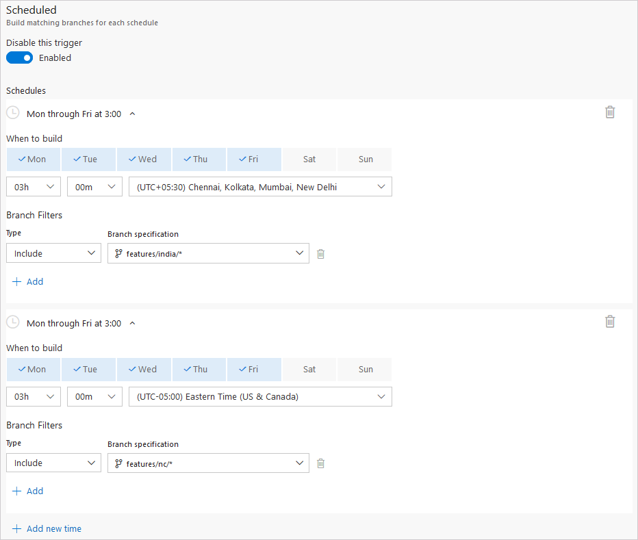
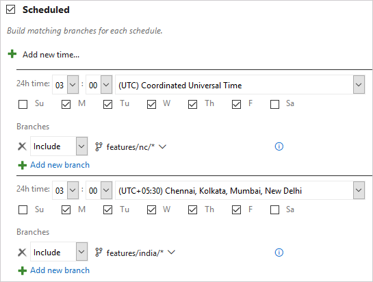
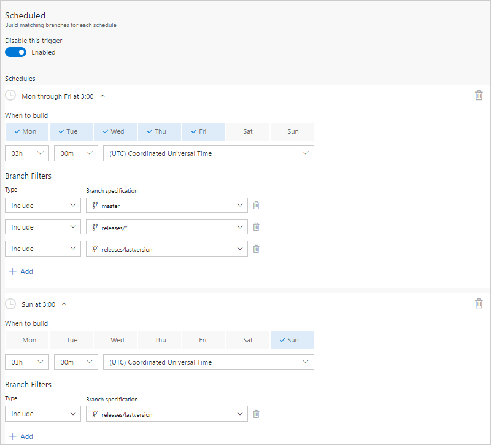
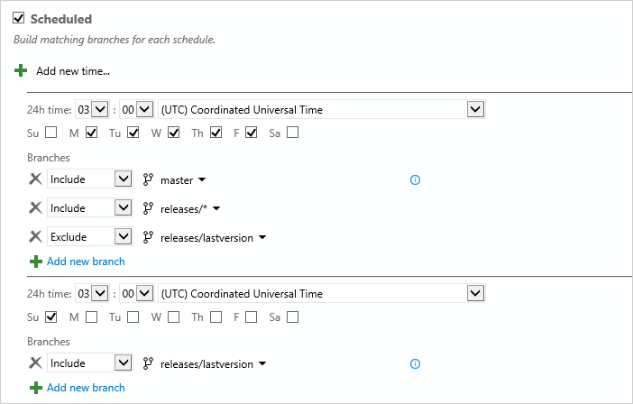

# Build pipeline triggers

**VSTS | TFS 2018 | TFS 2017 | TFS 2015 | [Previous versions (XAML builds)](https://msdn.microsoft.com/library/hh190718%28v=vs.120%29.aspx)**

::: moniker range="<= tfs-2018"
[!INCLUDE [temp](../_shared/concept-rename-note.md)]
::: moniker-end

On the **Triggers** tab you specify the events that will trigger the build. You can use the same build pipeline for both CI and scheduled builds.

## Continuous integration (CI)

Select this trigger if you want the build to run whenever someone checks in code.

### Batch changes

Select this check box if you have a lot of team members uploading changes often and you want to reduce the number of builds you are running. If you select this option, when a build is running, the system waits until the build is completed and then queues another build of all changes that have not yet been built.

> You can batch changes when your code is in Git in the team project or on GitHub. This option is not available if your code is in a remote Git repo or in Subversion.

### Git filters

If your repository is Git then you can specify the branches where you want to trigger builds. If you want to use wildcard characters, then type the branch specification (for example, `features/modules/*`) and then press Enter.

#### Path filters in VSTS and Team Foundation Services (TFS)

If your Git repo is in VSTS or TFS, you can also specify path filters to reduce the set of files that you want to trigger a build.

 > **Tips:**
 * If you don't set path filters, then the root folder of the repo is implicitly included by default.
 * When you add an explicit path filter, the implicit include of the root folder is removed. So make sure to explicitly include all folders that your build needs.
 * If you exclude a path, you cannot also include it unless you qualify it to a deeper folder. For example if you exclude _/tools_ then you could include _/tools/trigger-runs-on-these_
 * The order of path filters doesn't matter.

#### Example

For example, you want your build to be triggered by changes in master and most, but not all, of your feature branches. You also don't want builds to be triggered by changes to files in the tools folder.

::: moniker range=">= tfs-2017"

**VSTS, TFS 2017.3 and newer**

::: moniker-end

::: moniker range="<= tfs-2017"

**TFS 2017.1 and older versions**

::: moniker-end

### TFVC Include

Select the version control paths you want to include and exclude. In most cases, you should make sure that these filters are consistent with your TFVC mappings on the [Repository tab](repository.md).

### CI trigger for a remote Git repo or Subversion

You can also select the CI trigger if your code is in a remote Git repo or Subversion. In this case we poll for changes at a regular interval. For this to work, VSTS or your Team Foundation Server must be able to resolve the network address of the service or server where your code is stored. For example if there's a firewall blocking the connection, then the CI trigger won't work.

## Scheduled

Select the days and times when you want to run the build.

If your repository is Git, GitHub, or External Git, then you can also specify branches to include and exclude. If you want to use wildcard characters, then type the branch specification (for example, `features/modules/*`) and then press Enter.

### Example: Nightly build of Git repo in multiple time zones

::: moniker range=">= tfs-2017"

**VSTS, TFS 2017.3 and newer versions**

::: moniker-end

::: moniker range="<= tfs-2017"

**TFS 2017.1 and older versions**

::: moniker-end

### Example: Nightly build with different frequencies

::: moniker range=">= tfs-2017"

**VSTS, TFS 2017.3 and newer versions**

::: moniker-end

::: moniker range="<= tfs-2017"

**TFS 2017.1 and older versions**

::: moniker-end

<h2 id="gated">TFVC gated check-in</h2>

If your code is in a [Team Foundation version control (TFVC)](../../tfvc/overview.md) repo, use gated check-in to protect against breaking changes.

By default **Use workspace mappings for filters** is selected. Builds are triggered whenever a change is checked in under a path specified in your mappings in the [source repository settings](repository.md).

Otherwise, you can clear this check box and specify the paths in the trigger.

### How it affects your developers

When a developers try to check-in, they are prompted to build their changes.

The system then creates a shelveset and builds it.

For details on the gated check-in experience, see [Check in to a folder that is controlled by a gated check-in build process](../../tfvc/check-folder-controlled-by-gated-check-build-process.md).

### Option to run CI builds

By default, CI builds are not run after the gated check-in process is complete and the changes are checked in.

However, if you **do** want CI builds to run after a gated check-in, select the **Run CI triggers for committed changes** check box. When you do this, the build process does not add **&#42;&#42;&#42;NO_CI&#42;&#42;&#42;** to the changeset description. As a result, CI builds that are affected by the check-in are run.

### A few other things to know

* Make sure the folders you include in your trigger are also included in your mappings on the [Repository tab](repository.md).

* You can run gated builds on either a [Microsoft-hosted agent](../agents/hosted.md) or a [self-hosted agent](../agents/agents.md).

::: moniker range="vsts"

## Build completion triggers

Large products have several components that are dependent on each other. 
These components are often independently built. When an upstream component (a library, for example) changes, the downstream dependencies have to be rebuilt and revalidated.

In situations like these, add a build completion trigger to run your build upon the successful completion of the **triggering build**. You can select any other build in the same team project.

After you add a **build completion** trigger, select the **triggering build**. If the triggering build is sourced from a Git repo, you can also specify **branch filters**. If you want to use wildcard characters, then type the branch specification (for example, `features/modules/*`) and then press Enter.

> [!NOTE]
> Keep in mind that in some cases, a single [multi-phase build](/vsts/pipelines/process/phases) could meet your needs. 
> However, a build completion trigger is useful if your requirements include different configuration settings, options, or a different team to own the dependent process.

### Download artifacts from the triggering build

In many cases you'll want to download artifacts from the triggering build. To do this:

1. Edit your build pipeline.

1. Add the **Download Build Artifacts** task to one of your phases under **Tasks**.

1. For **Download artifacts produced by**, select **Specific build**.

1. Select the team **Project** that contains the triggering build pipeline.

1. Select the triggerging **Build pipeline**.

1. Select **When appropriate, download artifacts from the triggering build**.

1. Even though you specified that you want to download artifacts from the triggering build, you must still select a value for **Build**. The option you choose here determines which build will be the source of the artifacts whenever your triggered build is run because of any other reason than `BuildCompletion` (e.g. `Manual`, `IndividualCI`, or `Schedule`, and so on).

1. Specify the **Artifact name** and make sure it matches the name of the artifact published by the triggering build.

1. Specify the **Destination directory** to which you want to download the artifacts. For example: `$(Build.BinariesDirectory)`

::: moniker-end

## Q & A

<!-- BEGINSECTION class="md-qanda" -->

### How do I protect my Git codebase from build breaks?

If your code is in a Git repo on VSTS or Team Foundation Server, you can create a branch policy that runs your build. See [Improve code quality with branch policies](../../git/branch-policies.md). This option is not available for GitHub repos.

::: moniker range="vsts"

### My build didn't run. What happened?

Someone must view a page in your VSTS account regularly for CI and scheduled builds to run. It can be any page, including, for example, the **Build and release** hub. 

Your VSTS account goes dormant five minutes after the last user signed out. After that, each of your build pipelines will run one more time. For example, while your account is dormant:

 * A nightly build of code in your VSTS account will run only one night until someone signs in again.

 * CI builds of an external Git repo will stop running until someone signs in again.

::: moniker-end

[!INCLUDE [temp](../_shared/qa-agents.md)]

::: moniker range="< vsts"
[!INCLUDE [temp](../_shared/qa-versions.md)]
::: moniker-end

<!-- ENDSECTION -->
