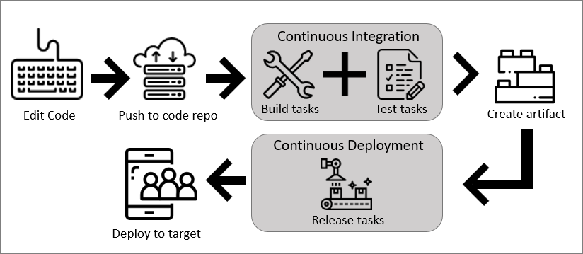

# Key Concepts for New Azure DevOps Pipelines Users

Learn about the key concepts and components that are used in Pipelines. Understanding the basic terms and parts of Pipelines will help you further explore how it can help you deliver better code more efficiently and reliably.

## How Pipelines works

Azure DevOps Pipelines is simple in its design:

1. Edit your code any way you like
2. Push your code to your version control repository
3. Once your code is pushed to the repository your build pipeline is triggered, running any tasks such as checking or testing code
4. The build pipeline creates an artifact that is used by the release pipeline, running any tasks such as building and testing code
5. Your updated, tested, and packaged code is sent to your deployment target

**ELBATK NOTE:** NEED HELP HERE - should we get art for this kind of stuff? 

## Agent

When your build or deployment runs, the system begins one or more jobs. An **agent** is installable software that runs one build or deployment job at a time.

The [Build and Release Agents article](../agents/agents.md) goes more in-depth about the different types of agents and how to use them.

## Build

A **build** is an essential part of the development process - parts of an application are collected and tested in **builds** to ensure a reliable final product. 

## Continuous delivery

**Continuous Delivery (CD)** is a process by which code is built, tested, and deployed to one or more test and production environments. Deploying and testing in multiple environments helps drive quality. **Continuous Integration** systems produce the deployable artifacts, including infrastructure and apps, automated release pipelines consume these artifacts to release new versions and fixes to existing systems. Monitoring and alerting systems run constantly to drive visibility into the entire CD process and to ensure errors are caught often and early.

## Continuous integration

**Continuous Integration (CI)** is the practice used by development teams to simplify the testing and building of code. CI helps to catch bugs or problems early in the development cycle, which makes them easier and faster to fix. Automated tests and builds are run as part of the CI process, which can be run on a set schedule, whenever code is pushed, or both. Items known as "artifacts" are produced from CI systems and used by the **Continuous Delivery** release pipelines to drive automatic deployments.

## Deployment target

Once you have continuous integration in place, the next step is to create a release pipeline to automate the deployment of your application to one or more environments. This automation process is again defined as a collection of tasks. VSTS and TFS support deploying your application to virtual machines, containers, on-premises and cloud platforms, or PaaS services. You can also publish your mobile application to a store.

## Pipeline

A **pipeline** is made up of **tasks** and can be thought of as a script that defines how your testing, building, and deploying tasks are run.

## Release

**Release** is the term used to describe the step of the development process after **build**. In the **release** step, code is tested, built, and deployed to any available deployment target. 

## Task

A **task** is the building block of a pipeline. For example, a build pipeline may consists of build tasks and test tasks, while a release pipeline will consist of deployment tasks. Each task runs a specific job in the **pipeline**.

