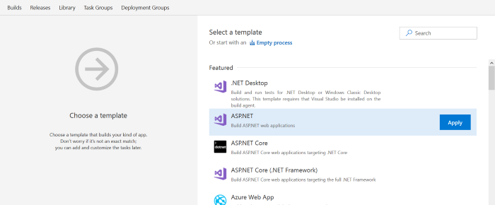
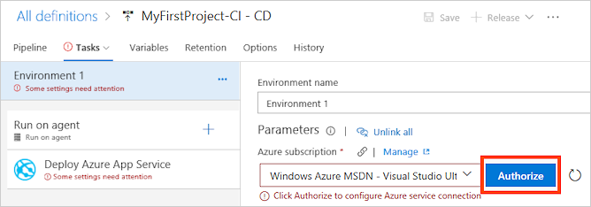

# Tutorial:  CI/CD with App Service and Azure Cosmos DB

Create a continuous integration (CI) and continuous delivery (CD) pipeline for Azure Comsos DB backed Azure App Service Web App.  Azure Cosmos DB is Microsoft's globally distributed, multi-model database. Cosmos DB enables you to elastically and independently scale throughput and storage across any number of Azure's geographic regions. 

You will:

> [!div class="checklist"]
> * Clone a sample Azure Web App to your VSTS repository
> * Create a Cosmos DB collection and database
> * Set up CI for your app
> * Set up CD to Azure for your app
> * Review the CI/CD pipeline

## Prerequisites

* An Azure subscription. You can get one free through [Visual Studio Dev Essentials](https://visualstudio.microsoft.com/dev-essentials/).
* A VSTS organization. If you don't have one, you can [create one for free](https://go.microsoft.com/fwlink/?LinkId=307137). If your team already has one, then make sure you are an administrator of the project you want to use.
* A SQL API based Cosmos DB instance.  If you don't have one, you can follow the initial steps in [this tutorial](https://docs.microsoft.com/azure/cosmos-db/create-sql-api-dotnet) to create a Cosmos DB instance and collection.

## Clone a sample Azure Web App to your VSTS repository

This sample shows you how to use the Microsoft Azure Cosmos DB service to store and access data from an ASP.NET MVC application hosted on Azure Websites.

To import the sample app into a Git repo in VSTS:

 1. Sign into your VSTS organization.

 1. On the **Code** hub for your project in VSTS, select the drop down and choose the option to **Import repository**.

 1. In the **Import a Git repository** dialog box, paste https://github.com/Azure-Samples/documentdb-dotnet-todo-app.git into the **Clone URL** text box.

 1. Click **Import** to copy the sample code into your Git repo.

## Set up CI for your App

1. On the build and release hub for your project in VSTS, select **builds**.

1. On the right-side of the screen, select **+ NEW** to create a new build.

1. Choose the **repository** for the sample application you imported earlier in this tutorial, and then cnoose **continue**.

1. Search for the **ASP.NET Application** build template, and then select **Apply**.

  

1. Select the **triggers**, and then select the checkbox for ""Enable continuous integration**.  This setting ensures every commit to the repository excecutes a build.

1. Select **Save & Queue**, and then choose **Save and Queue** to execute a new build.

1. Select the build **hyperlink** to examine the running build.  In a few minutes the build completes.  The build produces artifacts which can be used to deploy to Azure.

## Set up CD to Azure for your App

The CI for the sample app produces the artifacts needed for deployment to Azure.  Follow the steps below to create a release definition which uses the CI artifacts for deploying a Cosmos DB instance.

1. Select **Release** to create a release definition linked to the build artifacts from the CI pipeline you created with the previous steps.

1. Choose the **Azure App Service deployment** template, and then choose **Apply**.

1. On the **Environments** section, select the **1 phase and 1 task** link.

1. Select the **Azure Subscription**, and then select **Authorize**.

  

1. Choose an **App Service name**.

1. Select the **Deploy Azure App Service** task, and then select the **File Transforms & Variable Substitution Options** setting.  

1. Enable the checkbox for **XML Variable substitution**.

1. At the top of the menu, select **Variables**.

1. Retrieve your **endpoint** (URL) and **authKey** (primary or secondary key) for your Azure Cosmos DB account.  This information can be found on the Azure portal.

  

1. Select **+ Add** to create a new variable named **endpoint**.  Select **+ Add** to create a second variable named **authKey**.

1. Select the **padlock** icon to make the authKey variable secret.

1. Select the **Pipeline** menu.

1. Under the **Artifacts** ideas, choose the **Continuous deployment trigger** icon.  On the right side of the screen, ensure **Enabled** is on.

1. Select **Save** to save changes for the release defintion.

## Review the CI/CD pipeline

Follow the steps below to review the CI/CD pipeline.

1. On the **Code** hub select the **...** icon next to the **web.config** file in the **src** directory, and then select **Edit**.

1. Enter a new **value** for the **database** key in the **appSettings** section of the web.config.  This simple change allows us to quickly test creating a new database in Azure Cosmos DB.

1. Select **Commit**, and then choose **Commit** to save the changes directly to the repostiory.

1. On the **Build** hub select **Builds** and you will see your CI build executing.

A new CI build was created due to the continuous integration trigger you enabled earlier.  Once the build completes a release will execute and deploy your changes to Azure.  Navigate to Cosmos DB in the Azure portal and you will see the CD process created a new database.

## Clean up resources

 > [!NOTE]
 > Ensure you delete any unneeded resources in Azure such as the Cosmos DB instance to avoid incurring charges.

## Next steps

You can optionally modify these build and release definitions to meet the needs of your team. You can also use this CI/CD pattern as a template for your other projects.  You learned how to:

> [!div class="checklist"]
> * Clone a sample Azure Web App to your VSTS repository
> * Create a Cosmos DB collection and database
> * Set up CI for your app
> * Set up CD to Azure for your app
> * Review the CI/CD pipeline

To learn more about the VSTS pipeline see this tutorial:

> [!div class="nextstepaction"]
> [Customize CD process](../release/define-multistage-release-process.md)
