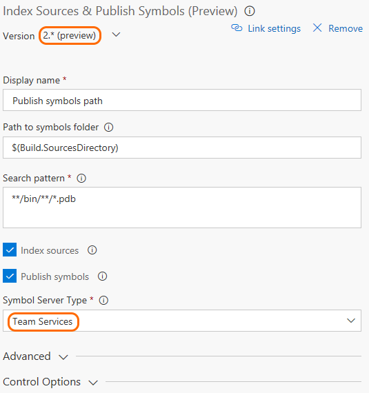

# Publish symbols for debugging

::: moniker range="<= tfs-2018"
[!INCLUDE [temp](../_shared/concept-rename-note.md)]
::: moniker-end

[!INCLUDE [](../../package/_shared/availability-symbols.md)]

Symbol servers enable debuggers to automatically retrieve the correct symbol files without knowing product names, build numbers or package names. To learn more about symbols, read the [concept page](/vsts/package/concepts/symbols); to consume symbols, see [this page for Visual Studio](/vsts/package/symbols/debug-with-symbols-visual-studio) or [this page for WinDbg](/vsts/package/symbols/debug-with-symbols-windbg).

## Publish symbols
In order to publish symbols to the Package Management symbol server in Azure Pipelines, include the [Index Sources and Publish Symbols](../tasks/build/index-sources-publish-symbols.md) task in your build pipeline. Configure the task as follows:

* For **Version**, select the 2.\* (preview).  
* For **Symbol Server Type**, select **Azure Pipelines**.
* Use the **Path to symbols folder** argument to specify the root directory that contains the .pdb files to be published.
* Use the **Search pattern** argument to specify search criteria to find the .pdb files in the folder that you specify in **Path to symbols folder**. You can use a single-folder wildcard (```*```) and recursive wildcards (```**```).
For example, ```**\bin\**\*.pdb``` searches for all *.pdb* files in all subdirectories named *bin*.



### Publish symbols for NuGet packages
To publish symbols for NuGet packages, include the above task in the build pipeline that produces the NuGet packages. Then the symbols will be available to all users in the Azure DevOps organization.

## Portable PDBs

If you're using [Portable PDBs](https://github.com/dotnet/core/blob/master/Documentation/diagnostics/portable_pdb.md), you don't need to use the **Index Sources and Publish Symbols** task. For Portable PDBs, indexing is done by the build. This is a design feature of Portable PDBs and .NET.

## Q&A

<!-- BEGINSECTION class="md-qanda" -->

#### Q: What's the retention policy for the symbols stored in the Azure Pipelines symbol server?

A: Symbols will have the same retention as the build. When you delete a build, you also delete the symbols produced by that build.

#### Q: Can I use source indexing on a portable PDB created from a .NET Core assembly?

A: No, source indexing is currently not enabled for Portable PDBs as SourceLink doesn't support authenticated source repositories. The workaround at the moment is to configure the build to generate full PDBs.

#### Q: Is this available in TFS?

A: In TFS, you can bring your own file share and set it up as a symbol server as described in [this blog](https://edsquared.com/source-server-and-symbol-server-support-in-tfs-2010-cf35ed5527e2).

<!-- ENDSECTION -->