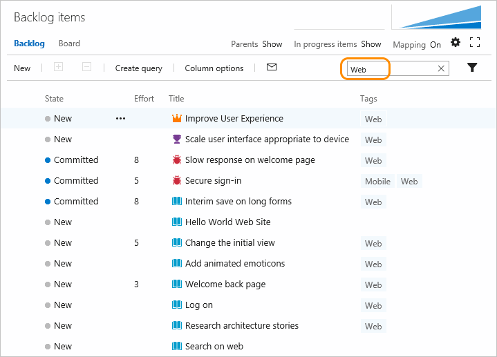

  

# Filter lists and boards 

[!INCLUDE [temp](../../_shared/version-tfs-2017-through-vsts.md)] 

Several services and pages support filtering, useful when a large number or artifacts or items have been defined. Most directory views provide one or more filter functions. Here we show you how to use filtering to find items of interest to you. 

You can filter most items using keywords or a user name for an author of an item or where work is assigned to them. You can filter lists and boards in the following areas: 

- Git repositories: Branches, Commits, Commit history, Pull Requests, Pushes, and Repositories  
- Work tracking: Work Items, Kanban boards, Backlogs, Sprint Backlogs, and Taskboards
- Various selector menus: Dashboards, Builds, Releases

> [!NOTE]   
> You may have fewer or additional filter options based on the [features you've enabled](preview-features.md).


<a id="filter"></a>

::: moniker range=">= tfs-2018"
## Filter work tracking backlogs, boards, and queries based on keywords, tags, or fields

To turn filtering on, choose the  filter icon. 

You can filter work items by typing a keyword or using one or more of the fields provided, such as work item type, assigned to, state, and tags. Based on the keyword that you enter, the filter function will list work items based on any visible/displayed column or field, including tags. Also, you can enter a value for an ID, whether or not the ID field is visible.  


The filtered set is always a flat list, even if you've selected to show parents. 

### Characters ignored by keyword filter criteria

The filter criteria ignores the following characters: `,` (comma), `.` (period), `/` (forward slash), and `\` (back slash). 
::: moniker-end


::: moniker range=">= tfs-2013 <= tfs-2017"

## Filter work items based on keywords

You can use keywords to filter your backlogs or queries. The filter function lists those work items based on any visible/displayed column or field, including tags, based on the keyword that you enter. Also, you can enter a value for an ID, whether or not the ID field is visible.  

Here, we filter the backlog to only show items that include 'Web' in any one of the displayed column fields. 

   

The filtered set is always a flat list, even if you've selected to show parents.  


### Characters ignored by keyword filter criteria

The filter criteria ignores the following characters when the field value starts with the character: ```{, (, [, !, @, #, $, %, ^, &, *, ~, `, ', "```.  
::: moniker-end

::: moniker range=">= tfs-2015 <= tfs-2017"
## Filter work tracking backlogs and queries based on tags

If you've [added tags to your work items](../../boards/queries/add-tags-to-work-items.md), you can filter your backlogs, Kanban boards, and query results using the  tag filter. For backlogs and query results, add Tags as a column option prior to filtering on tags.  

To learn more about filtering using tags, see [Add tags to work items to categorize and filter lists and boards, Filter lists using tags](../../boards/queries/add-tags-to-work-items.md#filter)
 
::: moniker-end

## Related articles  
- [Commit history](../../repos/git/commit-history.md)
- [Working with Git tags](../../repos/git/git-tags.md)
- [Filter backlogs and queries](../../boards/backlogs/filter-backlogs.md)
- [Filter your Kanban board](../../boards/boards/filter-kanban-board.md)
- [Add tags to work items](../../boards/queries/add-tags-to-work-items.md) 


<!---
* Code>Commits: Simple history, Author, From date, To date 
* Code>Pushes
* Code>Branches (Filter icon is there, but doesn't appear active. 
* Code> Pull Request (In active filter icon) 
* Code> Pull Request> Search 
* Work>Work Items - Keyword, Types, Assigned to, States, Area, Tags 
* Work> Board (Kanban) - Keyword, Types, Assigned To, Tags, Iteration, Parent Work Item 
* Work>Backlogs - Keyword, Types, Assigned to, States, Tags
* Work>Sprint Backlogs - Keyword, Types, Assigned to, States, Tags
* Work>Taskboard 

--> 