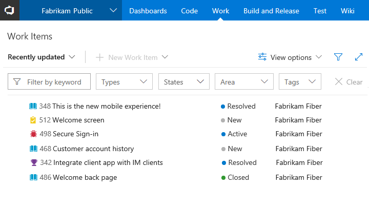
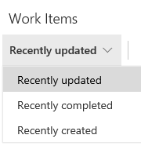
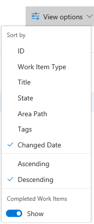

# View and filter work items  

**VSTS Public Project**  

View work items defined for a team project. The **Work>Work Items** page provides several pivots and filter functions to streamline listing work items. Use this page to quickly find work items defined within a team project. 

>[!NOTE]   
><b>Feature availability: </b>As an anonymous user of a public project, you can only view work items. To create and modify work items, you must be a regular contributor or stakeholder of the team project. To learn more, see XXX. 

## Prerequisites 

- You must connect to a team project. If you don't have an account or team project yet, create one in [VSTS](../../user-guide/sign-up-invite-teammates.md). You can then connect to a public project from your web portal.
 
## Open the Work Items page
You can start viewing work items once you connect to a team project. 

<a id="browser" /> 

Open a browser window, click the **Work** hub to open th **Work Items** page. 

> [!div class="mx-imgBorder"]

>[!NOTE]  
>Depending on the process chosen when the team project was created&mdash;[Agile](guidance/agile-process-workflow.md), [Scrum](guidance/scrum-process-workflow.md), or [CMMI](guidance/cmmi-process-workflow.md)&mdash;the types of work items you view will differ. For example, backlog items may be called product backlog items (Scrum), user stories (Agile), or requirements (CMMI). All three are similar: they describe the customer value to deliver and the work to be performed.
>
> For an overview of all three processes, see [Choose a process](../work-items/guidance/choose-process.md). 

## View work items

Using the drop-down menu, you can focus on relevant items inside a team project using one of the three pivots described next. Additionally, you can [filter](#filter) and [sort](#sort) each pivot view.  

<table>
<tbody valign="top">
<tr>
<td>

</td>
<td>
<ul>
<li>**Recently updated**: lists work items recently updated in the project. </li>
<li>**Recently completed**: lists work items completed or closed in the project.</li>
<li>**Recently created**: lists work items created within the last 30 days in the team project.</li>
</ul>
</td>
</tr>
</tbody>
</table>

<a id="filter" />
## Filter to create personal views
You can filter each work item pivot view by typing a keyword or using one or more of the fields provided, such as work item type (Types), State, Area Path, and Tags. The page remembers the filters you set for each pivot, supporting personalized views across all pivots.  

> [!div class="mx-imgBorder"]

<a id="sort" />
## Sort your view and other View options 

You can sort your view by one of the column fields that you select from the **View options** menu. 

> [!NOTE]   
> The column fields differ depending on the view that you select. You can't change the fields supported by a view. 

<table>
<tbody valign="top">
<tr>
<td>

</td>
<td>
<ul>
<li>**ID, Work Item Type, Title, State, Area Path, Tags** (Assigned to me view): Sorts by the column selected.  </li>
<li>**Ascending/Descending**: click to change the sort order.   </li>
<li>**Completed Work Items**: Click the slider to choose to show completed work items in the current pivot view.  </li>
</ul>
</td>
</tr>
</tbody>
</table>

<!---
## Copy selected items to the clipboard or email them

To select several items in a sequence, hold down the shift key. To select several non-sequential items, use the Ctrl key. Then, you can use **Ctrl+c** to copy the selected items to a clipboard. Or, you can open the context menu for the selected work items, click (), and then choose the option you want from the menu. 

> [!div class="mx-imgBorder"]

-->

## Related notes
- [Work from the account home page](../../user-guide/account-home-pages.md)
- [Enable preview features](../../collaborate/preview-features.md)

### Got feedback?

Fill out the comment box that appears when you turn the feature off. See also our [comprehensive feedback and support page](../../user-guide/provide-feedback.md).