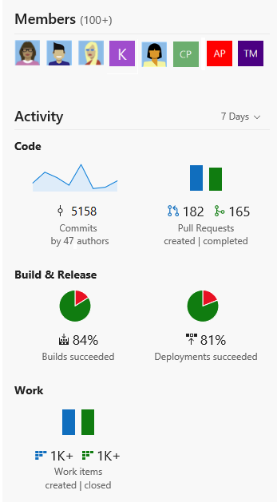

# Share project homepage or a dashboard 

**VSTS Public Project**

You can quickly get started with a team project from the project page. You can share your project vision with your team, add team members, and check the latest activity. Use this page to leverage all the built-in DevOps functionality of VSTS and to perform the following activities:

  
> [!NOTE]    
> The features and functions available from your project page depend on the source control&#151;Git or Team Foundation Version Control (TFVC)&#151;that you selected when you [created your team project](../accounts/create-team-project.md).  

> [!div class="mx-tdBreakAll"]   
> |Git repository |TFVC repository |  
> |-------------|----------|  
> |- Clone your project to your client computer - Push an existing repository from the command line - Import a repository - Initialize a README or gitignore - Setup a build from an external repository - [Add team members](#cross-project-activity) - [View code, build, and work activity](#cross-project-activity)|- Setup a build - Add a README for your project - [Add team members](#cross-project-activity) - [View code, build, and work activity](#cross-project-activity) |

## Prerequisites

- To view the team project page, you must be a valid member of the team project. For more information, see [Default roles and access for public projects](default-roles-access-public.md) 

## Open the project home page
From your web browser, open the team project drop down menu and select the home page. If you don't have a public project yet, [create one](create-public-project.md).   

<!--- 

<b>https://<i>AccountName</i>.visualstudio.com/<i>ProjectName</i></b>

## Get started with a new team project 

Upon [adding another team project](../accounts/create-team-project.md) to your account or collection, you'll see the get started page. This page guides you to get started quickly by adding code to your repository when you choose one of the options to clone, push, import, or simply initialize a repo. You can easily get started by adding members, setting up builds, or adding work from this page.

**Git repository**

   

**TFVC repository**

   

## Share your project vision

You can share your project vision and objective, as well as ways for team members to contribute to the project through a Project readme. 

To edit the project README.md file, click the Edit button. You'll need to be a member of the [Project Administrators group](../security/set-project-collection-level-permissions.md) or have your Edit project-level information permission set to allow. 

You can use Markdown language to format the README file and add images. To learn more about adding a README file, see [Create a README for your repo](../git/create-a-readme.md) and [Markdown guidance](../collaborate/markdown-guidance.md). 

   

-->  

## View cross project activity  

In addition to sharing information, the project home page pulls data from the various functional hubs to give visitors a bird's-eye view of your project activity. 

   

To add team members or manage membership in the team project, click  Add button. 

## Try this next

> [!div class="nextstepaction"]
> [View the wiki for your team project](view-wiki-public.md) 

 

  