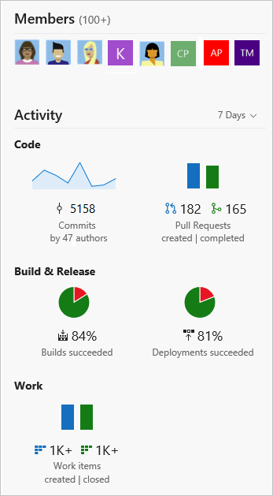

# View project homepage or a dashboard 

**VSTS Public Project**

You can view the homepage or dashboards defined for a public project. 
Use the project page to XXX. If you're a contributor, you can also [add and edit dashboards](../report/dashboards/dashboards.md).  
Use the project page to XXX. 

## Open the project home page
From your web browser, open the team project drop down menu and select the home page. If you don't have a public project yet, [create one](create-public-project.md).   

<!--- 

<b>https://<i>AccountName</i>.visualstudio.com/<i>ProjectName</i></b>

## View cross project activity  

In addition to sharing information, the project home page pulls data from the various functional hubs to give visitors a bird's-eye view of your project activity. 

   

## Try this next

> [!div class="nextstepaction"]
> [View the wiki for your team project](view-wiki-public.md) 

 

  