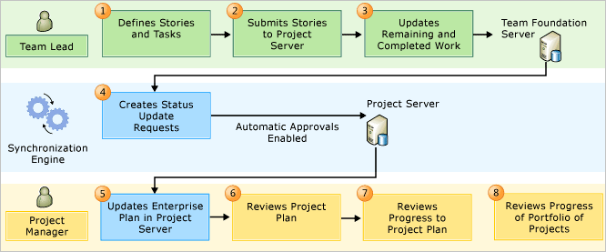
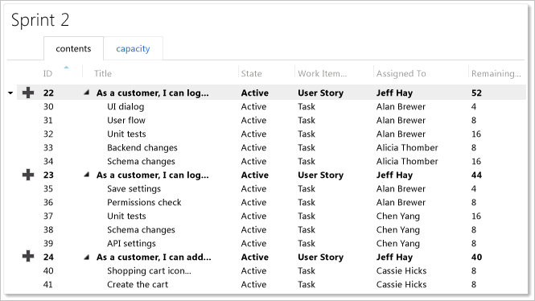
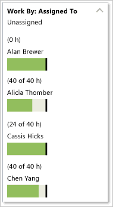
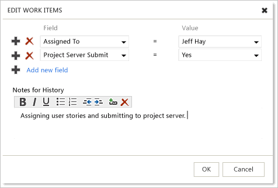
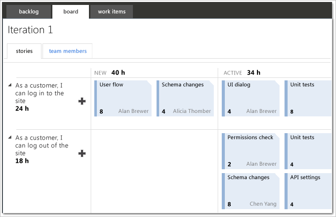
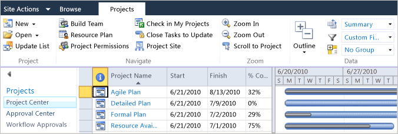

# Make Agile team progress visible to the Program Management Office

[!INCLUDE [temp](../../_shared/tfs-ps-sync-header.md)]

 As a project manager, you can view work progress and resource usage by using Microsoft Project Server while the agile development team manages their user stories and tasks in Visual Studio Team Foundation Server (TFS). You and the Project Management Office (PMO) can view schedules, progress on user stories, and rollup of resources. Meanwhile, the development team members can define, plan, and update their work in TFS. The synchronization engine for TFS and Project Server maintains scheduling data and resource usage for user stories in the mapped enterprise project plan and project.  
  
 Before you can view the progress of your agile team, you must first associate your enterprise project plan with their project. For more information, see [Associate enterprise projects and projects](manage-associations-enterprise-projects.md). Before you associate the plan with the project, you should review [Recommended Configurations to Support Agile Development and PMO Visibility](#Requirements) later in this topic.  
  
> [!NOTE]
>  The process and activities that this topic describes require that your deployment of Team Foundation Server has been configured to integrate with Project Server 2010 or Project Server 2013. For more information, see [Configure TFS-Project Server integration](configure-tfs-project-server-integration.md).  
  
 
  
> [!NOTE]
>  For a demonstration video, see the following page on the Microsoft website: [Making Agile Team Progress Visible to the Project Management Office](http://go.microsoft.com/fwlink/?LinkId=222612). Some details may differ between the procedures demonstrated in the video and those described here because this video was made for the previous release of Team Foundation Server.  
  
 **Requirements**  
  
 To perform the procedures in this topic, the following permissions must be assigned:  
  
-   To publish tasks from an enterprise project plan to Team Foundation, Team Foundation users must be members of the **Contributors** group for the project.  
  
-   To update work items in Team Foundation and submit them to Project Server, Team Foundation users must be members of the **Team Members** group for Project Web Access or Project Web App (PWA) or those users must have the Open Project and View Project Site permissions in Project. Those users must also be added to the enterprise resource pool for Project Server and the resource pool for the enterprise project plan.  
  
 For more information, see [Assign permissions](assign-permissions-support-tfs-project-server-integration.md).  
  
##   Process overview of Agile development and PMO visibility  
 As the following illustration shows, the team lead initiates the process by planning the user stories and tasks in Team Foundation Server. The synchronization engine creates status updates for each user story that is submitted to Project Server. Because the project manager has enabled automatic approvals for the enterprise project plan, Project Server automatically updates the plan with changes that were made in Team Foundation. The project manager can review the plan for implementing new user stories and track their progress in the project plan.  
  
   
  
 Team Foundation automatically calculates the rollup of remaining and completed work by resource based on the tasks that are linked to each user story. As team members update tasks, the roll-up values are automatically updated for the user stories in the mapped project plan. The project manager must add team members to the enterprise resource pool for Project Server in addition to the resource pool for the enterprise project plan.  
  
 The following table summarizes the tasks that are performed:  
  
|||  
|-|-|  
|**Team Lead**|In Team Foundation, the team lead and team members perform the following activities:    Define user stories and tasks in Team Foundation, and plan iterations by using the backlog page in the web portal. Balance the work that is assigned to team members by using the capacity bars.    Set the **Submit to Project Server** status of those user stories that will be implemented by using the web portal bulk edit feature or opening the Product Backlog query in Excel.    As work progresses, update the **Remaining Work** and **Completed Work** for each task by using individual work items, the task board page in the web portal, or a customized Iteration Backlog query.|  
|**Synchronization Engine**| For each user story that is submitted to Project Server, the synchronization engine creates a status update as changes occur in Team Foundation for each mapped field for each published user story.   When you set a rule to automatically approve all status updates, Project Server automatically updates the enterprise project plan as changes occur in Team Foundation. Otherwise, status updates appear in the approval queue for the project manager to review.|  
|**Project Manager**|As a member of the PMO, you can perform the following tasks in Project Professional or your instance of PWA:    View the schedule of user stories that are being implemented, and move user stories to iterations that are defined in your project plan.    Track progress of user stories, and review progress against the portfolio of projects that you or the PMO manage.    Review the workload that is assigned to each resource.|  
  
##   Recommended configurations to support Agile development and PMO visibility  
 To support the process that was outlined in the previous section, you must map the enterprise project plan to the project. The following table describes the recommended configurations for both the enterprise project plan and project. For more information, see [Associate enterprise projects and projects](manage-associations-enterprise-projects.md).  
  
|Area to configure|Recommended configuration|Notes|  
|-----------------------|-------------------------------|-----------|  
|Process template for project|Microsoft Solutions Framework (MSF) for Agile Software Development|The Agile process template provides user story and task types of work items. You can use the web portal **Backlog** and **Board** pages to manage your backlog and plan and run your sprints **Note:**  You can also use a customized process template.|  
|Project mapping|`/workItemTypes:User Story`|When you map the enterprise project plan to the project, specify the user story as the work item type. You can also disallow fixed work for tasks. Fixed work is one of three types of tasks that you can use in Project. For more information, see [Change the task type Project uses to calculate task duration](http://go.microsoft.com/fwlink/?LinkId=203354).|  
|Field mappings|`/useDefaultFieldMappings`|You can use the default field mappings. No additional field mappings are required.|  
|Resource Names|You must add team members to the Team Members group for each instance of PWA, or you must grant them the Open Project and View Project Site permissions in Project. For more information, see [Assign permissions](assign-permissions-support-tfs-project-server-integration.md).   Also, you must add all team leads and other team members to the enterprise resource pool for Project Server and the resource pool for the enterprise project plan.|You must grant permissions to all user accounts that are assigned as resources in the project plan or that are named in the Assigned To field for a work item. These users submit status updates that flow into the status queue for the instance of PWA.   All names that are assigned to the **Resource Names** field must be recognized as valid contributors of the project.|  
|Project managers|Accounts of users of Project Professional  must be granted **View Project-level information** or assigned as members of the **Reader** group in Team Foundation for projects to which they will publish.|You must grant project managers permissions to modify work items in those projects that are mapped to their enterprise project plans.|  
|Automatic approvals|Define a rule to automatically approve all updates that are submitted from Team Foundation Server to Project Server.|As a project manager, you can define approval rules by using the instance of PWA for your project plan. For more information, see [Approve or reject task updates](http://go.microsoft.com/fwlink/?LinkId=203361).|  
  
  
   
## Tasks and recommended practices for the Agile development team  

As a team lead, you can use the backlog, task board, and work item pages in the web portal to perform the following tasks:  
  
-   [Define User Stories and Tasks](#DefineStories)    
-   [Plan an Iteration](#PlanIteration)    
-   [Submit User Stories to Project Server](#SubmitStories)   
-   [Update Remaining and Completed Work](#UpdateWork)  
  
You can also export a shared query to Excel to perform bulk updates of user stories and tasks. See [Bulk add or modify work items with Excel](../../work/backlogs/office/bulk-add-modify-work-items-excel.md).  
  
 
### Define user stories and tasks  
 You can use the sprint backlog page to [plan a sprint or iteration](../../work/scrum/assign-work-sprint.md). This page calculates individual and team capacity based on the estimated and remaining effort that is defined for tasks.  
  
 As the following illustration shows, you can use the backlog page to define user stories and the tasks that are required to implement them. Tasks are automatically linked to user stories. This association supports the rollup of work hours from all tasks to the user story.  
  
   
  
###   Plan an iteration  
 As the following illustration shows, you can use the capacity bars to balance the workload across your team resources. Before you balance the workload, make sure that you have assigned values to the **Remaining Work** field for each task. Also, make sure that you have specified the time off for each team member and the team on the **Capacity** tab.  
  
   
  
 
###  Submit user stories to Project Server  
 As a team lead, you determine when you want to submit user stories to the PMO. You can use the bulk edit feature available in the web portal to assign user stories and to update the value assigned to **Project Server Submit** for several user stories.  
  
##### To bulk update several fields  
  
1.  From the TFS web portal, choose the **Work Items** tab within the **Work** context.  
  
2.  Expand **Shared Queries** and choose the **Product Backlog** query.  
  
3.  Select the work items from the Query Results view that you want to update.  
  
4.  Open the shortcut menu for one of the selected items and choose **Edit selected work items**.  
  
5.  Select the fields you want to update, and enter a value for each field that you select. Remember that all the selected work items will be updated with the new values.  
  
     For example, to assign the user stories and submit them to Project Server, choose the **Assign To** and **Project Server Submit** fields as shown in the following illustration.  
  
       
Edit Work Items dialog box  
  
6.  Enter a description for your bulk modification task under the **Notes for History**, and then choose **OK**.  
  
7.  To commit the updates to the data store, choose  (**Save Results**).  
  
    > [!NOTE]
    >  Work Items shown in bold text indicate that the modifications are not yet published to the data store. Work items shown in bold red text indicate that you have not assigned values to all required fields to support submission to Project Server.  
  
       
  
###   Update remaining and completed work  
 Team members can update their work by using the web portal task board or work item forms in Team Explorer. To update both **Remaining Work** and **Completed Work**, you must open each task and update the fields. The value shown in the lower-left corner of each task corresponds to the **Remaining Work**. See [Task board](../../work/scrum/task-board.md).  
  
   
  
##   Tasks and recommended practices for the program office  
 As a member of the program office, you can engage in the following activities to monitor the work that the agile development team is performing:  
  
-   [Review User Stories, and Plan Project Schedule](#ReviewStories)  
-   [Review Progress to Your Plan](#ReviewProgress)  
-   [Review Progress for Project Portfolio](#ReviewPortfolio)  
  
 In addition, you can also view the assignment of work to resources. For more information, see [Work with resource rollup](work-with-resource-rollup.md).  
  
###   Review user stories, and plan project schedule  
 As new user stories are submitted to Project Server, they automatically appear in your enterprise project plan. As the following illustration shows, the three user stories that were submitted by the agile team in [Submit User Stories to Project Server](#SubmitStories) are added to the project plan.  
  
   
  
 You can group these stories to support your planning view. As the following illustration shows, the three user stories have been moved to occur under Iteration 1 in the plan. You can see the rollup of the three user stories, and in this example, the implementation of Iteration 1 stories requires 10 days.  
  
   
  
> [!IMPORTANT]
>  Text30 is the default Project field that is associated with the **Work Item Type** column that is used in synchronizing tasks with work items. If you ever connect the project plan to Team Foundation Server by using the **Choose Team Project** option on the Team ribbon menu, an additional Project field, which is labeled **Work Item Type**, becomes available. This field, with a default Project field of Text24, supports mapping of project plans that are bound to Team Foundation but does not support synchronizing plans. The Text24-based field contains the full list of work item types for the project. You can verify that you have the correct field by pointing to it and verifying that **Text30** appears.  
  
###   Review progress to your plan  
 As the members of the development team update the amount of work for their tasks, the information automatically flows into the project plan. As the following illustration shows, work has been completed on the first two stories, and the team must complete only the remaining third story.  
  
> [!TIP]
>  To view updates to the plan, you may have to close and reopen it.  
  
   
  
###   Review progress of the project portfolio  
 You can review the progress of a portfolio of projects with the PMO by using the Project Center view that PWA provides. As the following illustration shows, you can easily track the progress of several agile development projects.  
  
   
  
## Related articles  
 [Understand how updates to specific fields are managed](understand-how-updates-to-specific-fields-managed.md)   
 [Resolve validation errors](resolve-validation-errors.md)