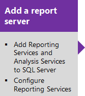
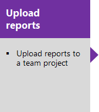
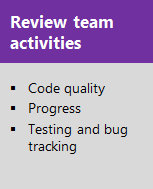
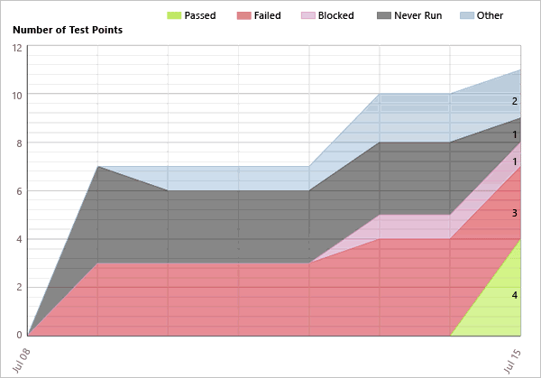

#Review team activities to support useful reports 

[!INCLUDE [temp](../_shared/tfs-header-17-15.md)]

>[!IMPORTANT]
>**Feature availability**: You can only add a report server to an on-premises TFS.  If you're using VSTS, adding a report server isn't a supported option, instead, you can use [PowerBI](../powerbi/overview.md).

This is the fourth task in the four-task sequence to add reports to your team project. To generate useful reports, team members must perform certain tasks. This topic summarizes those tasks.     

 

Now that you've uploaded reports, how do you use them to track progress, gain insight, and improve processes?

First, make sure your team is performing the activities that create the data that these reports use. Your team is probably performing most of these activities already.

Here's a summary of the reports that TFS provides and the team activities that are associated with them. Over time, you can use these reports to see trends and identify which practices and processes require more attention to deliver desired results.

##Monitor code quality
Build reports track the quality of software under development. By defining tests to run automatically as part of each build definition and instrumenting tests to gather code coverage data, you can gain insight about the quality of the builds, tests, and code. 

<table>
<tr valign="top">
<td>
<b>Build and test activities</b> 
<ol>
<li>[Configure a build system](../../build-release/concepts/agents/agents.md)</li>
<li>[Get started with CI/CD](../../build-release/actions/ci-cd-part-1.md)</li>
<li>[Run tests in your build process](../../build-release/test/getting-started-with-continuous-testing.md)</li>
<li>(Optional) [Rate completed builds](https://msdn.microsoft.com/library/ms181734.aspx) to populate the Build Quality dimension.</li>
</ol>
</td>
<td>
<b>Build reports</b>
<ul>
    <li>[Build Quality Indicators](../sql-reports/build-quality-indicators-report.md) (Agile and CMMI only)</li>
    <li>[Build Success Over Time](../sql-reports/build-success-over-time-report.md) (pictured)</li>
    <li>[Build Summary](../sql-reports/build-summary-report.md)</li>
</ul>
    </td>
</tr>
</table>

**Sample build success over time report**  

  

##Monitor progress
Project management reports provide insight into how much work the team is tackling within a sprint or release, and the rate of their progress. By linking work items and updating specific fields as work is performed, you can track the progress of individual stories and be able to more accurately estimate future activities. 

<table width="100%">
<tr valign="top">
<td width="60%">
<b>Work item tracking activities</b>
    <ol>
        <li>[Create the backlog](../../Work/backlogs/create-your-backlog.md).
            <ul>
                <li>Create product backlog items and specify the <b>Effort</b> (Scrum).</li>
                <li>Create user stories and specify the <b>Story Points</b> (Agile).</li>
                <li>Create requirements and specify the <b>Size</b> (CMMI).</li>
            </ul>
        </li>
        <li>[Work in sprints](../../work/scrum/sprint-planning.md). Assign backlog items to sprints, create tasks and link them to parent backlog items, and assign to a team member.</li>
        <li>
            [Update Remaining Work for tasks](../../work/scrum/task-board.md). For Agile and CMMI team projects, update <b>Completed Work</b> as well.
             
            <b>Tip</b>
             
            The only report that references <b>Original Estimate</b> is [Status on All Iterations](../sql-reports/status-on-all-iterations-report.md).
        </li>
        <li>Create test cases and bugs, link them to their parent backlog item, and update their <b>State</b>.</li>
        <li>(Optional) Assign work items to areas to filter reports.</li>
    </ol>
</td>
    <td width="40%">
        <b>Project management (Scrum) reports</b>
        <ul>
    <li>[Backlog Overview (Scrum)](../sql-reports/backlog-overview-scrum.md)</li>
    <li>[Release Burndown](../sql-reports/release-burndown.md)</li>
    <li>[Sprint Burndown (Scrum)](../sql-reports/sprint-burndown-scrum.md)</li>
        </ul>
        <b>Project management (Agile and CMMI) reports</b>
        <ul>
    <li>[Burndown and Burn Rate](../sql-reports/burndown-and-burn-rate-report.md)</li>
    <li>[Remaining Work](../sql-reports/remaining-work-report.md)</li>
    <li>[Requirements Overview (CMMI)](../sql-reports/requirements-overview-report-cmmi.md)</li>
    <li>[Requirements Progress (CMMI)](../sql-reports/requirements-progress-report-cmmi.md)</li>
    <li>[Status on All Iterations](../sql-reports/status-on-all-iterations-report.md)</li>
    <li>[Stories Overview (Agile)](../sql-reports/stories-overview-report-agile.md)</li>
    <li>[Stories Progress (Agile)](../sql-reports/stories-progress-report-agile.md)</li>
    <li>[Unplanned Work](../sql-reports/unplanned-work.md)</li>
</ul>
    </td>
</tr>
</table>

**Sample stories overview report**  
  

##Monitor test plans and bug tracking
Test planning reports support monitoring the test progress and coverage of backlog items or user stories. Bug tracking reports illustrate the team's capacity to find and resolve bugs.

<table width="100%">
<tr valign="top">
<td width="60%">
<b>Test planning and bug tracking activities</b>
<ol>
<li>Define test plans and test cases, and update their <b>State</b> as work progresses.</li>
<li>[Mark the results of each validation step in manual tests](../../manual-test/getting-started/run-manual-tests.md) as either passed or failed.</li>
<li><b>Create bugs</b>, specify the <b>Priority</b> and <b>Severity</b>, assign to a team member, and update the <b>State</b>.</li>
<li>(Optional) Assign test cases and bugs to areas and iterations to filter reports.</li>
</ol>
</td>
<td width="40%">
<b>Bug and test reports</b>
<ul>
    <li>[Bug Status](../sql-reports/bug-status-report.md)</li>
    <li>[Bug Trends](../sql-reports/bug-trends-report.md)</li>
    <li>[Reactivations](../sql-reports/reactivations-report.md)</li>
    <li>[Test Case Readiness](../sql-reports/test-case-readiness-report.md)</li>
    <li>[Test Plan Progress](../sql-reports/test-plan-progress-report.md)</li>
</ul>
</td>
</tr>
</table>

**Sample test plan progress report**   
  

##Q & A
<!-- BEGINSECTION class="md-qanda" -->

###Q: Do reports handle stories and substories or tasks and subtasks?
**A:**  Yes, you can subdivide stories or backlog items as well as tasks, creating a nested hierarchy of both backlog items and tasks. You can nest items several levels deep. If you subdivide a task into subtasks, specify hours only for the subtasks. These hours are rolled up as summary values for the parent task and their parent backlog item. To correct reports you believe are in error, see [Address inaccuracies published for summary values](../address-inaccuracies-published-for-summary-values.md).

###Q: Which reports depend on linking work items?
**A:**  The overview and progress reports depend on linking tasks, test cases, and bugs to backlog items. You must link these items using the parent-child link for tasks and bugs and the Tested By link for test cases.

###Q: Are these reports the same as the charts that appear in the web portal?
 **A:**  While some reports do display similar information, such as sprint burndown and velocity or status on all iterations, these reports are formatted differently and support additional filters. 

###Q: Do you want to create additional product areas or release milestones?
**A:**  See [Modify areas or iterations](../../work/customize/set-area-paths.md).

###Q: Do you want to bulk edit work items to assign them to an area, iteration, team member, or priority?
**A:**  See [Bulk modify work items](../../work/backlogs/bulk-modify-work-items.md).

###Q: Do you want to add a field to track additional data?
**A:**  See [Add or modify a work item field to support reporting](../../work/customize/reference/add-or-modify-work-item-fields-to-support-reporting.md).  

<!-- ENDSECTION -->
