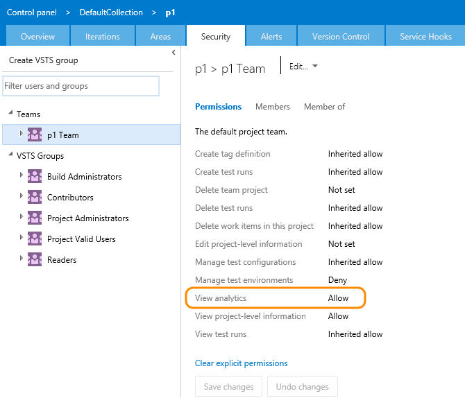

# Permissions required to access the Analytics service

**VSTS**  

[!INCLUDE [temp](../_shared/analytics-preview.md)]

The Analytics service implements a subset of the security found in the VSTS operational store. The security container in the Analytics service is at the team project level.   

>[!NOTE]  
>The Analytics service is installed at the account level. When installing Analytics from the [Analytics Marketplace extension](https://marketplace.visualstudio.com/items?itemName=ms.vss-analytics), any user with permissions to this project are granted the “View Analytics permission”. This will allow the user to report on data under that project regardless of any security enforced in the area path level. Therefore, if a user has access to a team project but they don't have access to work items in specific areas of that project, they can still view data for the restricted items through the Analytics service. 
If you wish to restrict access to data in  the Analytics service, the best practice is to individually manage the "View Analytics permission" for users or teams. 

Security for Analytics is managed by the **View analytics** permission in VSTS.Learn more [about permissions and groups in VSTS.](../../security/about-permissions.md) 

**The whole truth or nothing at all**

The Analytics service is designed to provide accurate data - not data trimmed by your security settings.  

For example, take the following scenario:

Project A has 200 work items  

Project B has 100 work items  

If a user with access to both projects issues a query that says "give me the sum of all work items in Project A
and Project B" the result will be 300 which is as expected. Now, say that another user who only has access to
Project B makes the same query the expected results might be 100. However, the Analytics service will not return
a result at all in the latter case. Instead, it will return a "Project access denied" error. The reason for this is that
in requesting a specific set of data the service could not return the "truth" so it returns nothing at all. 

This behavior is different from that provided by the current Work Item Query editor which would return you all
the work items in Project B but nothing from Project A without informing you that there is missing data. 

Because of this scenario, the recommended approach for querying the Analytics Service is to always provide
a project level filter instead of using a global query. For information on providing a project level filter, see [WIT analytics](../extend-analytics/wit-analytics.md).

##Related notes 

-  [Power BI integration overview](../powerbi/overview.md)
