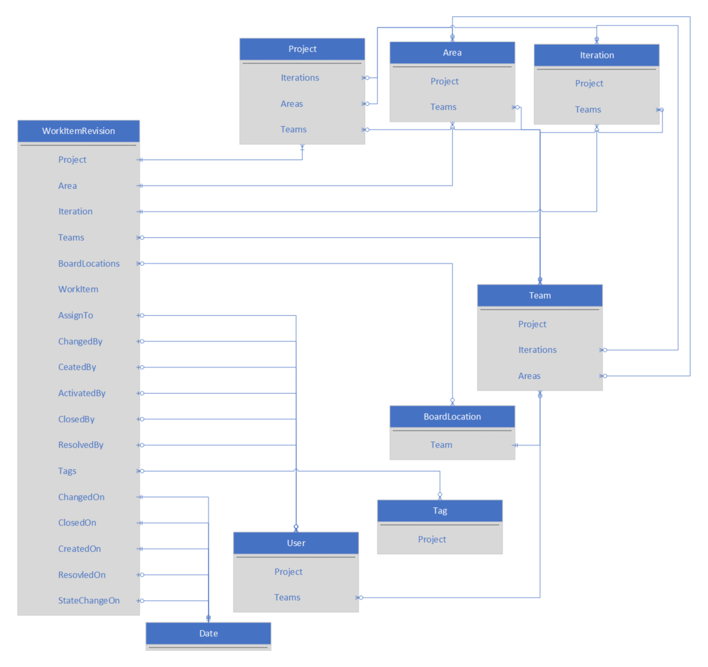

# Data model for the Analytics service  

**VSTS**  

[!INCLUDE [temp](../_shared/analytics-preview.md)]


The Analytics service data model consists of data entities that are related to each other with navigation properties. Each entity contains attributes and measures than can be filtered, aggregated, and summarized.  

##Entities  

>[!NOTE]  
>Information listed may differ from the entities shown as```https://{account}.analytics.visualstudio.com/_odata/v1.0/$metadata```.  

The data model contains the following entity sets:  

| EntitySet | Description|  
|--------|------------|  
|Areas | The work item area paths, with fields for grouping and filtering by area hierarchy |  
|BoardLocations | The Kanban board locations, as identified by board column, lane, and split |  
|Dates | The dates used to filter and group other entities using navigation or external joins|  
|Iterations | The work item iteration paths, with fields for grouping and filtering by iteration hierarchy |  
|Projects | The projects|  
|Tags | All work item tags for each project|  
|Teams | All teams|  
|WorkItemBoardSnapshot | The state of each work item on each calendar date, including Kanban board location - used for trend reporting|  
|WorkItemLinks | The links between work items (e.g. child, parent, related) - includes history of links - hyperlinks not included  
|WorkItemRevisions | All work item revisions, including the current revision|  
|WorkItems | The current work items|  
|WorkItemSnapshot | The state of each work item on each calendar date - used for trend reporting|  
|WorkItemTypeFields | The work item fields for each work item type and process - used for report building|  
|Users | User information - used to expand or filter various work item fields (e.g. Assigned To, Created By)|  

##Relationships

Entities can be combined using relationships to compute more complex query results. Within an OData query relationships can be followed using navigation properties in the expand, filter, or groupby statements.

Some navigation properties result in a single entity, while others result in sets of entities. In the following diagram, entities and their navigation properties are shown.  For clarity, some derivitive entities and relationships have been omitted.



##Relationship Keys

 Entity relationships are also exposed as foreign keys so that external tools can implement joins. These fields have the suffix "SK", and are either integer or GUID data types. Date properties will have corresponding integer date key properties that use the following format: YYYYMMDD

##Attributes and Measures

Data entites contain attribute fields that can be used to filter and summarize query results...


##Related notes 

- [WIT analytics](wit-analytics.md)  
- [Aggregate data](aggregated-data-analytics.md)
- [Overview of the analytics service](overview-analytics-service.md)


