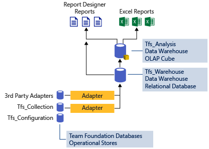

# VSTS/TFS Reporting Roadmap

**VSTS / TFS **  
 
## TFS and SQL Server Reporting
Since [Team Foundation Server (TFS)](https://www.visualstudio.com/tfs/) was released in 2005, we've offered a reporting solution [based on a data warehouse and OLAP cube](../sql-reports/index.md), coupled with [an SSRS server](../sql-reports/create-and-manage-reporting-services-reports.md?toc=../sql-reports/toc.json&bc=../sql-reports/breadcrumb/toc.json) to host reports:

<!--  -->

While configuration can be complex, this solution is powerful. You can create custom reports by writing [customized SSRS reports](../sql-reports/create-and-manage-reporting-services-reports.md?toc=/vsts/report/sql-reports/toc.json&bc=/vsts/report/sql-reports/breadcrumb/to]c.json). You can also create reports [using Excel](../excel/create-status-and-trend-excel-reports.md?toc=/vsts/report/sql-reports/toc.json&bc=/vsts/report/sql-reports/breadcrumb/toc.json), and share them on SharePoint, once you've [configured SharePoint to host Excel Charts](../sharepoint-dashboards/configure-sharepoint-tfs-2017-earlier.md).

## VSTS and Analytics
The reporting solution for [Visual Studio Team Services (VSTS)](https://www.visualstudio.com/team-services/) is [VSTS Analytics](what-is-analytics.md)

Analytics is in Public Preview. It currently [contains partial data](./data-available-in-analytics.md) and only works with VSTS. We are working hard to add all reportable data to Analytics.

**Our goal is to bring Analytics to TFS, and replace SQL Server Reporting with Analytics**. The future of VSTS/TFS Reporting is Analytics.

We have no plans to bring a cloud version of our SQL Server Reporting story to VSTS.

## Support of TFS & SQL Server Reporting
We currently support TFS & SQL Server Reporting through TFS 2018. 

We will continue support SQL Server Reporting until Analytics is brought to TFS and can fully replace its functionality. After that, we will likely support both SQL Servier Reporting and Analytics for one additional major TFS release. This allows customers time to convert their reports to Analytics.

## Roadmap Timeline
### 2018 Q1
* VSTS Analytics + Power BI Integration

### 2018 Q2
* Microsoft Teams – Embed VSTS Dashboard in Channel
* Dashboards - Sprint Burndown Widget based on Analytics
* Dashboards – Charts for Work Items Widget based on Analytics
* Dashboards – Create dashboard separate from a team
* Add Automated Test data to VSTS Analytics

### 2018 Q3/Q4
* Bring Public Preview version of Analytics to TFS v.Next
* Add Automated and Manual Test data to Analytics
* Start adding other data to Analytics (Code, Build, Release)
* Take VSTS Analytics out of Public Preview

### 2019
* Add all data to Analytics
* Bring full version of Analytics to TFS