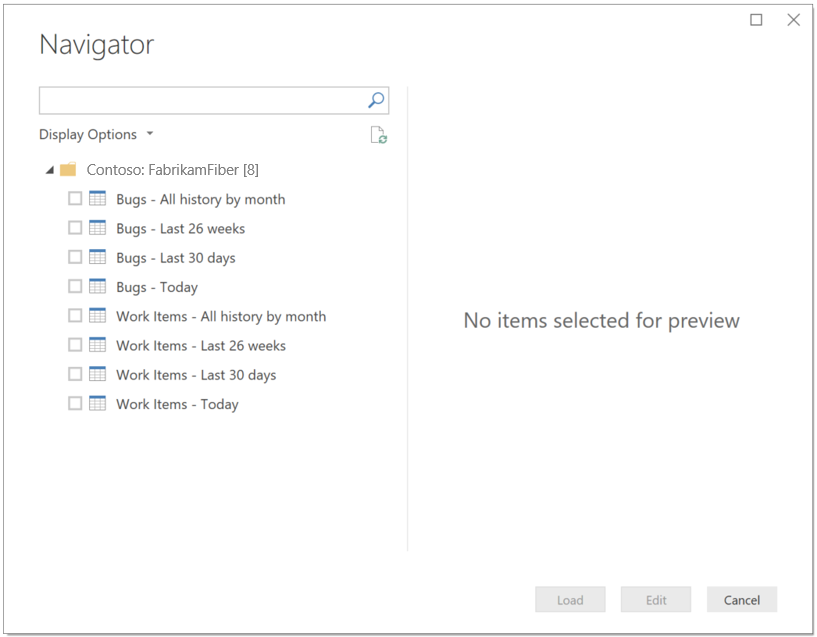

# What are Analytics Views

**VSTS**  

Analytics Views work with our [VSTS Power BI Data Connector](../powerbi/data-connector-connect.md). Together they provide a easy way to get your VSTS data into Power BI so you can start creating amazing reports.

When using the VSTS Power BI Data Connector, you are provided a list of Analytics Views to choose from:

The view you select determines what records, fields, and history is pulled into Power BI.

## Creating custom Analytics Views
When you install the [VSTS Analytics extension](https://marketplace.visualstudio.com/items?itemName=ms.vss-analytics), we create a set of [default Analytics Views](./analytics-default-views.md). These views are immediately available from Power BI and are a great way to get started.

The default Analytics Views return all the specified data in a VSTS team project. They work well for customers with smaller accounts. 

**If the default Analytics Views do not meet your needs**, you can create your customized Analytics Views to fine-tune the records, fields, and history returned to Power BI.

For more information on creating custom Analytics Views, read [Create & manage Analytics views](./analytics-views-create.md).

## Using Analytics Views makes Power BI reporting easier
Each view loads a set of data into Power BI. The data model built in Power BI is modeled to make it easy to get started with Power BI reports.
The data model has the following characteristics:
* The data is flattened (denormalized) into a single table. For example, the user name is modeled as a string (User Name), rather than the user ID. This eliminates the need to join between tables to create reports.
* Historical data is modeled as snapshots for each time period, so trending reporting is extremely simple.

For more information on how data is modeled when using the [VSTS Power BI Data Connector](../powerbi/data-connector-connect.md), read [Data model in the Power BI Data Connector for VSTS](../powerbi/data-connector-available-data.md)

