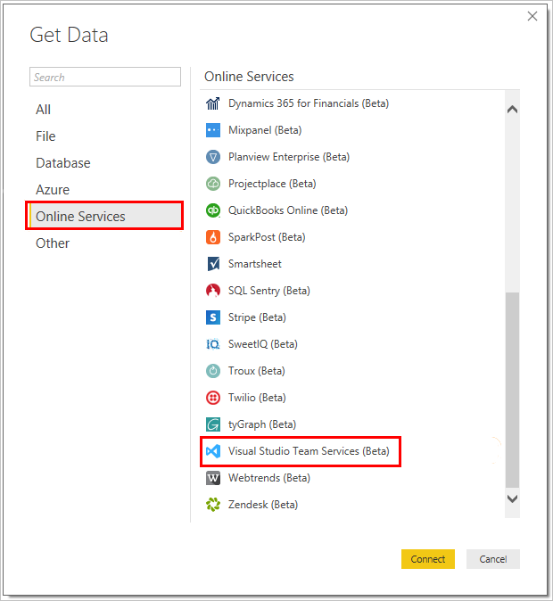

# What is the Analytics Service

The Analytics Service is the reporting platform for Visual Studio Team Services (VSTS). It provides a concise data model over the VSTS suite. You can use it to answer quantitative questions about past or present state of your projects. The Analytics Service is built for reporting. It is optimized for fast read-access and server-based aggregations.

The Analytics Service is deployed for your VSTS account when you install the [VSTS Analytics extension](https://marketplace.visualstudio.com/items?itemName=ms.vss-analytics). Once installed, the Analytics Service populates itself with all available VSTS data. Once populated, it updates itself whenever VSTS data changes. For more information, read [Understanding Analytics Service data aquisition](). 

> [!NOTE]
> **The Analytics Service is in public preview**. While in preview, it is available to everyone free of charge. We encourage you to use it and provide us feedback. As we add features, we will post them on the [Microsoft DevOps Blog](https://blogs.msdn.microsoft.com/devops/?s=VSTS+Analytics+Extension).

## Accessing the Analytics Service
You can access the Analytics Service in the following ways:
### Dashboard Widgets
In VSTS, you can create [Dashboards](../dashboards.md) and [add widgets to them](../add-widget-to-dashboard.md). We provide several [widgets based on the Analytics Service](analytics-widgets-available-vsts.md). These widgets take advantage of the power of the Analytics Service. 

For example, the Velocity Widget provides insights to your team's historical performance. 

Here, the Velocity widget shows this team has a history of closing stories late. It  also shows a discrepancy between planned and completed work over the past 4 sprints. The team can drill into the data to determine the root causes. After implementing new practices, the team can use the Velocity widget to track their effectiveness.

Widgets provide the easiest way to get insights from your data. Check out [Enable and use the Analytics Services](enable-and-use-ax-with-velocity-widget-topic.md) for a step-by-step guide to get started with the Velocity Widget.

If you want to develop your own widget based on the Analytics Service, check out [Build a widget that uses the Analytics Service.]()

### OData
The Analytics Service is fully accessible via OData. 
>![NOTE] 
> Need to fill this in after I know what the OData docs look like. I don't want to dupllicate wording here and mostly want to point them to the other docs.

### Power BI
[Power BI](https://powerbi.microsoft.com) is a suite of business analytics tools. Use it to do ad-hoc analysis, produce beautiful reports, and publish for enterprise consumption. We have created a Power BI Desktop connector which simplifies pulling data from the Analytics Service.

From Power BI Desktop, select the connector "Visual Studio Team Services (Beta)". 

**The VSTS connector is in beta.** The current version has performance issues when dealing with large amounts of data. During the beta phase, we recommend using it for small accounts. The production version will be optimized to work with large amounts of data. 
We plan to upgrade it to production in the early 2018. 

For more information on the Beta version of the connector, check out [Connect to VSTS with Power BI Data Connector](../powerbi/data-connector-connect.md)

## Data available in the Analytics Service
**The Analytics Service is in public preview.** At this point, only Work Item Tracking data is modeled in the Analytics Service.

We are working hard to add more types of data, including:
* Code (Pull Requests, Commits, etc...)
* Automated Test Results
* Manual Test Results (Test Manager)
* Build
* Release
* Packaging

As more data types come online, we will update this page. Look for annoucements on the [Microsoft DevOps Blog](https://blogs.msdn.microsoft.com/devops).

## Availability for Team Foundation Server (TFS)
**The Analytics Service is not yet available for our on-premise product, Team Foundation Server (TFS).** When we have information on when it will be available, we will update this page. Look for announcements on the [Microsoft DevOps Blog](https://marketplace.visualstudio.com/items?itemName=ms.vss-analytics).

For TFS reporting, you may use [Dashboards](../dashboards.md) with a [variety of widgets](../widget-catalog.md) that don't require the Analytics Service. You may also use [SQL Server Reporting](../sql-reports). 

The future of reporting for both VSTS and TFS, however, is the Analytics Service.  