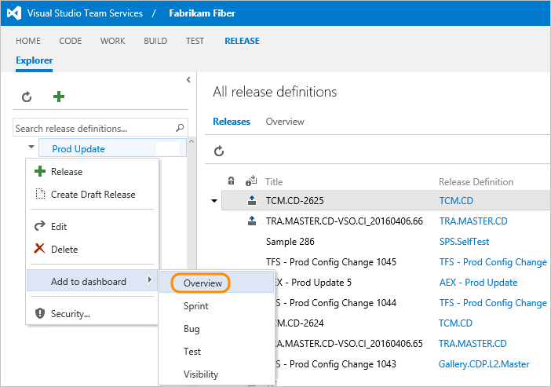
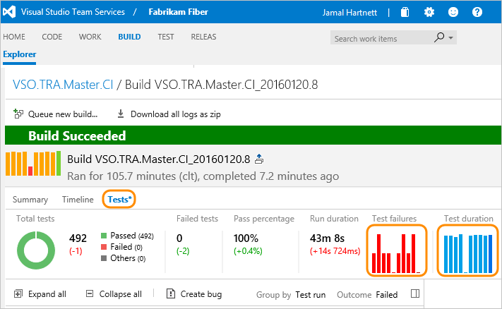
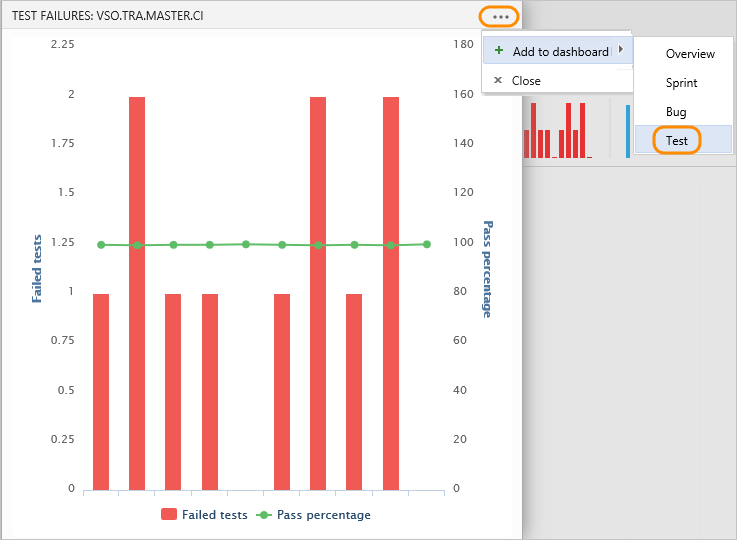
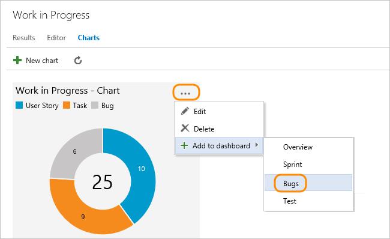

# Add charts to a dashboard

[!INCLUDE [temp](../../_shared/banner-vsts-tfs.md)]

::: moniker range="tfs-2013"
> [!NOTE]   
> Adding charts to a dashboard is not a supported feature in TFS 2013 or TFS 2015, instead, you can [pin items to a team homepage](team-dashboard.md).  Consider [upgrading to the latest TFS version](https://www.visualstudio.com/downloads/) to get access to the widget catalog and [multiple team dashboards](dashboards.md).  
::: moniker-end

<!---
<b>VSTS | TFS 2018 | TFS 2017 | TFS 2015.1-2015.3  </b>  
-->

::: moniker range="vsts || >= tfs-2015 <= tfs-2018"

You can add the charts described in this topic to a dashboard from their corresponding functional page, such as Builds, Releases, or Queries. 

## Prerequistes

You must be a team admin to add a chart to a team dashboard or homepage, or be [granted permissions to manage a dashboard](dashboard-permissions.md). Or, if you're a member of the Project Administrators group, you can add charts to any team's dashboards or home page. 
::: moniker-end
 

::: moniker range="vsts || >= tfs-2015 <= tfs-2018"

## Add a build history chart

Each time a build is run, it logs information about the build, including the run time, errors and warnings, and whether it successfully completed or failed.   

>[!NOTE]  
>You can also add this chart to a team dashboard from the [widget catalog](widget-catalog.md#build-history-widget).  

1. Select your [team context](../../settings/switch-team-context.md?toc=/vsts/report/toc.json&bc=/vsts/report/breadcrumb/toc.json) and then open the Build hub to add a build history chart to a team dashboard. (Requires TFS 2015.1 or later version).  

	  

	If you aren't a team administrator, [get added as one](../../work/scale/add-team-administrator.md). The Add to dashboard menu selection is disabled when you don't have permissions to add it to the dashboards of the selected team context.  

2. Build summary charts look like this:  

	  

	Hover over a bar to view build information and run time. Click a bar to go to the build summary page.   

::: moniker-end

::: moniker range="vsts || >= tfs-2017 <= tfs-2018"

## Add a release summary chart

Each time a release is deployed, it logs information about the release to each of its environments. You can add a release tile to your team dashboard to monitor release progress and gain quick access to each release. (Requires TFS 2017.1 or later versions). 

>[!NOTE]  
>You can also add this chart to a team dashboard from the [widget catalog](widget-catalog.md#release-definition-widget).  

1. Select your [team context](../../settings/switch-team-context.md?toc=/vsts/report/toc.json&bc=/vsts/report/breadcrumb/toc.json) and then open the Release hub to add a release definition chart to a team dashboard.   

	  

	If you aren't a team administrator, [get added as one](../../work/scale/add-team-administrator.md). The Add to dashboard menu selection is disabled when you don't have permissions to add it to the dashboards of the selected team context.  

2. Release definition charts show the success (green), in progress (blue), cancellation (red), or non-deployment (grey) to an environment for the current and last four releases:  

	  

::: moniker-end

::: moniker range="vsts || >= tfs-2015 <= tfs-2018"

  
## Add a test status or result chart  

As you create and run tests, you can track your status by defining [lightweight charts of test plans and test results](../../manual-test/getting-started/track-test-status.md).  

>[!NOTE]  
>You can also add a [Chart for test plans widget](widget-catalog.md#chart-test-plan-widget) to a dashboard. 

1. Select your [team context](../../settings/switch-team-context.md?toc=/vsts/report/toc.json&bc=/vsts/report/breadcrumb/toc.json), make sure you're a [team admin](../../work/scale/add-team-administrator.md), and if you haven't yet created the dashboard, [do that now](dashboards.md).  

2. Open the Test hub charts page and select the dashboard to add the test chart to.  

	  

::: moniker-end

::: moniker range="vsts || >= tfs-2017 <= tfs-2018"

  
## Add a test quality trend chart   

You can add trends to the dashboard of the failures and duration of those [tests that were run as part of a build](../../build-release/test/getting-started-with-continuous-testing.md).
::: moniker-end
::: moniker range="vsts || >= tfs-2017 <= tfs-2018"
>[!NOTE]  
><b>You can also add a [test result trend chart widget](widget-catalog.md#test-results-widget) to a dashboard. 

::: moniker-end
::: moniker range="tfs-2017"
Requires TFS 2017.2 or later version. 
::: moniker-end
::: moniker range="vsts || >= tfs-2017 <= tfs-2018"
1. Select your [team context](../../settings/switch-team-context.md?toc=/vsts/report/toc.json&bc=/vsts/report/breadcrumb/toc.json), make sure you're a [team admin](../../work/scale/add-team-administrator.md), and if you haven't yet created the dashboard, [do that now](dashboards.md).  

2. Open a build summary for a build definition to which you've added tests, open the Tests page, and click the bar chart for either Test failures or Test duration.    

	  

3. Click the  Actions menu and choose the dashboard to add the chart to.  

	  

	Learn more about [reviewing automated test results after a build](../../build-release/test/review-continuous-test-results-after-build.md).  

::: moniker-end

::: moniker range="vsts || >= tfs-2015 <= tfs-2018"

## Add a work item query or chart  

You add work item queries and charts to a dashboard from the Queries page. Queries and charts must be associated with queries under the Shared queries folder.  

>[!NOTE]  
><b>You can also add a [work item query chart widget](widget-catalog.md#build-history-widget) to a team dashboard.  

1. First, make sure you have selected your team context. Only those dashboards created for a team appear in the context menu for each query or chart. [Switch team context](../../settings/switch-team-context.md?toc=/vsts/report/toc.json&bc=/vsts/report/breadcrumb/toc.json) as needed.  

2. If you aren't a team administrator, [get added as one](../../work/scale/add-team-administrator.md). Only team and project admins can add and customize team dashboards.  

3. If you haven't yet created the dashboard, [do that now](dashboards.md).  

4. From the charts Actions menu, choose the team dashboard.  

	  

	You can only add charts associated with shared queries. Charts associated with queries under My Queries folder won't display the add to dashboard option.  

::: moniker-end

::: moniker range="vsts || > tfs-2015 <= tfs-2018"

## Add a markdown file to a dashboard  
 
Open the Markdown file defined in your repository and make sure you are in your team context. 

Click **Add to dashboard**, and then choose the team dashboard to add the markdown file to. As you update the Markdown file, changes will automatically appear on the dashboard upon refresh. See [Dashboards](dashboards.md) for more info.  

::: moniker-end
::: moniker range="tfs-2015"
Requires TFS 2015.2 or later version. 
::: moniker-end
::: moniker range="vsts || > tfs-2015 <= tfs-2018"

::: moniker-end

## System-generated work tracking charts 

There are a number of system-generated charts that you can access from the web portal, but can't add to a dashboard. However, you may find a comparable widget listed in the [widget catalog](widget-catalog.md) that tracks the same or similar data which you can add to the dashboard. These include: 

- [Add Markdown to a dashboard](add-markdown-to-dashboard.md)
- [Team velocity](../guidance/team-velocity.md)
- [Sprint burndown chart](../../work/scrum/sprint-burndown.md), see [Sprint burndown widget](widget-catalog.md#sprint-burndown-widget)
- [Cumulative flow](../guidance/cumulative-flow.md), see [CFD widget](widget-catalog.md#cfd-widget)

<!---

All charts listed in the following table are available from VSTS and TFS 2017.2 and later versions. You can add them to a dashboard from the widget catalog or directly from the Build, Release, Test, or Work hubs. For TFS 2015 and earlier versions, some charts require you to add them to a team dashboard from their respective hub. 

<table >
<thead align="center">
<tr >
<th align="center" width="30%">Chart </th>
<th align="center" width="18%">TFS 2015 </th>
<th align="center" width="18%">TFS 2015.1</th>
<th align="center" width="18%">TFS 2015.2</th>
<th align="center" width="18%">TFS 2017.1</th>
</tr>
</thead>
<tbody align="center"  >

<tr>
<td align="left">[Build history chart](#build-history)  1</td>
<td>  </td>
<td></td>
<td></td>
<td></td>
</tr>

<tr>
<td align="left">[Release summary chart](#release-summary)  1</td>
<td>  </td>
<td>  </td>
<td>  </td>
<td></td>
</tr>

<tr>
<td align="left">[Test status or result chart](#test-result)  2 </td>
<td></td>
<td></td>
<td></td>
<td></td>
</tr>
<tr>
<td align="left">[Test quality trend chart](#test-quality) 1  </td>
<td>  </td>
<td>  </td>
<td></td>
<td></td>
</tr>
<tr>
<td align="left">[Work item query](#work-item-query)  2</td>
<td></td>
<td></td>
<td></td>
<td></td>
</tr>
<tr>
<td align="left">[Work item query chart](#work-item-query)  2</td>
<td></td>
<td></td>
<td></td>
<td></td>
</tr>

</tbody>
</table>

1. These charts are configured by the system. You can't edit them. 
2. These charts are user-configurable.     
 
-->