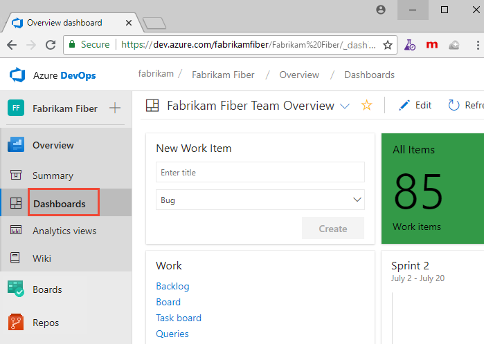
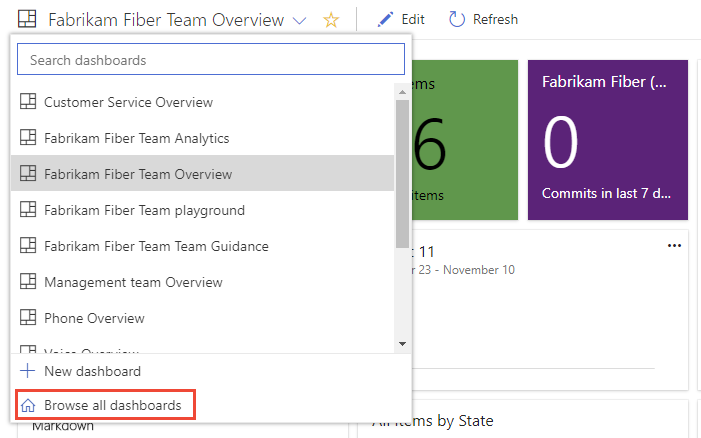
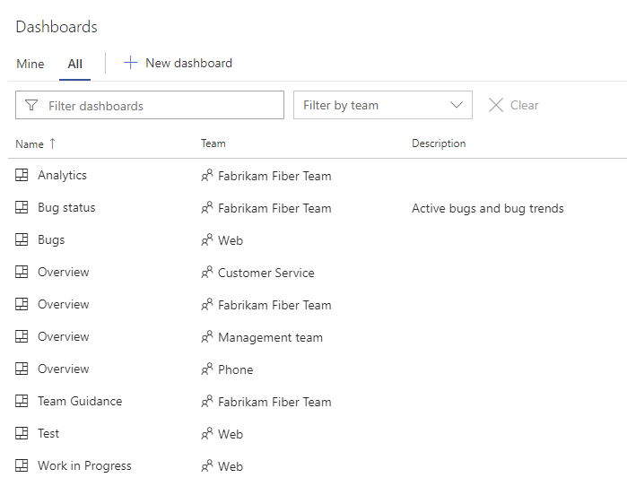
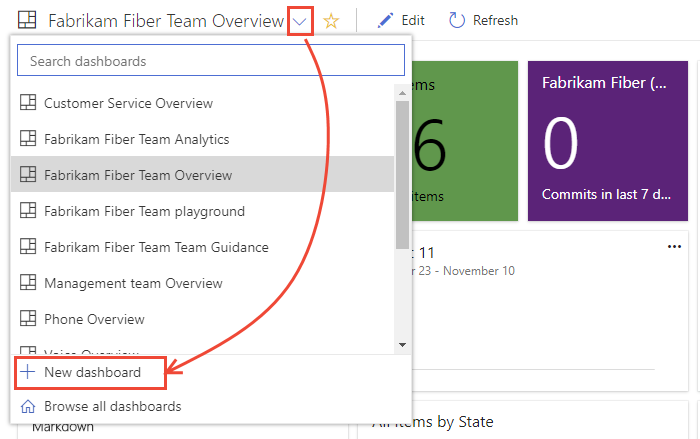
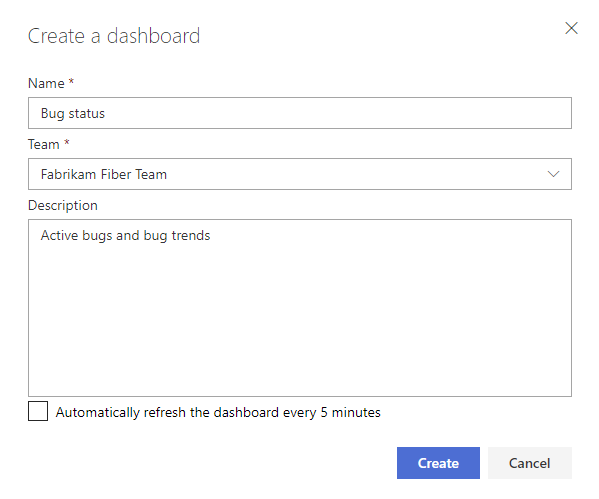
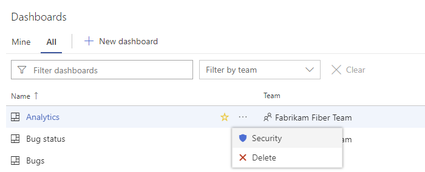

# Add and manage dashboards

**Azure DevOps | TFS 2018 | TFS 2017 | TFS 2015.1**

Share progress and status with your team using configurable team dashboards. Dashboards provide easy-to-read, easy access, real-time information. At a glance, you can make informed decisions without having to drill down into other parts of your project. 

The Overview page provides access to a default team dashboard which you can customize by adding, removing, or rearranging the tiles. Each tile corresponds to a widget that provides access to one or more features or functions.   

::: moniker range="tfs-2015"
> [!NOTE]   
> Multiple team dashboards and the [widget catalog](widget-catalog.md) are available from TFS 2015.1 or later versions. For TFS 2015 and earlier versions, you don't have access to multiple team dashboards. Instead, your home page serves as a [single team dashboard](team-dashboard.md). For information on SharePoint dashboards, see [Project portal dashboards](../sharepoint-dashboards/project-portal-dashboards.md).
::: moniker-end

::: moniker range="tfs-2017"
> [!NOTE]   
> For information on SharePoint dashboards, see [Project portal dashboards](../sharepoint-dashboards/project-portal-dashboards.md).
::: moniker-end

::: moniker range="vsts"
[!INCLUDE [temp](../_shared/dashboard-prerequisites-vsts.md)]  
::: moniker-end

::: moniker range=">= tfs-2017 <= tfs-2018"
[!INCLUDE [temp](../_shared/dashboard-prerequisites-tfs-2017-18.md)] 
::: moniker-end

::: moniker range="tfs-2015"
[!INCLUDE [temp](../_shared/dashboard-prerequisites-tfs-2015.md)] 
::: moniker-end
 

## Connect to the web portal for your project 

[!INCLUDE [temp](../../_shared/new-navigation-dashboards.md)] 

# [New navigation](#tab/new-nav)

::: moniker range="vsts" 

Open a web browser window and choose **Overview>Dashboards**. 

> [!div class="mx-imgBorder"]  
> 

If you need to switch to a different project, choose the  project icon to [browse all projects and teams](../../project/navigation/go-to-project-repo.md).  

::: moniker-end  

::: moniker range=">= tfs-2015  <= tfs-2018"  
[!INCLUDE [temp](../../_shared/new-navigation-not-supported.md)]  
::: moniker-end  

# [Previous navigation](#tab/previous-nav)

::: moniker range=">= tfs-2015"  

Open a web browser window and choose **Dashboards**. 

 

If you need to switch to a different project, choose the  project icon to [browse all projects and teams](../../project/navigation/go-to-project-repo.md).    

::: moniker-end 

---

<a id="choose-dashboard" />
## Select a dashboard to view or modify

All dashboards are associated with a team. 

::: moniker range="vsts"

1. From **Overview>Dashboards**, open the selector and choose the **Browse all dashboards** option. 
 
	> [!div class="mx-imgBorder"]  
	>   

2. The **Mine** page shows your favorited dashboards, and all dashboards of teams that you belong to. The **All** page (shown below) lists all dashboards defined for the project in alphabetical order. You can filter the list by team or by keyword.  
 
	> [!div class="mx-imgBorder"]  
	>   

	> [!TIP]
	> You can change the sort order of the list by choosing the column label. However, you can't change the column size of the displayed columns. 
	 
3. To favorite a dashboard, hover over the dashboard and choose the .  

	> [!div class="mx-imgBorder"]  
	>   

	Favoriting a dashboard will cause it to appear within your Favorites page, and appear towards the top in the **Dashboards** selector.
   
::: moniker-end

::: moniker range=">= tfs-2015  <= tfs-2018"  
1. Select the team whose dashboards you want to view. To switch your team focus, see [Switch project, repo or team](../../project/navigation/go-to-project-repo.md#switch-team-context).

2. From **Dashboards**, choose the name of the dashboard to view it. 

	For example, here we choose to view the Work in Progress dashboard. 

	> [!div class="mx-imgBorder"]  
	>   

::: moniker-end  

## Add and name your dashboard 

Add a new dashboard as needed to support your team's needs. You can also edit and rename any existing dashboards associated with your team. All dashboards are associated with a team. 

::: moniker range="vsts"

1. From the **Dashboards** hub, open the selector and choose the  **New Dashboard** option. 

	> [!div class="mx-imgBorder"]  
	>   

	If you don't see the  **New Dashboard** option, then you're not a team admin for the currently selected team, or you don't have permissions to add and edit dashboards. Either [switch the context to your team](../../project/navigation/go-to-project-repo.md?toc=/vsts/report/dashboards/toc.json&bc=/vsts/report/dashboards/breadcrumb/toc.json), or request you be added as a [team admin](../../organizations/settings/add-team-administrator.md?toc=/vsts/report/dashboards/toc.json&bc=/vsts/report/dashboards/breadcrumb/toc.json). 

2. Enter the name of the dashboard and other information you want to capture. 

	> [!div class="mx-imgBorder"]  
	>   

	Choose **Save**. 

3.  The widget catalog opens. You can add one or more widgets to the dashboard. You can then configure and resize each widget as needed. 

4.	You can move the widgets around the dashboard to place them where you want them. 

5.  When you're done making changes, choose **Done Editing**. 

::: moniker-end

::: moniker range=">= tfs-2015  <= tfs-2018"  

From the **Dashboards** hub, choose the  and enter a dashboard name. 

 

If you don't see the , then you're not a team admin for the currently selected team, or you don't have permissions to add and edit dashboards. Either [switch the context to your team](../../project/navigation/go-to-project-repo.md?toc=/vsts/report/dashboards/toc.json&bc=/vsts/report/breadcrumb/dashboards/toc.json), or request you be added as a [team admin](../../organizations/settings/add-team-administrator.md?toc=/vsts/report/dashboards/toc.json&bc=/vsts/report/breadcrumb/dashboards/toc.json). 

With the dashboard selected, you can add [widgets and charts to the dashboard](add-widget-to-dashboard.md). Or, you can [add charts to a team dashboard from the Work, Build, or Test pages](add-charts-to-dashboard.md).

::: moniker-end

 
## Manage dashboards, reorder and enable auto-refresh

You can rename or delete a dashboard. Also, you can enable auto-refresh, and the dashboard will automatically update every 5 minutes.  

::: moniker range=">= tfs-2015 <= tfs-2017"  
> [!NOTE]  
> You can configure the auto-refresh setting for each dashboard for TFS 2015.2 and later versions. For TFS 2017.1 and later versions, you can [set dashboard permissions](dashboard-permissions.md). 

::: moniker-end

::: moniker range="vsts"

- To rename a dashboard, modify it's description, or change it's automatic refresh setting, open the dashboard, click the  gear icon, and change the field options shown. Save your changes. 

- To delete a dashboard, open the **All** dashboards page, open the  actions menu for the dashboard, and choose the **Delete** option.  

	> [!div class="mx-imgBorder"]  
	>   

- To set permissions for a dashboard, choose the **Security** option. For details, see [Set dashboard permissions](dashboard-permissions.md).

::: moniker-end

::: moniker range=">= tfs-2017 <= tfs-2018"  

1. To manage dashboards, click the  wrench icon.

	 

2. Drag and drop the dashboards into the sequence you want them to appear.  

	 

3. (Optional) Select the Auto-refresh checkbox when you want the dashboard to refresh every five minutes. 
 
4. To delete a dashboard, click the  .

5. Choose Save to save your changes. 

You can also [manage dashboard permissions](dashboard-permissions.md).   
::: moniker-end

::: moniker range="tfs-2015"

1. To manage dashboards, click the  gear icon.
 
	 

2. Drag and drop the dashboards into the sequence you want them to appear.  

	   

3. (Optional) Select the Auto-refresh checkbox when you want the dashboard to refresh every five minutes. The Auto-refresh feature requires TFS 2015.2 or later version.   

4. To delete a dashboard, click the .

5. Choose Save to save your changes. 

::: moniker-end

## Move or delete a widget from a dashboard  

> [!NOTE]  
> Just as you have to be a team admin, a project admin, or have the necessary permissions to add items to a dashboard, you must have the [necessary permissions](#permissions) to remove items.  

::: moniker range="vsts"

Choose  to modify your dashboard. 

You can then add widgets or drag tiles to reorder their sequence on the dashboard. 

To remove a widget, click the  actions icon and select the **Delete** option from the menu.  

> [!div class="mx-imgBorder"]  
>  

When you're finished with your changes, choose **Done Editing** to exit dashboard editing.

> [!TIP]   
> When you're in dashboard edit mode, you can remove, rearrange, and configure widgets, as well as add new widgets. Once you leave edit mode, the widget tiles remain locked, reducing the chances of accidentally moving a widget.  

::: moniker-end

::: moniker range=">= tfs-2015  <= tfs-2018"  

Choose  to modify your dashboard. You can then drag tiles to reorder their sequence on the dashboard. 

To remove a widget, choose the widget's  or  delete icons. 

When you're finished with your changes, click  to exit dashboard editing.

> [!TIP]   
> When you're in dashboard edit mode, you can remove, rearrange, and configure widgets, as well as add new widgets. Once you leave edit mode, the widget tiles remain locked, reducing the chances of accidentally moving a widget.  

Note that you can drag and drop a widget from the catalog onto the dashboard.

::: moniker-end

## Try this next 

As you can see, you can use team dashboards to provide guidance and keep your team in sync, providing visibility across your org about status, trends, and progress. 

> [!div class="nextstepaction"]
> [Add a widget to a dashboard](add-widget-to-dashboard.md)
  
## Related articles
- [Review the widget catalog](widget-catalog.md)
- [Review Marketplace widgets](https://marketplace.visualstudio.com/search?term=widget&target=VSTS&category=All%20categories&sortBy=Relevance)

### Extensibility 

Using the REST API service, you can [create a dashboard widget](../../extend/develop/add-dashboard-widget.md). To learn more about the REST APIs for dashboards and widgets, see [Dashboards (API)](https://docs.microsoft.com/rest/api/vsts/dashboard/dashboards).  

