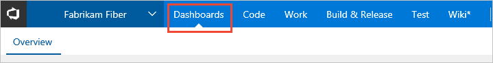
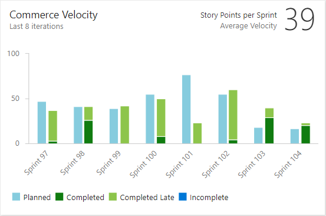

# Enable and use Analytics with Velocity Widget
 
The [Analytics Service](../analytics/what-is-analytics.md) is the reporting platform for Visual Studio Team Services (VSTS). 
Using Analytics, you and your team can gain new insights into the health and status of your work.
Follow this short guide to get started in a few simple steps.

> [!TIP]  
> To gain the greatest utility from the velocity chart or velocity widget, You will need to have completed work assigned to [defined sprints](../../work/customize/set-iteration-paths-sprints.md) in your team project. 

## Install the Analytics extension on your VSTS account
1.	Go to the [Analytics Marketplace extension](https://marketplace.visualstudio.com/items?itemName=ms.vss-analytics) in VSTS Market place. 
0.	Click to **Install** the Analytics extension. You might need to log in with your VSTS account.
0. Select a Visual Studio Team Services account where you would like to install this extension and confirm. Learn more about [Installing extensions for VSTS](../../marketplace/install-vsts-extension.md).

<!---  
c:\Users\romik\source\repos\vsts-docs-pr\docs\marketplace\install-vsts-extension.md

	
--> 
## Add a Velocity widget to your dashboard.

To add a widget to a dashboard, you connect to your team project using a [supported web browser](../../tfs-server/requirements.md#supported-browsers).  If you don't have a team project yet, create one in [VSTS](../../accounts/create-account-msa-or-work-student.md)

1. Connect to the web portal for your team project and click the Dashboards hub. 
0. Select any dashboard or [create a new dashboard](../dashboards.md)
0. Click  to modify a dashboard. Click  to add a widget to the dashboard.
0. Search for the **Velocity widget** from the widget catalog in the right pane.
0. Click to add the Velocity widget and close the widget catalog. Learn more on [adding widgets to dashboard](../add-widget-to-dashboard.md)
    

**Widget catalog search result for Velocity widget** 

Congratulations! A new Velocity widget has been added to your dashboard. 

> [!TIP]  
> The Velocity widget is only one of the many widgets you can add to your dashboard. Explore more [widgets available for Analytics service](./analytics-widgets-vsts.md). 

##  Learn about your team’s velocity using the Velocity widget 

The Velocity widget will help you learn how much work your team can complete during a sprint. The widget shows the team's velocity by Story Points, work item count, or any custom field. You can also compare the work delivered against your plan and track work completed late. Using the Velocity widget, you will be able to answer questions like:
* On average, what is the velocity of my team?
* Is my team consistently delivering what we planned?
* How much work can we commit to deliver in upcoming sprints? 

**Velocity widget showing 8 sprints of data based on Story Points.**

 

Here, the Velocity widget shows this team has a history of closing stories late. It also shows a discrepency between planned and completed work in the past 4 sprints. The team can drill into the data to determine the root causes. After implementing new practices, the team can use the Velocity widget to track their effectiveness.

Learn more about the Velocity widget in [Configure and view Velocity widgets](./team-velocity.md).  

