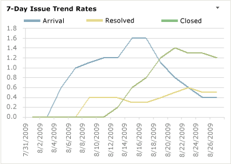

# Issue Trends Excel Report

[!INCLUDE [temp](../_shared/tfs-sharepoint-version.md)]

You can use the Issue Trends report to track the rate at which the team is finding and resolving Issues. This report shows the average number of Issues in each state over time. For information about how to access this report, see [Excel reports](excel-reports.md).  
  
> [!NOTE]
>  You can view the Issue Trends report from the Progress dashboard. You can access this dashboard only if your team project portal has been enabled and is provisioned to use Microsoft Office SharePoint Server 2007. For more information, see [Configure or redirect process guidance](../sharepoint-dashboards/configure-or-redirect-process-guidance.md).  
  
 **Required Permissions**  
  
 To view the report, you must be assigned or belong to a group that has been assigned the **Read** permissions in SharePoint Products for the team project.  
  
 To modify or customize the report, you must be a member of the **TfsWarehouseDataReaders** security role in SQL Server Analysis Services. You must also be assigned or belong to a group that has been assigned the **Members** permissions in SharePoint Products for the team project. For more information, see [Grant Access to the Databases of the Data Warehouse for Team System](../admin/grant-permissions-to-reports.md).  
  
##   Data in the Report  
 The Issue Trends report calculates a rolling average of the number of Issues that the team has opened, resolved, and closed for the past four weeks. The rolling average is based on the seven days before the date for which it is calculated. More precisely, the report averages the number of Issues in each state for each of the seven days before the date and then the divides the result by seven.  
  
   
  
 You can use the Issue Trends report to understand the volume of Issues that the team is identifying and addressing. This report is based on a PivotChart report that shows the last four weeks of data that is captured for Issues and that is stored in the data warehouse.  
  
### Required Activities for Tracking Issue Trends  
 For the Issue Trends report to be useful and accurate, the team must perform the following activities:  
  
-   Define Issues.  
  
-   Close the **State** of each Issue as the team addresses it.  
  
-   (optional) Specify the **Iteration** and **Area** paths for each Issue if you want to filter by that field.  
  
##   Interpreting the Report  
 You can review the Issue Trends report to determine whether the team is addressing the Issues that it is identifying. Specifically, you can find answers to the following questions:  
  
-   How often is the team identifying Issues?  
  
-   Is the team resolving Issues as quickly as they are identifying them?  
  
 If the team identifies more Issues than it can address, the Issue Trends report will show that the team is closing Issues more slowly. The team might need to reexamine priorities to determine whether the Issues are actually problems that it should address or if the team can ignore them.  
  
##   Customizing the Report  
 You can update the Issue Trends report by opening it in Office Excel and changing the filter options for the PivotTable report. You can customize this report to support other views as the following table describes.  
  
|View|Action|  
|----------|------------|  
|Issue trends for an iteration|Change the filter for **Iteration** (default=All)|  
|Issue trends for a product area|Change the filter for **Area** (default=All)|  
|Issue trends for the last six, eight, or more weeks|In the Columns PivotTable Field List, replace **@@Last 4 weeks@@** with a different **Set**|  
  
 For more information about how to work with and customize PivotTable and PivotChart reports, see the following pages on the Microsoft Web site:  
  
-   [Ways to customize PivotTable reports](http://go.microsoft.com/fwlink/?LinkId=165722)  
  
-   [Edit or remove a workbook from Excel Services](http://go.microsoft.com/fwlink/?LinkId=165723)  
  
-   [Publish a workbook to Excel Services](http://go.microsoft.com/fwlink/?LinkId=165724)  
  
-   [Save a file to a SharePoint library or another Web location](http://go.microsoft.com/fwlink/?LinkId=165725)  
  
## Related notes  
 [Excel reports](excel-reports.md)