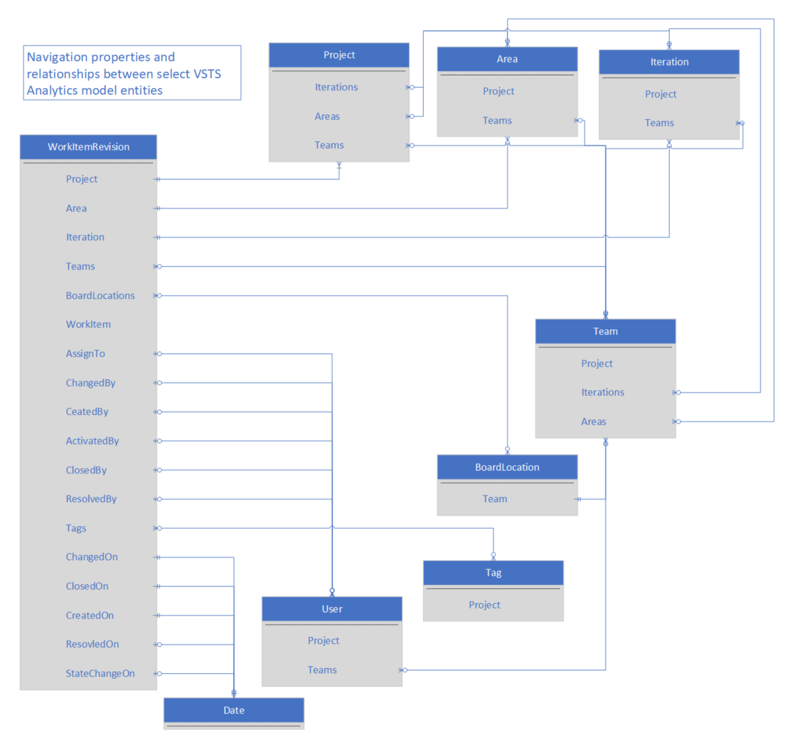

# Data model for the Analytics Service  

**VSTS**  

[!INCLUDE [temp](../_shared/analytics-preview.md)]


The Analytics service data model consists of entity sets, whose members (entities) contains properties that can be filtered, aggregated, and summarized.  Additionally, they contain [navigation properties](http://www.odata.org/getting-started/basic-tutorial/#relationship) that relate entities to one other, providing access to additional properties for selecting, filtering, and grouping.

##Entities  

>[!NOTE]  
>Entities are described in OData metadata, and vary by VSTS project. A complete list of entity sets, entity types, and properties can be discovered by requesting the OData metadata for your project: ```https://{account}.analytics.visualstudio.com/{project}/_odata/v1.0/$metadata```  

The data model contains the following entity sets:  

| EntitySet | Description|  
|--------|------------|  
|Areas | The work item area paths, with properties for grouping and filtering by area hierarchy |  
|Iterations | The work item iteration paths, with properties for grouping and filtering by iteration hierarchy |  
|BoardLocations | The Kanban board cell locations, as identified by board column, lane, and split - includes historic board settings|  
|Dates | The dates used to filter and group other entities using relationships |  
|Projects | All VSTS projects|  
|Tags | All work item tags for each project|  
|Teams | All VSTS teams|  
|Users | User information - used to expand or filter various work item properties (e.g. Assigned To, Created By)|  
|WorkItems | The current state of work items|  
|WorkItemLinks | The links between work items (e.g. child, parent, related) - includes history of links - hyperlinks not included  
|WorkItemRevisions | All historic work item revisions, including the current revision - does not include deleted work items|  
|WorkItemSnapshot | (Composite) The state of each work item on each calendar date - used for trend reporting|  
|WorkItemBoardSnapshot | (Composite) The state of each work item on each calendar date, including Kanban board location - used for trend reporting|  
|WorkItemTypeFields | The work item properties for each work item type and process - used for report building|  

##Composite Entities

Some entities are composed from other simpler entities. Often these entities require more computing resources to generate and may return larger result sets. These composite entities are designed to specific scenarios. Take care to query the correct entity for your scenario, to achieve the best performance and avoid unnecessary throttling.

For example, WorkItemSnapshot combines WorkItemRevisions and Dates such that each date has one revision for each work item. This representation is useful for OData queries that want trend data for a filtered set of work items. However, this entity should not be used to query the current state of work items. Such a query would run more quickly using the WorkItems entity set.

Similarly, some entities may contain all historic values, while others may only contain current values. WorkItemRevision contains all work item history, and should not be used in scenarios where the current values are of interest.

##Relationships

Entities can be combined using relationships to generate more complex query results. Relationships can be followed when expanding, filtering, or summarizing data.

Some navigation properties result in a single entity, while others result in a collection of entities. In the following diagram, entities and their navigation properties are shown.  For clarity, some composite entities and relationships have been omitted.



##Relationship Keys

 Entity relationships are also represented as foreign keys so that external tools can join entities. These properties have the suffix "SK", and are either integer or GUID data types. Date properties have corresponding integer date key properties with the following format: YYYYMMDD

##Entity Properties

The WorkItemRevision entity can contain hundreds of properties and will include any custom properties you add to your process. The sample below is a partial list, to illustrate some commonly found properties:

| Property | Type | Description|  
|--------|------------|------------|  
|WorkItemRevisionSK | Int32 | The VSTS Analytics unique key for the work item revision - used by external tools to join related entities |  
|WorkItemId | Int32 | The VSTS id for the work item |  
|Revision | Int32 | The revision of the work item |  
|Title | String | The work item title |
|WorkItemType | String | The work item type (e.g. Bug, Task, User Story) |
|StoryPoints | Double | The points assigned to this work item - commonly aggregated as a sum
| Tags | Navigation | Navigation property to a Tag entity collection. Commonly used in ```$expand``` statements to access the Name property for multiple work item tags.
|CreatedDate | DateTimeOffset | The date the work item was created, expressed in the time zone for the account. Commonly used for filtering and for display.
|CreatedDateSK | Int32 | The date the work item was created, expressed as YYYYMMDD in the time zone for the account. Used by external tools to join related entities.
|CreatedOn | Navigation | Navigation property to the Date entity for the date the work item was created, in the time zone for the account. Commonly used to reference properties from the Date entity in ```groupby``` statements.

The last three properties here show that the same value is often expressed in multiple properties, each designed for different scenarios.

>[!NOTE]
>Changes to custom fields will affect the shape of your data model and will affect all revisions.


##Related notes 

- [WIT analytics](wit-analytics.md)  
- [Aggregate data](aggregated-data-analytics.md)
- [Exploring Analytics OData metadata](analytics-metadata.md) 


