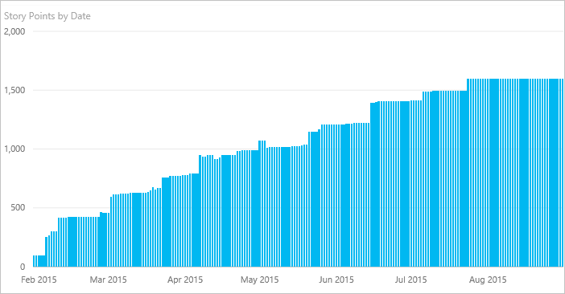
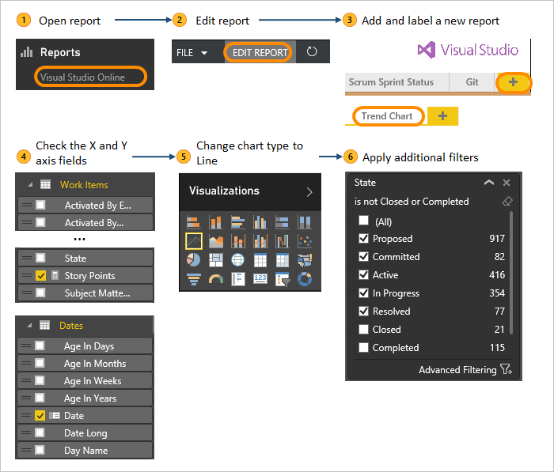
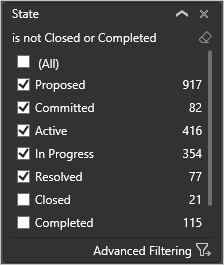
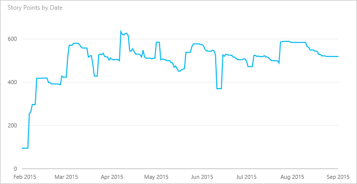
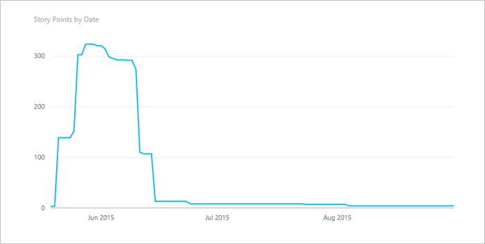
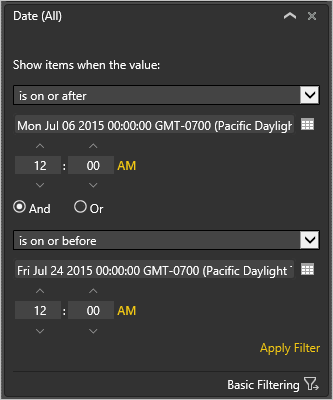
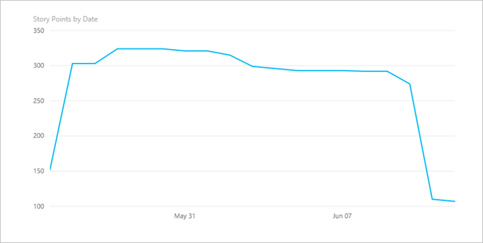

#Create trend charts

<b>VSTS</b>
[!INCLUDE [temp](../_shared/content-pack-deprecation.md)]

Trend charts show progress or activity over time. Common types of trend charts include sprint burndowns or burnups, cumulative flow diagrams, and bug activity. 

## Story points burnup trend chart 

By following steps  through  of the [basic steps shown below](#basic-steps), you'll see the trend of story points as their added to the work item store. 
  
 

Story points provide an estimate of the amount of work required to complete a user story ([Agile](../../work/work-items/guidance/agile-process.md) process) using any unit of measurement your team prefers, such as t-shirt size, story points, or time. 

If you use the [Scrum](../../work/work-items/guidance/scrum-process.md) or 
[CMMI](../../work/work-items/guidance/cmmi-process.md) processes, you can create similar charts by filtering on the Effort or Size fields. 

##Basic steps to create a trend chart
The following image shows the basic steps to create a trend chart. In step , you expand the Fields sections to checkmark the X and then Y axis fields on which to create the report. Here we check Story Points for the X axis and the Date field for the Y axis.  

After you have your initial chart, you can change the chart type and apply additional filters as shown in the examples below. 

if you're new to Power BI, go [here to Connect to Power BI](connect-vso-pbi-vs.md).  

You can create Power BI trend charts for data stored in VSTS. To access similar charts for on-premises TFS, see [Create status and trend charts in Excel](../excel/create-status-and-trend-excel-reports.md). 

##Apply State filter 

To focus the trend chart to count only story points from active or in progress work items, add the state filter and check those values associated with being Closed, Completed, Cut, or Done. For example: 

 

Apply step  and change the chart type from a column to a line chart, and your chart will look more like this one. 

##Apply additional filters to create a burndown chart 

To change the trend chart to a burndown that focuses on a specific iteration, add the Iteration Path to the filter set and choose the iteration of interest.  

This chart indicates that most of the work was finished in the iteration, but there are still some story points assigned to the iteration that haven't been closed. Beware! These are things to investigate.

You can also apply advanced filtering on the Date field to focus only on the start and end dates for your selected sprint.  Here we add the Date field and set the advanced filters to:  
- First option: **is on or after** the first day of the sprint And  
- Second option: **is on or before** the last day of the sprint.  

This changes the trend to the following:  

This chart indicates that some work wasn't scoped until a day or two after the sprint started and that some work was added to the sprint a day or two before the sprint was started (indicated by the line starting at 150 on the first day instead of zero). Note also that by constraining it with the iteration and the date it ends nicely on the last day showing how many story points were not delivered.

##Related notes

The sprint burndown chart based on Story Points provides you with a daily update of your sprint progress when you don't break your stories down into tasks. You can update the chart further by adding Work Item Type as an additional filter to differentiate the story point count for bugs versus user stories.  

###Get started using Power BI and the VSTS connector 
- [Create dashboards and reports](report-on-vso-with-power-bi-vs.md)
- [What's available in the Power BI VSTS connector](vso-pbi-whats-available-vs.md)
- [Add a page to a Power BI report](https://support.powerbi.com/knowledgebase/articles/474804-add-a-page-to-a-power-bi-report)
- [Save a report in Power BI](https://support.powerbi.com/knowledgebase/articles/444112-save-a-report-in-power-bi)

###Pin your chart to a dashboard

To pin your trend chart to a dashboard, follow the steps provided in [Pin a tile to a Power BI dashboard from a report](https://support.powerbi.com/knowledgebase/articles/430323-pin-a-tile-to-a-power-bi-dashboard-from-a-report). 

###More about sprint burndown
To learn more about healthy and unhealthy sprint burndown charts, see [Sprint burndown](../../Work/scrum/sprint-burndown.md). 

###Additional chart resources:

- [Create charts from flat-list queries](../charts.md)
- [Cumulative flow diagram](../guidance/cumulative-flow.md) 
