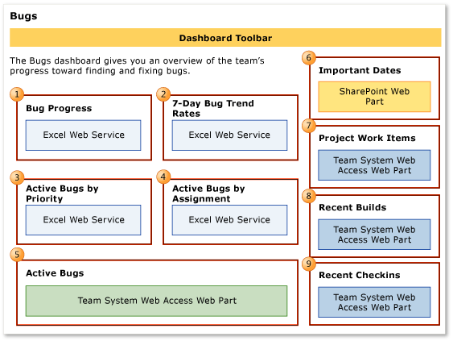
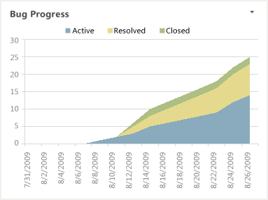
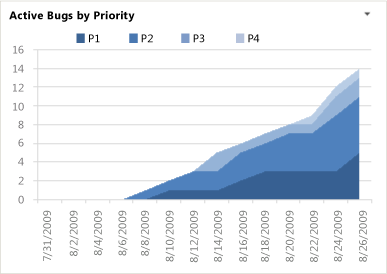
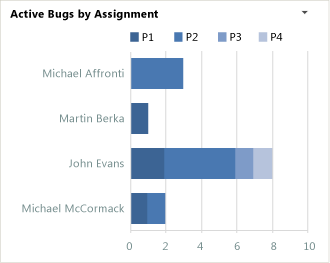

# Bugs dashboard (Agile and CMMI)

[!INCLUDE [temp](../_shared/tfs-sharepoint-version.md)]

You can monitor Bug activity for a team project by using the Bugs dashboard, which shows the following charts:  
  
-   Bug burndown  
  
-   The rate at which the team is finding, resolving, and closing Bugs over time  
  
-   The count of priority Bugs over time  
  
-   The current count of active Bugs that are assigned to each team member  
  
     You access dashboards through your team project portal. You can access the Bugs dashboard only if that portal has been enabled and is provisioned to use SharePoint Server Enterprise Edition. For more information, see [Project portal dashboards](project-portal-dashboards.md).  
  
**You can use this dashboard to answer the following questions**:   -   How quickly is the team resolving and closing bugs? -   Is the team fixing bugs quickly enough to finish on time? -   How many bugs is the team reporting, resolving, and closing per day? -   Is the team resolving priority 1 bugs before priority 2 and 3 bugs? -   Does any team member have a backlog of priority 1 bugs that warrant redistribution? -   What is the status of last night's build? -   What were the most recent check-ins?
  
 **Requirements**  
  
 Same requirements defined in [Project portal dashboards](project-portal-dashboards.md).  
  
##   Data that appears in the dashboard  
 The team can use the Bugs dashboard to understand how well the team is finding, resolving, and closing bugs. To learn about the Web Parts that are displayed on the Bugs dashboard, refer to the illustration and the table that follow.  
  
   
  
> [!NOTE]
>  Burndown, trend, and bar charts, reports  through , do not appear when the server that hosts Analysis Services for the team project is not available.  
  
 For more information about how to interpret, update, or customize the charts that appear in the Bugs dashboard, see the topics that are listed in the following table.  
  
|Web Part|Data displayed|Related topic|  
|--------------|--------------------|-------------------|  
||A visual representation of the cumulative count of all Bugs, grouped by their state, for the past four weeks.   |[Bug Progress](../excel/bug-progress-excel-report.md)|  
||Line chart that shows the rolling average of the number of Bugs that the team has opened, resolved, and closed for the past four weeks. The rolling average is based on the seven days before the date for which it is calculated.   |[Bug Trends](../excel/bug-trends-excel-report.md)|  
||A visual representation of the cumulative count of all Bugs, grouped by their priority, for the past four weeks.   |[Bugs by Priority](../excel/bugs-by-priority-excel-report.md)|  
||A horizontal bar chart with the total count of active Bugs that each team member has currently assigned to them, grouped by priority.   |[Bugs by Assignment](../excel/bugs-by-assignment-excel-report.md)|  
||List of the active Bugs. The list is derived from a Team Web Access Web Part.   |[Workbooks](workbooks.md)|  
||List of upcoming events. The list is derived from a SharePoint Web Part.   |Not applicable|  
||Count of active, resolved, and closed work items. You can open the list of work items by choosing each number. This list is derived from a Team Web Access Web Part.   |Not applicable|  
||List of recent builds and their status. You can view more details about a build by choosing it. This list is derived from a Team Web Access Web Part.      **Legend**:   : Build not started   : Build in progress   : Build succeeded   : Build failed   : Build stopped   : Build partially succeeded|[Run, monitor, and manage](../../build-release/overview.md)|  
||List of the most recent check-ins. You can view more details about a specific check-in by choosing it. This list is derived from a Team Web Access Web Part.   |[Manage pending changes](../../tfvc/develop-code-manage-pending-changes.md)|  
  
##   Required activities for tracking bugs  
 For the reports that appear in the Bugs dashboard to be useful and accurate, the team must perform the following activities:  
  
-   Define Bugs, and specify their **Iteration** and **Area** paths.  
  
-   Assign each Bug to the team member who is working to resolve or close it.  
  
-   Specify the **Priority** of each Bug.  
  
-   Update the **State** of each Bug as the team fixes, verifies, and closes it.  
  
##   Monitor active bugs and bug trends  
 Team members can use the Bugs dashboard to determine whether they are managing the list of active Bugs according to established team goals and agile practices. By unit testing each increment of code before check-in, the team can reduce the overall number of bugs that the team must find. A team that focuses on being able to ship each increment of code removes defects incrementally and minimizes ongoing bugs.  
  
 By using the Bugs dashboard, the team can answer the following questions:  
  
-   Is the number of active Bugs acceptable based on team goals? Is the team postponing too many Bugs?  
  
-   Is the team finding, fixing, and closing Bugs quickly enough to meet expectations and at a rate that matches previous development cycles?  
  
-   Is the team addressing high priority bugs before lower priority bugs?  
  
-   Does any team member need help in resolving bugs?  
  
###   Bug progress indicators  
  
|Indicator|Questions to ask|  
|---------------|----------------------|  
|**The band for active Bugs is becoming wider**. If the width of the team's band for active Bugs is increasing, the Bug backlog is growing. The team is finding more Bugs than it can resolve or close.   A widening band of active Bugs might indicate that a bottleneck is slowing the team's ability to resolve and close Bugs.|-   Are team members being reallocated to other, non-priority tasks? -   Are other issues blocking the team's ability to resolve and fix Bugs?|  
|**The number of active Bugs is not changing**. A flat trend in the number of active Bugs indicates that the team is not finding Bugs.|-   Is the test coverage sufficient? -   Are other issues blocking the team's ability to find Bugs?|  
|**The number of resolved or closed Bugs is not changing**. When the number of Bugs that the team is resolving or closing remains flat for long periods of time, team members might not be able to resolve or close Bugs.|-   Are team priorities correctly set? -   Are team members overallocated on other tasks? -   Are team members correctly tracking their Bug status?|  
  
###   Bug trend indicators  
  
|Indicator|Questions to ask|  
|---------------|----------------------|  
|**The team is resolving many Bugs in each time period**. A high resolution rate usually indicates that the team is making good progress.|-   Is the team promptly closing the Bugs that it resolves? The rate of closure should resemble the rate of resolution. -   Is the team reactivating Bugs at an acceptable rate?|  
|**The team is resolving Bugs quickly but not closing them**. Team members who are assigned to verify fixes might be spread too thin, or different priorities might keep those team members from closing resolved Bugs.|-   Are test resources over-allocated? -   Should the team revisit test priorities?      For more information about these metrics, see [Test](test-dashboard-agile-cmmi.md).|  
|**The team is finding few bugs in each time period**. The team might struggle to find bugs in a high-quality solution or with ineffective testing.|-   Do the metrics for code coverage, code churn, or test progress indicate a problem with the code or testing?      For more information about these metrics, see [Quality](quality-dashboard-agile-cmmi.md).|  
|**The team is finding about the same number of bugs in successive time periods**. If the team finds the same number of bugs week after week or iteration after iteration, you might investigate the underlying cause. Early in the testing cycle, the tests might not be rigorous or advanced enough to find many bugs. In early iterations, this situation is expected. However, as the product matures, tests should exercise broader scenarios and integrations.|-   Are the test cases adequate to test the user stories that the team is developing? -   Have the tests become stale or are they testing the wrong functionality? -   Is the test team rigorously testing each user story?      For more information about these metrics, see [Test](test-dashboard-agile-cmmi.md).|  
|**The team is finding many bugs in each time period**. The team might find bugs easily in sloppy code, in newly integrated code, with effective testing, or during a specific event, such as a bug bash.|-   Do the metrics for code coverage, code churn, or test progress indicate a problem with the code or testing?      For more information about these metrics, see [Quality](quality-dashboard-agile-cmmi.md).|  
  
###   Bug priority and distribution  
  
|Indicator|Questions to ask|  
|---------------|----------------------|  
|**The number of active higher priority Bugs is larger than the number of active lower priority Bugs**. When the number of high priority Bugs is much larger than the number of lower priority bugs, the team might be focusing on lower priority items first.|-   Is the team fixing bugs in the order of priority set by the team? -   Are issues blocking the team's ability to fix the higher priority bugs?|  
|**Bug assignments are not evenly distributed**. The team might consider reassigning work when many Bugs are assigned to one or two team members and only a few to other team members.|-   Should the team balance the workload by reassigning Bugs?|  
  
## Related notes  
 [Project portal dashboards](project-portal-dashboards.md)