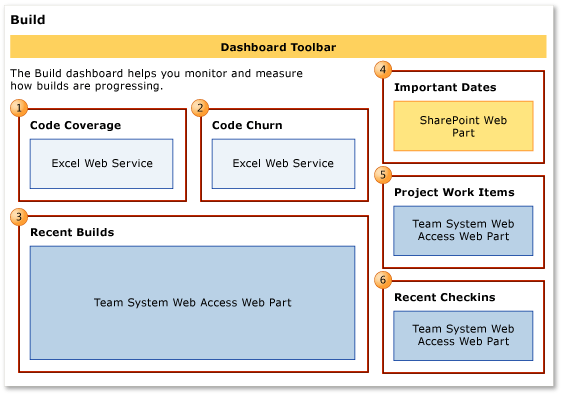
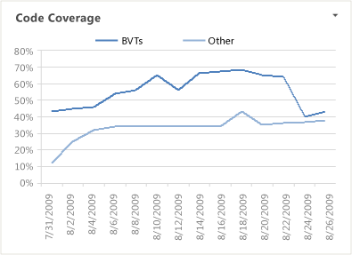
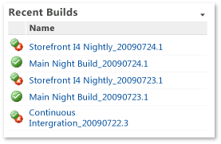

# Build dashboard  (Agile and CMMI)

[!INCLUDE [temp](../_shared/tfs-sharepoint-version.md)]

You can use the Build dashboard to obtain an overview of the development activities that are affecting the quality of the builds. Nightly builds are important to software development projects. When builds are not completing successfully or are not passing build verification tests (BVT), the team must fix the problem immediately.  
  
**You can use this dashboard to answer the following questions**:   -   How volatile is the code base? -   How much of the code is the team testing? -   How high is the quality of the builds? -   Is the quality increasing, decreasing, or staying constant? -   Which builds succeeded? -   Which builds have a significant number of changes to the code? 
  
 **Requirements**  
  
 Same requirements defined in [Project portal dashboards](project-portal-dashboards.md).  
  
##   Data displayed in the dashboard  
 The team can use the Build dashboard to monitor the quality of builds and determine whether a member of the team must take specific steps to correct build failures. To learn about the Web Parts that are displayed on the Build dashboard, refer to the illustration and the table that follow.  
  
   
  
> [!NOTE]
>  Code coverage and churn charts, reports  and , do not appear when the data warehouse for the team project is not available.  
  
|Web Part|Data displayed|Related topic|  
|--------------|--------------------|-------------------|  
||Line chart that depicts the percentage of code that was tested by build verification tests (BVT) and other tests over the most recent four weeks.   |[Code Coverage](../excel/code-coverage-excel-report.md)|  
||Stacked area chart that depicts how many lines of code the team added, removed, and changed in the check-ins before the build within the most recent four weeks.   |[Code Churn](../excel/code-churn-excel-report.md)|  
||List of recent builds and their build status. You can view more details by choosing a specific build. This list is derived from a Team Web Access Web Part.      **Legend**:   : Build Not Started   : Build in Progress   : Build Succeeded   : Build Failed   : Build Stopped   : Build Partially Succeeded|[Run, monitor, and manage](../../pipelines/overview.md)|  
||List of upcoming events derived from a SharePoint Web Part.   |Not applicable|  
||Count of active, resolved, and closed work items. You can open the list of work items by choosing each number. This list is derived from a Team Web Access Web Part.   |Not applicable|  
||List of the most recent check-ins. You can view more details by choosing a specific check-in. This list is derived from a Team Web Access Web Part.   |[Manage pending changes](../../tfvc/develop-code-manage-pending-changes.md)|  
  
##   Required activities for tracking builds  
 For the reports shown in the Build dashboard to be useful and accurate, the team must perform the following activities:  
  
-   **Configure a build system**. To use Team Foundation Build, you must set up a build system.  
  
     For more information, see [Build and Release agents](../../pipelines/agents/agents.md).
  
-   **Create build definitions**. You can create several build definitions and then run each of them to produce code for a different platform. Also, you can run each build for a different configuration.  
  
     For more information, see [Get started with CI/CD](../../pipelines/actions/ci-cd-part-1.md).
  
-   **Define tests to run automatically as part of the build**. As part of the build definition, you can define tests to run as part of the build or to fail if the tests fail.  
  
     For more information, see [Set up continuous testing for your builds](../../pipelines/test/set-up-continuous-testing-builds.md).
  
-   **Configure tests to gather code coverage data**. For code coverage data to appear in the report, team members must instrument tests to gather that data.  
  
     For more information, see [Run tests in your build process](../../pipelines/test/test-build.md).
  
-   **Run builds regularly**. You can run builds at regular intervals or after every check-in. You can create regular builds when you use the schedule trigger.  
  
     For more information, see [Build triggers](../../pipelines/build/triggers.md).
  
    > [!NOTE]
    >  Although a team member can manually rate a build by using Build Explorer, this rating is not reflected in the Build Quality Indicators report. The build rating appears in the Build Summary report. For more information, see [Rate the quality of a completed build](https://msdn.microsoft.com/library/ms181734.aspx) and [Build Summary](../sql-reports/build-summary-report.md).  
  
##   Monitor builds  
 The team can use the Build dashboard to monitor the quality of builds and the level of code coverage that they are testing. Ideally, code coverage is high, and code churn is low or falling. Depending on your team goals, code coverage should be 80% to 100%.  
  
 You can use the Code Coverage and Code Churn reports to answer the questions that are listed in the following table.  
  
-   Which builds succeeded?  
  
-   Which builds have a significant number of changes to the code?  
  
-   How often are builds succeeding?  
  
-   How volatile is the code base?  
  
-   How much of the code is the team testing?  
  
-   How high is the quality of the builds?  
  
-   Is the quality increasing, decreasing, or staying constant?  
  
 For more information, see [Code Coverage](../excel/code-coverage-excel-report.md) and [Code Churn](../excel/code-churn-excel-report.md).  
  
## Related notes 
 [Project portal dashboards](project-portal-dashboards.md)
