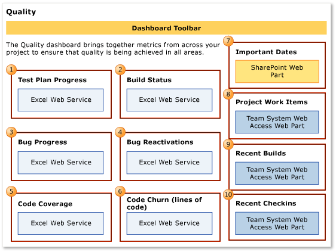
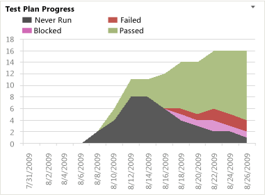
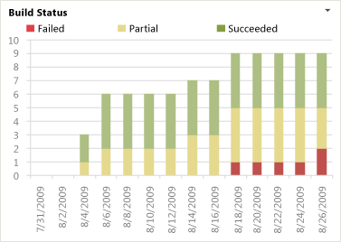
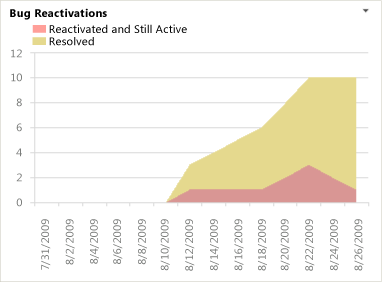
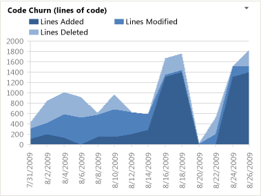
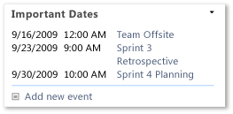
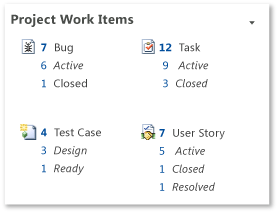
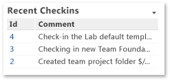

# Quality dashboard (Agile and CMMI)
[!INCLUDE [temp](../_shared/tfs-header-17-15.md)]

You can use the Quality dashboard to obtain an overview of progress occurring in the test, development, and build areas as they relate to the quality of the software under development. The team can use the Quality dashboard to learn and make decisions that support team goals around product quality.  
  
 By using this dashboard, you can review test progress, build states, progress in resolving and closing bugs, rate of bug reactivations, the percentage of code that has been tested, and the trends in code changes. Each of these metrics is plotted for the most recent four weeks.  
  

**You can use this dashboard to answer the following questions**:   -   Is the test effort on track? -   Is the team testing the appropriate functionality? -   Are the team's bug fixes of high quality? -   Are tests stale? -   Does the team have sufficient tests? -   Are any bottlenecks occurring?
  
 **Requirements**  
  
 Same requirements defined in [Project portal dashboards](project-portal-dashboards.md).  
  
##   Data displayed in the dashboard  
 Team members can use the Quality dashboard to determine the overall quality of the product that they are developing. In an ideal case, test pass rates, bugs, and code churn all show the same picture, but often they do not. When you find a discrepancy, you must examine more closely the appropriate build and data series. The Quality dashboard combines the test results, code coverage from testing, code churn, and bugs, to help you understand many perspectives at the same time.  
  
 To learn about the Web Parts that are displayed on the Quality dashboard, refer to the illustration and the table that follow.  
  
   
  
> [!NOTE]
>  The **Test Plan Progress** report is available only when the team [creates test plans](../../test/manual-exploratory-testing/getting-started/create-test-cases.md) and runs tests.  
>   
>  Progress, build, and code charts, reports  through , do not appear when the data warehouse for the team project is not available.  
  
 To learn more about how to interpret, update, or customize the charts that appear in the Quality dashboard, see the topics in the following table.  
  
|Web Part|Data displayed|Related topic|  
|--------------|--------------------|-------------------|  
||Stacked area graph of the test results of all Test cases grouped by their most recent recorded outcome - **Never Run**, **Blocked**, **Failed**, or **Passed** - during the most recent four weeks.   |[Test Plan Progress](../sql-reports/test-plan-progress-report.md)|  
||Stacked columns that show how many builds **Failed** or **Succeeded** during the most recent four weeks.   |[Build Status](../excel/build-status-excel-report.md)|  
||A stacked area graph of the cumulative count of all Bugs, grouped by state, during the most recent four weeks.   |[Bug Progress](../excel/bug-progress-excel-report.md)|  
||A stacked area graph of how many bugs the team has reactivated from the resolved or closed state during the most recent four weeks.   |[Bug Reactivations](../excel/bug-reactivations-excel-report.md)|  
||Line chart that shows the percentage of code tested by build verification tests (BVT) and other tests during the most recent four weeks.   |[Code Coverage](../excel/code-coverage-excel-report.md)|  
||Stacked area graph that shows how many lines of code the team added, removed, and changed in the check-ins before the build during the most recent four weeks.   |[Code Churn](../excel/code-churn-excel-report.md)|  
||List of upcoming events. This list is derived from a SharePoint Web Part.   |Not applicable|  
||Count of active, resolved, and closed work items. You can open the list of work items by choosing each number. This list is derived from a Team Web Access Web Part.   |Not applicable|  
||List of recent builds and their status. You can view more details by choosing a specific build. This list is derived from a Team Web Access Web Part.      **Legend**:   : Build not started   : Build in progress   : Build succeeded   : Build failed   : Build stopped   : Build partially Succeeded|[Run, monitor, and manage](../../build/overview.md)|  
||List of the most recent check-ins. You can view more details by choosing a specific check-in. This list is derived from a Team Web Access Web Part.   |[Manage pending changes](../../tfvc/develop-code-manage-pending-changes.md)|  
  
##   Required activities for monitoring quality  
 For the Quality Dashboard to be useful and accurate, the team must perform the activities that this section describes.  
  
### Required activities for tracking test plan progress  
 For the Test Plan Progress report to be useful and accurate, the team must perform the following activities:  
  
-   Define test cases and user stories, and create **Tested By** links between test cases and user stories.  
  
-   [Define test plans](../../test/manual-exploratory-testing/getting-started/create-test-cases.md), and assign test cases to test plans.  
  
-   For manual tests, mark the results of each validation step in the test case as passed or failed.  
  
    > [!IMPORTANT]
    >  Testers must mark a test step with a status if it is a validation test step. The overall result for a test case reflects the status of all the test steps that the tester marked. Therefore, the test case will have a status of failed if the tester marked any test step as failed or did not mark it.  
  
     For automated tests, each test case is automatically marked as passed or failed.  
  
-   (Optional) To support filtering, assign **Iteration** and **Area** paths to each test case.  
  
    > [!NOTE]
    >  For information about how to define area and iteration paths, see [Define area paths](../../work/customize/set-area-paths.md) or [Define iteration paths](../../work/customize/set-iteration-paths-sprints.md) .  
  
### Required activities for tracking bug progress and bug reactivations  
 For the Bug Progress and Bug Reactivations reports to be useful and accurate, the team must perform the following activities:  
  
-   Define Bugs.  
  
-   Update the **State** of each Bug as the team fixes, verifies, closes, or reactivates it.  
  
-   (Optional) Specify the **Iteration** and **Area** paths of each Bug if you want to filter by those fields.  
  
### Required activities for tracking build status, code coverage, and code churn  
 For the Build Status, Code Coverage, and Code Churn reports to be useful and accurate, team members must perform the following activities:  
  
-   **Configure a build system**. To use Team Foundation Build, you must set up a build system.  
  
     For more information, see [Build and Release agents](../../build/concepts/agents/agents.md).
  
-   **Create build definitions**. You can create several build definitions and then run each of them to produce code for a different platform. Also, you can run each build for a different configuration.  
  
     For more information, see [Get started with CI/CD](../../build/get-started/ci-cd-part-1.md).
  
-   **Define tests to run automatically as part of the build**. As part of the build definition, you can define tests to run as part of the build or to fail if the tests fail.  
  
     For more information, see [Set up continuous testing for your builds](../../test/continuous-testing/set-up-continuous-testing-builds.md).
  
-   **Configure tests to gather code coverage data**. For code coverage data to appear in the report, team members must instrument tests to gather that data.  
  
     For more information, see [Run tests in your build process](../../test/continuous-testing/test-build.md).  
  
-   **Run builds regularly**. You can run builds at regular intervals or after every check-in. You can create regular builds when you use the schedule trigger.  
  
     For more information, see [Build triggers](../../build/define/triggers.md).
  
    > [!NOTE]
    >  Although a team member can manually rate a build by using Build Explorer, this rating is not reflected in the Build Quality Indicators report. The build rating appears in the Build Summary report. For more information, see [Rate the quality of a completed build](https://msdn.microsoft.com/library/ms181734.aspx) and [Build Summary](../sql-reports/build-summary-report.md).  
  
##   Troubleshoot quality issues  
 The following table describes specific quality issues that the Quality dashboard can help you monitor and identify actions the team can take.  
  
|Issue|Reports to review|Troubleshooting notes|  
|-----------|-----------------------|---------------------------|  
|Build failures|**Builds Status**|A nightly build is the heartbeat of software development projects. When builds are not completing successfully or are not passing build verification tests (BVT), the team must fix the problem immediately.|  
|Tests failing|**Test Plan Progress**   **Code Churn**|When the rates of failed tests and code churn are high, the team may investigate why the software is failing so often. Causes may include loose development practices or tests that are too rigorous for an early iteration cycle.|  
|Tests passing but with a high rate of finding Bug|**Test Plan Progress**   **Bug Progress**|When many tests pass in the same period as many Bugs are found, the team might investigate the following possibilities:   -   Tests might not be sufficiently rigorous for the current product stage. In early iterations, simple tests are good. However,  tests should exercise broader scenarios and integration as the product matures. -   Tests might be stale or testing the wrong functionality. -   Different test techniques might offer better results. -   Bugs are being reported but not subject to testing. When Bugs are reported and are not linked to a test case, they are not subject to regression testing.|  
|Tests are stale|**Test Plan Progress**   **Code Coverage**   **Code Churn**|When many tests pass, a significant amount of code changes, and code coverage decreases, the team might not be running tests that exercise the new code.   Because tests are not developed at the same rate as the code changes, test coverage might become less and less adequate.|  
|Team is not testing, closing, or reactivating resolved Bugs|**Bug Progress**|When a bulge occurs in the Bug Progress report for resolved Bugs, developers are resolving Bugs, but testers have not verified and closed them. The team should investigate why this pattern has developed.|  
|Too little testing|**Test Plan Progress**   **Code Churn**|When the team is running few tests, code churn is high, and code coverage is less than expected, the team might need to allocate more resources to testing. In addition, the team should ensure that testers are focusing on the same functions as the rest of the team.|  
|Reactivations|**Bug Reactivations**|When the team reactivates Bugs at a high or increasing rate, testers are frequently rejecting developers' fixes. The team must address these problems to avoid allocating significant resources toward reworking the rejected fixes. Potential causes include poor bug reporting, poor test lab management, or overly aggressive triage.|  
|Inadequate unit testing|**Code Coverage**   **Code Churn**|When a decrease in code coverage coincides with an increase in code churn, developers might be checking in code without any corresponding unit tests to cover it.   In most cases, the code coverage should approach 100% if the team practices test-driven development or similar techniques. If unit tests are reused as BVTs, the code coverage should appear in the corresponding reports.|  
  
## Related notes
 [Project portal dashboards](project-portal-dashboards.md)