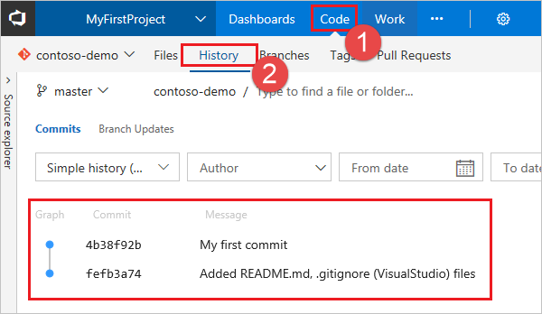
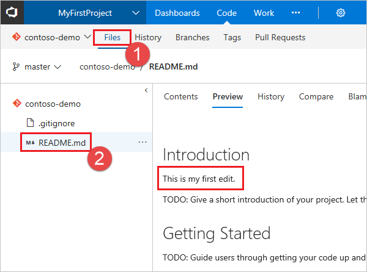

# Code with Git

**VSTS**

After you create a new account and team project in VSTS, you can begin sharing your code with others. 

To work with a Git repo, you clone it to your computer. Cloning a repo creates a complete local copy of the repo for you to work with, and downloads all [commits](../git/commits.md) and [branches](../git/branches.md) in the repo and sets up a named relationship with the repo on the server. Use this relationship to interact with the existing repo, pushing and pulling changes to share code with your team. 

## Install Git command line tools 

0. Install one of the following Git command line tools:

  - To install Git for Windows, including Git Credential Manager, see [Install the Git Credential Manager - Windows](../git/set-up-credential-managers.md#windows)
  - To install Git for macOS and Linux, see [Install the Git Credential Manager - macOS and Linix](../git/set-up-credential-managers.md#macos-and-linux)

## Get the clone URL for your repo

> [!NOTE]
> The **New navigation** feature, which provides a vertical navigation experience, is in preview for VSTS. [Go here to enable it](/vsts/project/navigation/preview-features.md). When you enable **New navigation**, you automatically enable several new Agile tool features described in this blog post, [New Work Hubs](https://blogs.msdn.microsoft.com/devops/2018/06/22/new-work-hubs/). For on-premises TFS users, choose **Previous navigation** for guidance. 

# [New navigation](#tab/new-nav)

New steps here

# [Previous navigation](#tab/previous-nav)

0. From your web browser, open the team project for your VSTS account and click the **Code** hub. If you don't have a team project, [create one now](sign-up-invite-teammates.md). 
 
0. Select Clone in the upper-right corner of the **Code** window and copy the **Clone URL**.

	

---

## Clone the repo to your computer


0. Open the Git command window (Git Bash on Git for Windows), navigate to the folder where you want the code from the repo stored on your computer, and run `git clone` followed by the path copied from the **Clone URL** in the previous section, as shown in the following example.

  ```
  git clone https://contoso-ltd.visualstudio.com/MyFirstProject/_git/contoso-demo
  ```
  Git downloads a copy of the code, including all [commits](../git/commits.md) and [branches](../git/branches.md) from the repo, into a new folder for you to work with.

  Keep this command window open, as you'll use it in the following steps.

## Create a branch

TODO

## Work with the code

In this step, we'll make a change to the files on your computer, commit the changes locally, push the commit up to the repo that is stored on the server, and view the changes there.

0. Browse to the folder on your computer where you cloned the repo, open the `README.md` file in your editor of choice, make some changes, and save and close the file.

## Commit your changes and push them to the remote repo

0. In the Git command window, navigate to the `contoso-demo` directory by entering the following command: 

  ```
  cd contoso-demo
  ```

0. Commit your changes by entering the following command in the Git command window:

  ```
  git commit -a -m "My first commit"
  ```

  When using `git commit`, `-a` means to commit all changed files, and `-m` specifies a commit message.

0. Push your changes up to the Git repo on the server by entering the following command into the Git command window:

  ```
  git push
  ```

0. Switch back to the web portal and select **History** from the **Code** view to view your new commit. The new repo has two commits: the first commit where the README and .gitignore were added when the repo was created, and the commit you just made.

  

0. Switch to the **Files** tab and click on the README file to view your changes.

    

## Create a pull request

TODO

## Try this next  

> [!div class="nextstepaction"]
> [Set up continuous integration & delivery](../../pipelines/get-started-designer.md?toc=/vsts/user-guide/toc.json&bc=/vsts/user-guide/breadcrumb/toc.json)
> or
> [learn more about working with a Git repo](../git/index.md)
