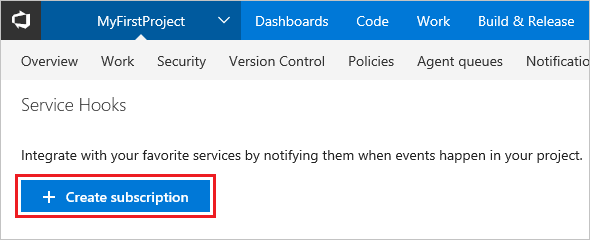
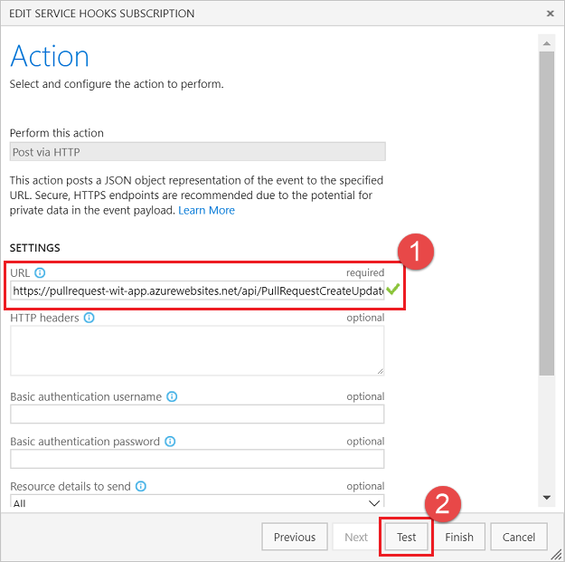
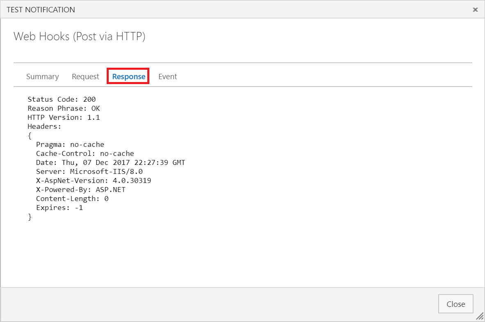
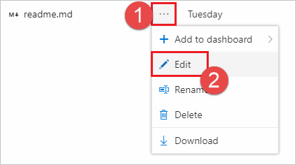
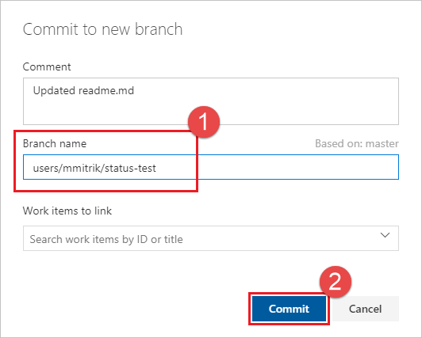
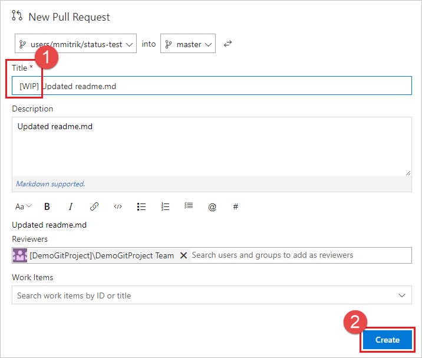

# Use Azure Functions to create custom branch policies

#### VSTS | TFS 2018

The pull request (PR) workflow provides developers with an opportunity to get feedback on their code from peers as well as from automated tools. 3rd party tools and services can participate in the PR workflow by using the PR [Status API](https://go.microsoft.com/fwlink/?linkid=854107). This article guides you through the process of creating a custom branch policy using [Azure Functions](https://azure.microsoft.com/en-us/services/functions/) to validate PRs in a VSTS Git repository. With Azure Functions you don't have to worry about provisioning and maintaining servers, especially when your workload grows. Azure Functions provide a fully managed compute platform with high reliability and security.

For more information about PR status, see [Customize and extend pull request workflows with pull request status](pull-request-status.md).

## Prerequisites
A VSTS account with a Git repo. If you don't have a VSTS account, [sign up](../../organizations/accounts/create-organization-msa-or-work-student.md) to upload and share code in free unlimited private Git repositories.

## Create a basic Azure function to listen to VSTS events
Follow the [create your first Azure function](https://docs.microsoft.com/en-us/azure/azure-functions/functions-create-first-azure-function) documentation to create a simple function. Modify the code in the sample to look like this:

```cs
#r "Newtonsoft.Json"

using System;
using System.Net;
using System.Net.Http;
using System.Net.Http.Headers;
using System.Text;
using Newtonsoft.Json;

public static async Task<HttpResponseMessage> Run(HttpRequestMessage req, TraceWriter log)
{
    try
    {
        log.Info("Service Hook Received.");

        // Get request body
        dynamic data = await req.Content.ReadAsAsync<object>();

        log.Info("Data Received: " + data.ToString());

        // Get the pull request object from the service hooks payload
        dynamic jObject = JsonConvert.DeserializeObject(data.ToString());

        // Get the pull request id
        int pullRequestId;
        if (!Int32.TryParse(jObject.resource.pullRequestId.ToString(), out pullRequestId))
        {
            log.Info("Failed to parse the pull request id from the service hooks payload.");
        };

        // Get the pull request title
        string pullRequestTitle = jObject.resource.title;

        log.Info("Service Hook Received for PR: " + pullRequestId + " " + pullRequestTitle);

        return req.CreateResponse(HttpStatusCode.OK);
    }
    catch (Exception ex)
    {
        log.Info(ex.ToString());
        return req.CreateResponse(HttpStatusCode.InternalServerError);
    }
}
```

## Configure a service hook for PR events
Service hooks are a VSTS feature that can alert external services when certain events occur. For this sample, you'll want to set up a service hook for PR events, your Azure function will be notified when a pull request changes. In order to receive `POST` requests from VSTS when pull requests change, you will need to provide the service hook with the Azure function URL.

For this sample you will need to configure 2 service hooks. The first will be for the **Pull request created** and the second will be for the **Pull request updated** event.

1. Get the function URL from the Azure portal by clicking the **Get function URL** in your Azure function view and copy the URL.

    

    

2. Browse to your VSTS project, e.g. `https://<your account>.visualstudio.com/<your project name>`

3. From the navigation menu, hover over the **gear** and select **Service Hooks**.

    

4. If this is your first service hook, select **+ Create subscription**. 

    

    If you already have other service hooks configured, select the green plus `(+)` to create a new service hook subscription.

    

5. On the New Service Hooks Subscription dialog, select **Web Hooks** from the list of services, then select **Next**.

    

6. Select **Pull request created** from the list of event triggers, then select **Next**.

    

7. In the Action page, enter the URL that you copied in step 1 in the **URL** box. Select **Test** to send a test event to your server.

    

    In the Azure function log window, you'll see an incoming `POST` that returned a `200 OK`, indicating your function received the service hook event.

    ```
    HTTP Requests
    -------------

    POST /                         200 OK
    ```

    In the Test Notification window, select the Response tab to see the details of the response from your server. You should see the response from your server.

    

8. Close the Test Notification window, and select **Finish** to create the service hook.

Go through steps 2-8 again but this time configure the **Pull request updated** event.

Create a pull request to verify your Azure function is receiving notifications.

## Post status to PRs
Now that your server can receive service hook events when new PRs are created, update it to post back status to the PR. You can use the JSON payload posted by the service hook in order to determine what status to set on your PR.

Update the code of your Azure function to look like the following example.

Make sure to update the code with your account name, project name, repository name and [PAT token](../../integrate/get-started/authentication/pats.md). In order to have permission to change PR status, the PAT requires [vso.code_status](https://visualstudio.microsoft.com/docs/integrate/api/repos/git/pull-requests/pullrequeststatuses#authorization-scopes) scope, which you can grant by selecting the **Code (status)** scope on the **Create a personal access token** page.

>[!Important]
>This sample code stores the PAT in code to simplify the sample. It is recommended to store secrets in KeyVault and retrieve them from there.


This sample inspects the PR title to see if the user has indicated if the PR is a work in progress by adding **WIP** to the title. If so, the sample code changes the status posted back to the PR. Replace the code in your Azure function with the following code to implement updating the status posted back to the PR.

```cs
#r "Newtonsoft.Json"

using System;
using System.Net;
using System.Net.Http;
using System.Net.Http.Headers;
using System.Text;
using Newtonsoft.Json;

private static string accountName = "[Account Name]";   // Account name
private static string projectName = "[Project Name]";   // Project name
private static string repositoryName = "[Repo Name]";   // Repository name

/*
    This is here just to simplify the sample, it is recommended to store
    secrets in KeyVault and retrieve them from there.
*/
private static string pat = "[PAT TOKEN]";

public static async Task<HttpResponseMessage> Run(HttpRequestMessage req, TraceWriter log)
{
    try
    {
        log.Info("Service Hook Received.");

        // Get request body
        dynamic data = await req.Content.ReadAsAsync<object>();

        log.Info("Data Received: " + data.ToString());

        // Get the pull request object from the service hooks payload
        dynamic jObject = JsonConvert.DeserializeObject(data.ToString());

        // Get the pull request id
        int pullRequestId;
        if (!Int32.TryParse(jObject.resource.pullRequestId.ToString(), out pullRequestId))
        {
            log.Info("Failed to parse the pull request id from the service hooks payload.");
        };

        // Get the pull request title
        string pullRequestTitle = jObject.resource.title;

        log.Info("Service Hook Received for PR: " + pullRequestId + " " + pullRequestTitle);

        PostStatusOnPullRequest(pullRequestId, ComputeStatus(pullRequestTitle));

        return req.CreateResponse(HttpStatusCode.OK);
    }
    catch (Exception ex)
    {
        log.Info(ex.ToString());
        return req.CreateResponse(HttpStatusCode.InternalServerError);
    }
}

private static void PostStatusOnPullRequest(int pullRequestId, string status)
{
    string Url = string.Format(
        @"https://{0}.visualstudio.com/{1}/_apis/repos/git/repositories/{2}/pullrequests/{3}/statuses?api-version=4.0-preview",
        accountName,
        projectName,
        repositoryName,
        pullRequestId);

    using (HttpClient client = new HttpClient())
    {
        client.DefaultRequestHeaders.Accept.Add(new MediaTypeWithQualityHeaderValue("application/json"));
        client.DefaultRequestHeaders.Authorization = new AuthenticationHeaderValue("Basic", Convert.ToBase64String(
                ASCIIEncoding.ASCII.GetBytes(
                string.Format("{0}:{1}", "", pat))));

        var method = new HttpMethod("POST");
        var request = new HttpRequestMessage(method, Url)
        {
            Content = new StringContent(status, Encoding.UTF8, "application/json")
        };

        using (HttpResponseMessage response = client.SendAsync(request).Result)
        {
            response.EnsureSuccessStatusCode();
        }
    }
}

private static string ComputeStatus(string pullRequestTitle)
{
    string state = "succeeded";
    string description = "Ready for review";

    if (pullRequestTitle.ToLower().Contains("wip"))
    {
        state = "pending";
        description = "Work in progress";
    }

    return JsonConvert.SerializeObject(
        new
        {
            State = state,
            Description = description,
            TargetUrl = "http://visualstudio.microsoft.com",

            Context = new
            {
                Name = "PullRequest-WIT-App",
                Genre = "pr-azure-function-ci"
            }
        });
}
```

## Create a new PR to test the status server
Now that your server is running and listening for service hook notifications, create a pull request to test it out. 

1. Start in the files view. Edit the readme.md file in your repo (or any other file if you don't have a readme.md).

    

2. Make an edit and commit the changes to the repo.

    

3. Be sure to commit the changes to a new branch so you can create a PR in the next step.

    

4. Select the **Create a pull request** link.

    

5. Add **WIP** in the title to test the functionality of the app. Select **Create** to create the PR.

    

6. Once the PR has been created, you will see the status section, with the **Work in progress** entry which links to the URL specified in the payload.

    

0. Update the PR title and remove the **WIP** text and note that the status changes from **Work in progress** to **Ready for review**.

## Next Steps
* In this article, you learned the basics of how to create a serverless Azure function that listens for PR events via service hooks and can post status messages using the status API. For more information about the pull request status API see the [REST API documentation](https://go.microsoft.com/fwlink/?linkid=854107). 
* [Configure a branch policy for an external service](https://go.microsoft.com/fwlink/?linkid=854109).
