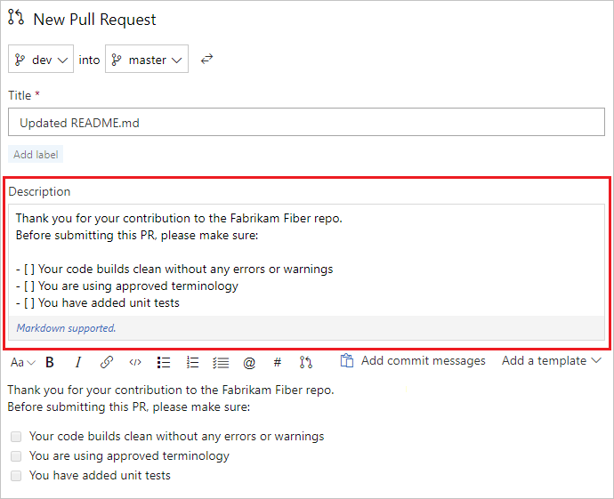

# Improve your pull request descriptions with pull request templates

#### VSTS 

A good pull request description can help reviewers be effective when reviewing pull requests. Pull request templates can help your pull request creators to create good pull request descriptions that meet your organization's standards.

This article shows you how to get started with pull request templates.

>[!NOTE]
>Pull request templates can provide guidance for your pull request creators, but are advisory only. Use branch policies to enforce best practices such as requiring pull requests for key branches like master, requiring a successful build, and enforcing required reviewers. For more information, see [branch policies](branch-policies-overview.md).

## What is a pull request template?

A pull request template is a block of text or markdown that can be added to your pull request description when the pull request is created. VSTS allows you to create the following type of pull request templates:

- Default - these pull request templates are automatically applied to pull request descriptions for all pull requests in the repo, unless a branch specific pull request template applies
- Branch specific - these pull request templates are automatically applied to pull requests targeting a specific branch
- Optional - these pull request templates can be optionally added by the pull request creator

A pull request template is a markdown file or text file located in a designated folder. When the pull request template is applied, the contents of the pull request template are placed in the pull request description. If the following snippet was the default pull request template for a repo, it would automatically be set as the description for any pull request into that repo (unless there was a more specific branch pull request template).

```
Thank you for your contribution to the Fabrikam Fiber repo. 
Before submitting this PR, please make sure:

- [ ] Your code builds clean without any errors or warnings
- [ ] You are using approved terminology
- [ ] If your PR covers more than 25 files, please break it up into smaller PRs
```

## Default pull request templates

Default pull request templates are automatically applied to the description field when a new PR is created. To configure your repository with a default pull request template, create a file named pull_request_template.md or pull_request_template.txt and save it in your repo in one of the following folders.

- The root folder of the repo
- A folder named `.vsts` that is contained in the root folder of the repo
- A folder name `docs` that is contained in the root folder of the repo

>[!NOTE]
>Multiple locations are provided to give you flexibility in where you store your pull request templates in your repo. When a pull request is created VSTS searches the previous folders in the order given, and uses the first default pull request template it finds.

When a new pull request is created in the repo, unless a more specific branch pull request template applies, the contents of the default pull request template are used for the description field in the pull request. 



You can edit or add to this description and append additional pull request templates if desired.

## Branch specific pull request templates

Branch specific pull request templates can be configured for pull requests that target a specific branch. To configure your repository with a branch specific pull request template, create a pull request template (`*.md` or `*.txt`) named after your branch. The name must match the first level of the branch name, such as `master`, `dev`, `release`, `feature`.Each branch specific pull request template is applied any time a pull request targets that branch or any branches contained under it. For example the pull request template named `feature.md` would be applied if a pull request targeted the `feature` branch or any `feature/*` branches.

Branch specific pull request templates must be saved in your repository in a folder named `pull_request_template\branches\`. The `pull_request_template\branches\` folder must be in one of the following folders in your repo:

- The root folder of the repo
- A folder named `.vsts` that is contained in the root folder of the repo
- A folder name `docs` that is contained in the root folder of the repo

For example, a branch specific pull request template that should apply to all pull requests into the `dev` branch would be name `dev.md` or `dev.txt` and located in one of the following locations.

- `<repository root>\pull_request_template\branches\`
- `<repository root>\.vsts\pull_request_template\branches\`
- `<repository root>\docs\pull_request_template\branches\`

Just like default pull request templates, multiple locations are provided to give you flexibility in where you store branch specific pull request templates in your repository. When a pull request is created, VSTS searches the previous folders in the order given for a branch specific pull request template, and uses the first one it finds. If no branch specific pull request template is found, VSTS then searches for a default pull request template as described in the previous [Default pull request templates](#default-pull-request-templates) section.


## Additional pull request templates

In addition to the default and branch specific pull request templates, you can configure additional pull request templates. These can be `.md` or `.txt` files, located in one of the following locations.

- `<repository root>\pull_request_template\`
- `<repository root>\.vsts\pull_request_template\`
- `<repository root>\docs\pull_request_template\`

When a pull request is created, you can append optional pull request templates by choosing them from the pull request template drop-down. The names in the drop-down are based on the file names of the templates.


>[!NOTE]
>An optional pull request can be specified to override any matching default or branch specific pull request by appending `?template=name.md` to the querystring.