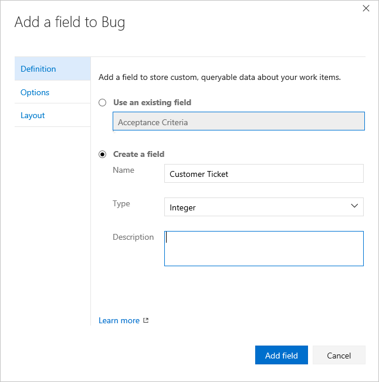
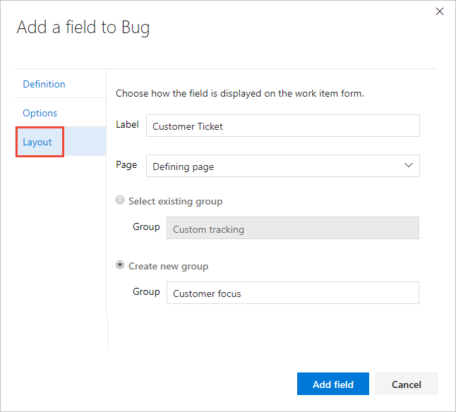

# Add a custom field to a work item type    
[!INCLUDE [temp](../../_shared/codex-agile.md)]

You can add a custom field to support tracking additional data requirements or modify select attributes of an  inherited field. For example, you can add a custom field and pick list or change the label that appears in the work item form for an inherited field.  

For a list of all fields defined for your account&mdash;which includes all fields defined for system and inherited processes&mdash;see [Review fields](customize-process-field.md#review-fields).  

## Prerequisites
* You must have a Codex Agile project created. If you don't have a project yet, create one in [Codex](../../accounts/set-up-vs.md).  
* You must be a member of the **Project Collection Administrators** group, the organization owner, or be granted explicit permissions to edit or create a specific process. 

	If you aren't a project administrator, [get added as one](../../security/set-project-collection-level-permissions.md) or have someone provide you with explicit permissions to [**Edit or Create a specific process**](../../security/set-permissions-access-work-tracking.md#process-permissions).  

## Open Settings>Process hub

[!INCLUDE [temp](../_shared/open-process-admin-context-ts.md)]

## Create an inherited process
You can create an inherited process from any one of the three system processes: [Agile](../../work/work-items/guidance/agile-process.md), [Scrum](../../work/work-items/guidance/scrum-process.md), or [CMMI](../../work/work-items/guidance/cmmi-process.md).   

0. From the **Process** page, open the **&hellip;** context menu of the process you'll use to create an inherited process, and then choose **Create inherited process**. 

	Here, we create an inherited process from the Agile system process.   

	> [!div class="mx-imgBorder"]  
	>  

	If you don't have access to these options, ask your project collection admin to [grant you permissions](../../security/set-permissions-access-work-tracking.md#process-permissions). 

0.	Enter a name for your process and optionally a description. (For naming restrictions, see [Process name restrictions](#process-naming) later in this topic.)

	  

## Add a custom field 

You always add a field to an existing work item type. If you want to add a field to a custom work item type, then [add that first](add-custom-wit.md).

You can add fields and specify the group and page where they should appear. Also, once you've added a field, you can drag-and-drop it within a page to relocated it on the form. If you have several fields you want to add to a custom page or group, then you may want to [add those elements first](customize-process-form.md) and then add your fields. 

0. From the Process page of the selected inheritance process, choose the work item type you want to add the custom field to. 

	Here we choose the Bug WIT. 
	
0. With the WIT selected, click the  (New Field icon).  

	> [!div class="mx-imgBorder"]  
	>  

0. Name the field and select the field type from one of the supported data types. Optionally, add a description.  

	> [!NOTE]    
	> You must specify a field name that is unique within the account. A custom field defined for one process cannot be the same as the name defined for another process. For more information on field names, see [What is a field? How are field names used?](#field-reference)
	
	Here we add an Integer field labeled Customer Ticket. 

     

	
0.	(Optional) On the Options tab, indicate if the field is required and specify a default value. Or leave these blank. By making a field Required, users must specify a value for the field in order to save it. The default value you specified is set when you create a work item as well as every time a work item is opened and the field is empty.

	  

	
0.	(Optional) On the Layout tab, you can enter a different form label than the name of the field. Also, you can choose the page and group where the field will appear on the form. 

	Here, we add the Customer Ticket field to a new group labeled Customer focus. 

	  

	> [!NOTE]    
	>While you can change the form label, you must use the field name when adding fields to cards ([Kanban](../../work/customize/customize-cards.md#fields), [task board](../../work/customize/customize-cards.md#task-board)) or [creating queries](../../work/track/using-queries.md) based on the field.   

0.	Click **Add field** to complete adding the field. If you haven't specified it's layout location, it will be added to the first group of fields on the layout form.  

0.	When you've completed making all your changes, open a work item of the type you've just customized. 

	Here, we show the Customer Ticket field has been added to the Status group. You may need to refresh your browser to see the changes. 

	

## Try this next
> [!div class="nextstepaction"]
> [Add a custom work item type](add-custom-wit.md) 
> Or
> [Customize a work item type](customize-process-wit.md)

## Related articles  

- [Add a pick list](add-custom-field.md#pick-list) 
- [Add an Identity field](add-custom-field.md#identity)  
- [Add a rich-text, HTML field](add-custom-field.md#html)
- [Add a checkbox field](add-custom-field.md#boolean-field)
- [Hide an inherited field or custom control](add-custom-field.md#show-hide-field) 
- [Remove a custom field from a form](add-custom-field.md#remove-field) 
- [Delete a field](add-custom-field.md#delete-field)   

