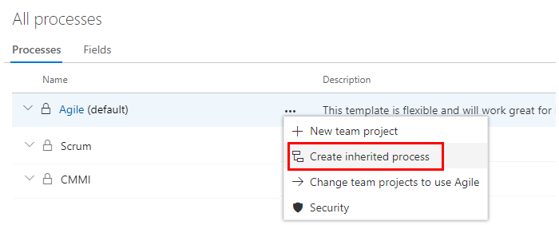
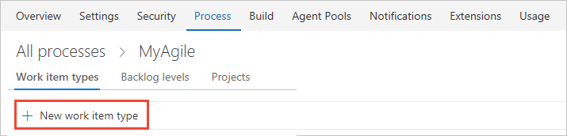

# Add a custom work item type     

[!INCLUDE [temp](../_shared/codex-agile.md)]

You use different work item types (WITs) to plan and track different types of work. Your Codex project contains 9 or more WITs that you can customize, based on the process used to create your project.  

For example, you may want to capture customer issues in a custom Ticket WIT.   

 

## Prerequisites
* You must have a Codex Agile project created. If you don't have a project yet, create one in [Codex](../../accounts/set-up-vs.md).  
* You must be a member of the **Project Collection Administrators** group, the organization owner, or be granted explicit permissions to edit or create a specific process. 

	If you aren't a project administrator, [get added as one](../../security/set-project-collection-level-permissions.md) or have someone provide you with explicit permissions to [**Edit or Create a specific process**](../../security/set-permissions-access-work-tracking.md#process-permissions).   

## Open Settings>Process hub

[!INCLUDE [temp](../../_shared/open-process-admin-context-ts.md)]

 

## Create an inherited process
You can create an inherited process from any one of the three system processes: [Agile](../../work/work-items/guidance/agile-process.md), [Scrum](../../work/work-items/guidance/scrum-process.md), or [CMMI](../../work/work-items/guidance/cmmi-process.md).   

0. From the **Process** page, open the **&hellip;** context menu of the process you'll use to create an inherited process, and then choose **Create inherited process**. 

	Here, we create an inherited process from the Agile system process.   

	> [!div class="mx-imgBorder"]  
	>  

	If you don't have access to these options, ask your project collection admin to [grant you permissions](../../security/set-permissions-access-work-tracking.md#process-permissions). 

0.	Enter a name for your process and optionally a description. (For naming restrictions, see [Process name restrictions](#process-naming) later in this topic.)

	  

## Add a custom work item type

0. From the Work Item Types page, click  New work item type.

	
 
0. Name the WIT and optionally specify a description, icon and color. The icon and color you specify will appear throughout the web portal, including on the work item form and when associated work items appear on a backlog, boards, query results, and more. Click Create to save. 

	 

	Each new WIT comes predefined with a Details page with the Description field, and Discussion, Development, and Related Work groups. Also added, but not shown nor editable, are the standard elements included with the header of the form as shown in the following image, as well as the history, links, and attachment pages. 
 
	 

0.   From the Layout page, you can add fields, groups, or pages to specify the form and fields you want to track. For details, see [Customize a field](customize-process-field.md) or [Customize a web form for a process](customize-process-form.md).    

	 	

0. Open the States page to view the default workflow states. Optionally, [customize the workflow states](customize-process-workflow.md). 

0.  Optional. To add the WIT to a backlog, see [Customize your backlogs or boards for a process](customize-process-backlogs-boards.md). By default, custom WITs aren't added to any backlog. To learn more about different backlog levels, see [Backlogs, boards, and plans](../../work/backlogs/backlogs-boards-plans.md).   

0. Verify the custom work item type appears as expected. Either navigate to the backlog or board to which you added the custom WIT, or open the Work hub menu and open a new work item of the type you added.  

	 

	If you don't see the custom WIT, refresh your browser to make sure it registers all the custom changes you've made. 

## Change description, icon or color of a custom WIT 

To change the description, icon or color of a custom WIT, choose Edit from the WIT context menu. 

Here we change the description, icon and color for the Ticket custom WIT.  

 

## Verify the customization you made 

We recommend that you create a test project and apply your customized inheritance process to it to verify the changes you've made. 

0. Open the &hellip; context menu for the process you want to use and choose **New team project**.  

	> [!div class="mx-imgBorder"]  
	>  

0. The Create new project page opens. Fill out the form. 

	> [!div class="mx-imgBorder"]  
	>  

0. Open the work items page and choose to create a new work item of the custom wit. 

## Apply the customized process to your project 

After you've verified your customizations, you can now apply the process to your existing project. 

0. Open the &hellip; context menu for the process and choose the **Change team projects**&hellip; option. 

	Here we open the menu for the Agile system process:

	> [!div class="mx-imgBorder"]  
	>  

	The system lists only those team projects that are valid for the current process.

0. Check the checkbox of those projects you want to change to use the Agile process. 	

	Here we choose to use the Agile process for the Fabrikam Fiber A and Fabrikam Fiber projects.  Only those projects created from the Agile process or one that inherits from Agile will appear under the Available projects column. 
 
	  

0. After  you've confirmed that the projects you want to change are correct, click Ok. 

## Try this next
> [!div class="nextstepaction"]
> [Add a custom field](add-custom-field.md) 
> Or
> [Customize a work item type](customize-process-wit.md)

 
## Additional notes 

<!--- Look at moving this to a concepts topic ==> 
As you customize a WIT, all team projects that reference the inherited process that you're customizing will automatically update to reflect the custom WITs you've added. To view your customizations, refresh your web browser.  

To customize a single project, always start by [creating an inherited process and migrating the team project to that process](manage-process.md). Then, all the customizations that you make to the inherited process automatically appear for the team project you migrated.  

> [!IMPORTANT]  
> When you change a project to use an inherited process, you may find one or more Agile tools or work items appear in an invalid state. For example: 
> 
> - If you make a field required, work items with that field undefined will show an error message. You'll need to resolve the errors to make additional changes and save the work item. 
> - If you add or remove/hide workflow states of a WIT that appears on the Kanban board, you'll need to update the Kanban board column configurations for all teams defined in the team project. 

