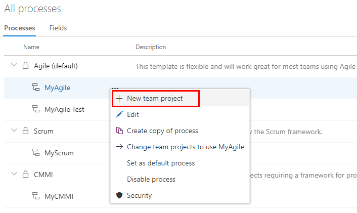

# Add a custom work item type     

[!INCLUDE [temp](../../_shared/codex-agile.md)]

You use different work item types (WITs) to plan and track different types of work. Your Codex project contains 9 or more WITs that you can customize, based on the process used to create your project.  

For example, you may want to capture customer issues in a custom Ticket WIT.   

 

[!INCLUDE [temp](../_shared/process-prerequisites.md)] 

## Open Settings>Process hub

[!INCLUDE [temp](../_shared/open-process-admin-context-ts.md)]

 
[!INCLUDE [temp](../_shared/create-inherited-process.md)] 

## Add a custom work item type

0. From the **Work Item Types** page, choose the  **New work item type**.

	
 
0. Name the WIT and optionally specify a description, icon and color. The icon and color you specify will appear throughout the web portal, including on the work item form and when associated work items appear on a backlog, boards, query results, and more. 

	 

	Click **Create** to save. 

	Each new WIT comes predefined with a Details page with the Description field, and Discussion, Development, and Related Work groups. Also added, but not shown nor editable, are the standard elements included with the header of the form as shown in the following image, as well as the history, links, and attachment pages. To learn more, see [About work items](../../work/work-items/about-work-items.md).
 
	 

0. Name the field and select the field type from one of the supported data types. Field names must be unique and no more than 128 characters. For additional restrictions, see [What is a field? How are field names used?](customize-process-field.md#field-reference). Optionally, add a description.  
	
	Here we add an Integer field labeled Customer Ticket. 

     

	Additional data types you can add include: [Pick list](add-custom-field.md#pick-list), [Identity](add-custom-field.md#identity), [Rich-text, HTML](add-custom-field.md#html),[Checkbox](add-custom-field.md#boolean-field). 
- 
	
0.	(Optional) On the **Options** tab, indicate if the field is required and specify a default value. Or leave these blank. 

	  

	By making a field Required, users must specify a value for the field in order to save it. The default value you specify is set when you create a work item as well as every time a work item is opened and the field is empty.

	
0.	(Optional) On the **Layout** tab, you can enter a different form label than the name of the field. Also, you can choose the page and group where the field will appear on the form.  

	Here we choose to add a new field. Choose the  (**New Field** icon).  

	 	

0.  Here, we add the Customer Ticket field to a new group labeled Customer focus. 

	  

	> [!TIP]    
	> Once you've added a field, you can drag-and-drop it within a page to relocate it on the form. If you have several fields you want to add to a custom page or group, then you may want to [add those elements first](customize-process-form.md) and then add your fields. 

0.	Click **Add field** to complete adding the field. If you haven't specified it's layout location, it will be added to the first group of fields on the layout form.  

## Verify the customization you made 

We recommend that you create a test project and apply your customized inheritance process to it to verify the changes you've made. 

0. Open the &hellip; context menu for the process you want to use and choose **New team project**.  

	> [!div class="mx-imgBorder"]  
	>  

0. The Create new project page opens. Fill out the form. 

	> [!div class="mx-imgBorder"]  
	>  

0. Open the **Work>Work Items** page (user context) and choose **New Work Item** and select the WIT you customized. Here we choose **Ticket**. 

	> [!div class="mx-imgBorder"]  
	>  

	If you don't see the custom WIT, refresh your browser to make sure it registers all the custom changes you've made. 

0.  Verify that the field you added appears on the form. Note that the  (exclamation mark) icon indicates the field is required.  

		

[!INCLUDE [temp](../_shared/change-project-to-inherited-process.md)] 

## Try this next
> [!div class="nextstepaction"]
> [Add a custom field](add-custom-field.md) 
> Or
> [Customize a work item type](customize-process-wit.md)

## Related articles 

- [Create and manage inheritance processes](manage-process.md)
- [Customize the workflow states](customize-process-workflow.md). 
- [Customize your backlogs or boards for a process](customize-process-backlogs-boards.md).  

 
## Additional notes 

<!--- Look at moving this to a concepts topic ==> 
  

To customize a single project, always start by [creating an inherited process and migrating the team project to that process](manage-process.md). Then, all the customizations that you make to the inherited process automatically appear for the team project you migrated.  

> [!IMPORTANT]  
> When you change a project to use an inherited process, you may find one or more Agile tools or work items appear in an invalid state. For example: 
> 
> - If you make a field required, work items with that field undefined will show an error message. You'll need to resolve the errors to make additional changes and save the work item. 
> - If you add or remove/hide workflow states of a WIT that appears on the Kanban board, you'll need to update the Kanban board column configurations for all teams defined in the team project. 

